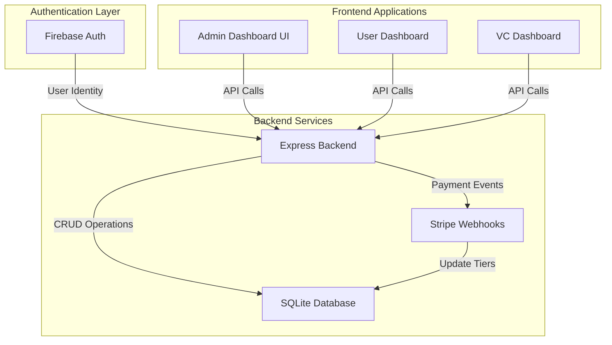

# 🎯 ScaleOps6 Admin Dashboard - Complete Implementation Plan

**Project:** ScaleOps6 Platform Admin Dashboard  
**Firebase Project:** LOGIN (login-df66c)  
**Database:** SQLite (Hybrid with Firebase Auth)  
**Status:** Architecture & Planning Phase  
**Created:** 2025-01-24

---

## 📋 Executive Summary

This plan outlines the complete implementation of the ScaleOps6 Admin Dashboard, integrating Firebase Authentication with the existing SQLite database infrastructure. The system will support 4 user roles (admin, user, vc, st6_partner) with comprehensive governance, analytics, and billing management capabilities.

**Key Principle:** ⚠️ **SAFE MODE** - No modifications to existing working code. All new features will be additive.

---

## 🏗️ System Architecture Overview



---

## 📊 Database Schema Extensions

### New Tables to Add (Non-Breaking)

#### 1. `users` Table
```sql
CREATE TABLE IF NOT EXISTS users (
    id INTEGER PRIMARY KEY AUTOINCREMENT,
    firebase_uid TEXT UNIQUE NOT NULL,
    email TEXT UNIQUE NOT NULL,
    full_name TEXT,
    role TEXT DEFAULT 'user' CHECK(role IN ('admin', 'user', 'vc', 'st6_partner')),
    tier INTEGER DEFAULT 0 CHECK(tier IN (0, 1, 2, 3)),
    subscription_status TEXT DEFAULT 'free' CHECK(subscription_status IN ('free', 'trial', 'paid', 'cancelled')),
    stripe_customer_id TEXT,
    created_at TIMESTAMP DEFAULT CURRENT_TIMESTAMP,
    last_login TIMESTAMP,
    is_active BOOLEAN DEFAULT 1,
    metadata TEXT -- JSON field for additional user data
);

CREATE INDEX idx_users_firebase_uid ON users(firebase_uid);
CREATE INDEX idx_users_email ON users(email);
CREATE INDEX idx_users_role ON users(role);
```

#### 2. `vc_assignments` Table
```sql
CREATE TABLE IF NOT EXISTS vc_assignments (
    id INTEGER PRIMARY KEY AUTOINCREMENT,
    vc_user_id INTEGER NOT NULL,
    startup_user_id INTEGER NOT NULL,
    assigned_at TIMESTAMP DEFAULT CURRENT_TIMESTAMP,
    assigned_by INTEGER, -- admin user_id who made assignment
    notes TEXT,
    is_active BOOLEAN DEFAULT 1,
    FOREIGN KEY (vc_user_id) REFERENCES users(id) ON DELETE CASCADE,
    FOREIGN KEY (startup_user_id) REFERENCES users(id) ON DELETE CASCADE,
    FOREIGN KEY (assigned_by) REFERENCES users(id),
    UNIQUE(vc_user_id, startup_user_id)
);

CREATE INDEX idx_vc_assignments_vc ON vc_assignments(vc_user_id);
CREATE INDEX idx_vc_assignments_startup ON vc_assignments(startup_user_id);
```

#### 3. `user_sessions` Table
```sql
CREATE TABLE IF NOT EXISTS user_sessions (
    id INTEGER PRIMARY KEY AUTOINCREMENT,
    user_id INTEGER NOT NULL,
    session_token TEXT UNIQUE NOT NULL,
    firebase_token TEXT,
    ip_address TEXT,
    user_agent TEXT,
    created_at TIMESTAMP DEFAULT CURRENT_TIMESTAMP,
    expires_at TIMESTAMP NOT NULL,
    last_activity TIMESTAMP DEFAULT CURRENT_TIMESTAMP,
    is_active BOOLEAN DEFAULT 1,
    FOREIGN KEY (user_id) REFERENCES users(id) ON DELETE CASCADE
);

CREATE INDEX idx_sessions_user ON user_sessions(user_id);
CREATE INDEX idx_sessions_token ON user_sessions(session_token);
```

#### 4. `admin_actions` Table (Audit Log)
```sql
CREATE TABLE IF NOT EXISTS admin_actions (
    id INTEGER PRIMARY KEY AUTOINCREMENT,
    admin_user_id INTEGER NOT NULL,
    action_type TEXT NOT NULL, -- 'user_created', 'role_changed', 'tier_updated', etc.
    target_user_id INTEGER,
    action_details TEXT, -- JSON field
    ip_address TEXT,
    timestamp TIMESTAMP DEFAULT CURRENT_TIMESTAMP,
    FOREIGN KEY (admin_user_id) REFERENCES users(id),
    FOREIGN KEY (target_user_id) REFERENCES users(id)
);

CREATE INDEX idx_admin_actions_admin ON admin_actions(admin_user_id);
CREATE INDEX idx_admin_actions_target ON admin_actions(target_user_id);
CREATE INDEX idx_admin_actions_type ON admin_actions(action_type);
```

#### 5. `stripe_events` Table
```sql
CREATE TABLE IF NOT EXISTS stripe_events (
    id INTEGER PRIMARY KEY AUTOINCREMENT,
    stripe_event_id TEXT UNIQUE NOT NULL,
    event_type TEXT NOT NULL,
    user_id INTEGER,
    customer_id TEXT,
    subscription_id TEXT,
    event_data TEXT, -- JSON field
    processed BOOLEAN DEFAULT 0,
    created_at TIMESTAMP DEFAULT CURRENT_TIMESTAMP,
    processed_at TIMESTAMP,
    FOREIGN KEY (user_id) REFERENCES users(id)
);

CREATE INDEX idx_stripe_events_user ON stripe_events(user_id);
CREATE INDEX idx_stripe_events_type ON stripe_events(event_type);
```

#### 6. `user_tags` Table
```sql
CREATE TABLE IF NOT EXISTS user_tags (
    id INTEGER PRIMARY KEY AUTOINCREMENT,
    user_id INTEGER NOT NULL,
    tag TEXT NOT NULL,
    created_by INTEGER,
    created_at TIMESTAMP DEFAULT CURRENT_TIMESTAMP,
    FOREIGN KEY (user_id) REFERENCES users(id) ON DELETE CASCADE,
    FOREIGN KEY (created_by) REFERENCES users(id),
    UNIQUE(user_id, tag)
);

CREATE INDEX idx_user_tags_user ON user_tags(user_id);
CREATE INDEX idx_user_tags_tag ON user_tags(tag);
```

#### 7. `admin_notes` Table
```sql
CREATE TABLE IF NOT EXISTS admin_notes (
    id INTEGER PRIMARY KEY AUTOINCREMENT,
    user_id INTEGER NOT NULL,
    note TEXT NOT NULL,
    created_by INTEGER NOT NULL,
    created_at TIMESTAMP DEFAULT CURRENT_TIMESTAMP,
    updated_at TIMESTAMP DEFAULT CURRENT_TIMESTAMP,
    is_pinned BOOLEAN DEFAULT 0,
    FOREIGN KEY (user_id) REFERENCES users(id) ON DELETE CASCADE,
    FOREIGN KEY (created_by) REFERENCES users(id)
);

CREATE INDEX idx_admin_notes_user ON admin_notes(user_id);
```

---

## 🔐 Firebase Authentication Integration

### Configuration Setup

**File:** `firebase-config.js` (NEW)
```javascript
const admin = require('firebase-admin');

// Initialize Firebase Admin SDK
const serviceAccount = {
    projectId: "login-df66c",
    // Add other credentials from Firebase Console
};

admin.initializeApp({
    credential: admin.credential.cert(serviceAccount),
    projectId: "login-df66c"
});

module.exports = { admin };
```

### Authentication Middleware

**File:** `auth-middleware.js` (NEW)
```javascript
const { admin } = require('./firebase-config');
const DatabaseService = require('./database-service');

async function verifyFirebaseToken(req, res, next) {
    const authHeader = req.headers.authorization;
    
    if (!authHeader || !authHeader.startsWith('Bearer ')) {
        return res.status(401).json({ error: 'Unauthorized' });
    }
    
    const idToken = authHeader.split('Bearer ')[1];
    
    try {
        const decodedToken = await admin.auth().verifyIdToken(idToken);
        req.firebaseUser = decodedToken;
        
        // Get user from SQLite
        const db = new DatabaseService();
        const user = await db.getUserByFirebaseUid(decodedToken.uid);
        
        if (!user) {
            return res.status(404).json({ error: 'User not found in database' });
        }
        
        req.user = user;
        next();
    } catch (error) {
        console.error('Token verification failed:', error);
        return res.status(401).json({ error: 'Invalid token' });
    }
}

function requireRole(...allowedRoles) {
    return (req, res, next) => {
        if (!req.user) {
            return res.status(401).json({ error: 'Unauthorized' });
        }
        
        if (!allowedRoles.includes(req.user.role)) {
            return res.status(403).json({ error: 'Forbidden: Insufficient permissions' });
        }
        
        next();
    };
}

function requireTier(minTier) {
    return (req, res, next) => {
        if (!req.user) {
            return res.status(401).json({ error: 'Unauthorized' });
        }
        
        if (req.user.tier < minTier) {
            return res.status(403).json({ error: 'Forbidden: Upgrade required' });
        }
        
        next();
    };
}

module.exports = {
    verifyFirebaseToken,
    requireRole,
    requireTier
};
```

---

## 🛠️ Backend API Endpoints

### User Management APIs

**File:** `routes/admin-users.js` (NEW)

```javascript
const express = require('express');
const router = express.Router();
const { verifyFirebaseToken, requireRole } = require('../auth-middleware');
const DatabaseService = require('../database-service');

// All routes require admin role
router.use(verifyFirebaseToken);
router.use(requireRole('admin'));

// GET /api/admin/users - List all users
router.get('/users', async (req, res) => {
    const { role, tier, status, search, page = 1, limit = 50 } = req.query;
    
    try {
        const db = new DatabaseService();
        const users = await db.getUsers({ role, tier, status, search, page, limit });
        res.json(users);
    } catch (error) {
        res.status(500).json({ error: error.message });
    }
});

// GET /api/admin/users/:id - Get single user
router.get('/users/:id', async (req, res) => {
    try {
        const db = new DatabaseService();
        const user = await db.getUserById(req.params.id);
        
        if (!user) {
            return res.status(404).json({ error: 'User not found' });
        }
        
        res.json(user);
    } catch (error) {
        res.status(500).json({ error: error.message });
    }
});

// PUT /api/admin/users/:id/role - Update user role
router.put('/users/:id/role', async (req, res) => {
    const { role } = req.body;
    
    if (!['admin', 'user', 'vc', 'st6_partner'].includes(role)) {
        return res.status(400).json({ error: 'Invalid role' });
    }
    
    try {
        const db = new DatabaseService();
        await db.updateUserRole(req.params.id, role);
        await db.logAdminAction(req.user.id, 'role_changed', req.params.id, { newRole: role });
        
        res.json({ success: true, message: 'Role updated' });
    } catch (error) {
        res.status(500).json({ error: error.message });
    }
});

// PUT /api/admin/users/:id/tier - Update user tier
router.put('/users/:id/tier', async (req, res) => {
    const { tier } = req.body;
    
    if (![0, 1, 2, 3].includes(tier)) {
        return res.status(400).json({ error: 'Invalid tier' });
    }
    
    try {
        const db = new DatabaseService();
        await db.updateUserTier(req.params.id, tier);
        await db.logAdminAction(req.user.id, 'tier_updated', req.params.id, { newTier: tier });
        
        res.json({ success: true, message: 'Tier updated' });
    } catch (error) {
        res.status(500).json({ error: error.message });
    }
});

// POST /api/admin/users/:id/deactivate - Deactivate user
router.post('/users/:id/deactivate', async (req, res) => {
    try {
        const db = new DatabaseService();
        await db.deactivateUser(req.params.id);
        await db.logAdminAction(req.user.id, 'user_deactivated', req.params.id);
        
        res.json({ success: true, message: 'User deactivated' });
    } catch (error) {
        res.status(500).json({ error: error.message });
    }
});

// DELETE /api/admin/users/:id - Delete user
router.delete('/users/:id', async (req, res) => {
    try {
        const db = new DatabaseService();
        await db.deleteUser(req.params.id);
        await db.logAdminAction(req.user.id, 'user_deleted', req.params.id);
        
        res.json({ success: true, message: 'User deleted' });
    } catch (error) {
        res.status(500).json({ error: error.message });
    }
});

module.exports = router;
```

### VC Assignment APIs

**File:** `routes/admin-vc.js` (NEW)

```javascript
const express = require('express');
const router = express.Router();
const { verifyFirebaseToken, requireRole } = require('../auth-middleware');
const DatabaseService = require('../database-service');

router.use(verifyFirebaseToken);
router.use(requireRole('admin'));

// GET /api/admin/vc/assignments - Get all VC assignments
router.get('/assignments', async (req, res) => {
    try {
        const db = new DatabaseService();
        const assignments = await db.getVCAssignments();
        res.json(assignments);
    } catch (error) {
        res.status(500).json({ error: error.message });
    }
});

// POST /api/admin/vc/assign - Assign startup to VC
router.post('/assign', async (req, res) => {
    const { vcUserId, startupUserIds, notes } = req.body;
    
    try {
        const db = new DatabaseService();
        const results = await db.assignStartupsToVC(
            vcUserId,
            startupUserIds,
            req.user.id,
            notes
        );
        
        await db.logAdminAction(req.user.id, 'vc_assignment_created', vcUserId, {
            startupCount: startupUserIds.length
        });
        
        res.json({ success: true, assignments: results });
    } catch (error) {
        res.status(500).json({ error: error.message });
    }
});

// DELETE /api/admin/vc/assign/:assignmentId - Remove assignment
router.delete('/assign/:assignmentId', async (req, res) => {
    try {
        const db = new DatabaseService();
        await db.removeVCAssignment(req.params.assignmentId);
        await db.logAdminAction(req.user.id, 'vc_assignment_removed', null, {
            assignmentId: req.params.assignmentId
        });
        
        res.json({ success: true, message: 'Assignment removed' });
    } catch (error) {
        res.status(500).json({ error: error.message });
    }
});

// GET /api/admin/vc/:vcId/portfolio - Get VC's portfolio
router.get('/:vcId/portfolio', async (req, res) => {
    try {
        const db = new DatabaseService();
        const portfolio = await db.getVCPortfolio(req.params.vcId);
        res.json(portfolio);
    } catch (error) {
        res.status(500).json({ error: error.message });
    }
});

module.exports = router;
```

### Analytics APIs

**File:** `routes/admin-analytics.js` (NEW)

```javascript
const express = require('express');
const router = express.Router();
const { verifyFirebaseToken, requireRole } = require('../auth-middleware');
const DatabaseService = require('../database-service');

router.use(verifyFirebaseToken);
router.use(requireRole('admin'));

// GET /api/admin/analytics/overview - Dashboard overview stats
router.get('/overview', async (req, res) => {
    try {
        const db = new DatabaseService();
        const stats = await db.getAdminOverviewStats();
        res.json(stats);
    } catch (error) {
        res.status(500).json({ error: error.message });
    }
});

// GET /api/admin/analytics/gtm-scores - GTM score analytics
router.get('/gtm-scores', async (req, res) => {
    const { days = 30 } = req.query;
    
    try {
        const db = new DatabaseService();
        const analytics = await db.getGTMScoreAnalytics(days);
        res.json(analytics);
    } catch (error) {
        res.status(500).json({ error: error.message });
    }
});

// GET /api/admin/analytics/agent-usage - Agent usage logs
router.get('/agent-usage', async (req, res) => {
    const { days = 30, limit = 100 } = req.query;
    
    try {
        const db = new DatabaseService();
        const usage = await db.getAgentUsageLogs(days, limit);
        res.json(usage);
    } catch (error) {
        res.status(500).json({ error: error.message });
    }
});

module.exports = router;
```

---

## 🎨 Admin Dashboard UI Components

### Section 1: User Management Console

**File:** `admin-enhanced.html` (REPLACE existing admin.html)

Key Features:
- Real-time user list with filters (role, tier, activity)
- Inline actions: upgrade/downgrade tier, change role, deactivate, delete
- User detail modal with full history
- Bulk operations support
- Export to CSV

### Section 2: VC Portfolio Assignments

**Component:** VC Assignment Manager

Features:
- VC dropdown selector
- Multi-select startup assignment
- Portfolio health visualization (radar charts)
- Assignment history
- Export portfolio reports (CSV/PDF)

### Section 3: GTM Score Analytics

**Component:** Score Analytics Dashboard

Features:
- Overall GTM completion % across all users
- Top performing startups (leaderboard)
- Most improved in last 30 days
- Heatmap: blocks vs. users with color-coded maturity
- Sparkline graphs of score progression

### Section 4: Agent & Deliverables Monitoring

**Component:** Agent Usage Monitor

Features:
- Agent usage logs table (agent name, user, timestamp, status)
- Deliverable generation logs
- Success/failure rates
- Usage trends over time

### Section 5: Billing & Stripe Sync

**Component:** Billing Management

Features:
- Stripe customer data display
- Plan name, billing status, next payment
- Manual tier override
- Open Stripe portal for customer
- Billing history view

### Section 6: System Controls

**Component:** System Administration

Features:
- Feature flags toggle
- Webhook logs viewer
- User login history
- Admin notes per user
- User tagging system

---

## 🔒 Security & Role Enforcement

### Role-Based Access Matrix

| Feature | admin | user | vc | st6_partner |
|---------|-------|------|----|----|
| Access `/admin` | ✅ | ❌ | ❌ | ❌ |
| View all users | ✅ | ❌ | ❌ | ❌ |
| Modify user roles | ✅ | ❌ | ❌ | ❌ |
| Assign VCs | ✅ | ❌ | ❌ | ❌ |
| View own dashboard | ✅ | ✅ | ✅ | ✅ |
| View assigned startups | ❌ | ❌ | ✅ | ✅ |
| Edit assigned startup data | ❌ | ❌ | ❌ | ✅ |
| Take GTM assessment | ✅ | ✅ | ❌ | ✅ |
| Generate deliverables | ✅ | ✅ (if paid) | ❌ | ✅ |
| Access billing | ✅ | ✅ (self) | ❌ | ❌ |

### Middleware Stack

```javascript
// Example protected route
app.get('/api/admin/users',
    verifyFirebaseToken,      // 1. Verify Firebase token
    requireRole('admin'),      // 2. Check role
    async (req, res) => {      // 3. Execute handler
        // Handler code
    }
);
```

---

## 📦 Implementation Phases

### Phase 1: Database Schema Extensions ✅
**Duration:** 1-2 days  
**Files:**
- `database-migration-users.js` (NEW)
- `database-service.js` (EXTEND)

**Tasks:**
- [ ] Create migration script for new tables
- [ ] Add new methods to DatabaseService
- [ ] Test migrations on development database
- [ ] Backup existing database before migration

### Phase 2: Firebase Auth Integration ✅
**Duration:** 2-3 days  
**Files:**
- `firebase-config.js` (NEW)
- `auth-middleware.js` (NEW)
- `login.html` (NEW)
- `signup.html` (NEW)

**Tasks:**
- [ ] Set up Firebase Admin SDK
- [ ] Create authentication middleware
- [ ] Build login/signup pages
- [ ] Implement token verification
- [ ] Test auth flow end-to-end

### Phase 3: User Management API ✅
**Duration:** 2-3 days  
**Files:**
- `routes/admin-users.js` (NEW)
- `routes/admin-vc.js` (NEW)
- `routes/admin-analytics.js` (NEW)

**Tasks:**
- [ ] Implement user CRUD endpoints
- [ ] Implement VC assignment endpoints
- [ ] Implement analytics endpoints
- [ ] Add audit logging
- [ ] Test all endpoints with Postman

### Phase 4-9: Admin Dashboard UI Sections ✅
**Duration:** 5-7 days  
**Files:**
- `admin-enhanced.html` (REPLACE admin.html)
- `admin-dashboard.js` (NEW)
- `admin-styles.css` (NEW)

**Tasks:**
- [ ] Build Section 1: User Management Console
- [ ] Build Section 2: VC Portfolio Assignments
- [ ] Build Section 3: GTM Score Analytics
- [ ] Build Section 4: Agent & Deliverables Monitoring
- [ ] Build Section 5: Billing & Stripe Integration
- [ ] Build Section 6: System Controls

### Phase 10: RBAC Implementation ✅
**Duration:** 2-3 days  
**Files:**
- `server-with-backend.js` (EXTEND)
- All route files (UPDATE)

**Tasks:**
- [ ] Apply middleware to all routes
- [ ] Implement role checks on frontend
- [ ] Add tier-based feature gating
- [ ] Test access control thoroughly

### Phase 11: Testing & Security Validation ✅
**Duration:** 2-3 days  
**Tasks:**
- [ ] Security audit of all endpoints
- [ ] Test role-based access control
- [ ] Test Firebase token expiration handling
- [ ] Load testing with multiple users
- [ ] Penetration testing
- [ ] Documentation review

---

## 🚀 Deployment Checklist

### Pre-Deployment
- [ ] All tests passing
- [ ] Database migrations tested
- [ ] Firebase credentials configured
- [ ] Stripe webhooks configured
- [ ] Environment variables set
- [ ] Backup current database

### Deployment Steps
1. [ ] Run database migrations
2. [ ] Deploy backend code
3. [ ] Deploy frontend code
4. [ ] Configure Firebase Auth domain
5. [ ] Test login flow
6. [ ] Create first admin user
7. [ ] Verify all admin features

### Post-Deployment
- [ ] Monitor error logs
- [ ] Test critical user flows
- [ ] Verify Stripe webhooks working
- [ ] Check Firebase Auth working
- [ ] Performance monitoring

---

## 📚 Additional Documentation Needed

1. **User Guide:** How to use admin dashboard
2. **API Documentation:** Complete endpoint reference
3. **Security Guide:** Best practices for admins
4. **Troubleshooting Guide:** Common issues and solutions
5. **Migration Guide:** Moving from old to new system

---

## 🎯 Success Criteria

- [ ] Admin can view all users with filtering
- [ ] Admin can modify user roles and tiers
- [ ] Admin can assign startups to VCs
- [ ] VCs can view their assigned portfolio
- [ ] GTM analytics display correctly
- [ ] Agent usage tracking works
- [ ] Stripe integration syncs properly
- [ ] All routes are properly protected
- [ ] No breaking changes to existing features
- [ ] Performance remains acceptable (<500ms API response)

---

## ⚠️ Risk Mitigation

| Risk | Mitigation |
|------|------------|
| Breaking existing features | Comprehensive testing before deployment |
| Firebase auth issues | Fallback to session-based auth temporarily |
| Database migration failures | Always backup before migration |
| Performance degradation | Load testing and optimization |
| Security vulnerabilities | Security audit and penetration testing |

---

## 📞 Support & Questions

For questions during implementation:
1. Review this plan thoroughly
2. Check existing codebase for patterns
3. Test in development environment first
4. Document any deviations from plan

---

**Next Step:** Review this plan and approve to proceed with Phase 1 (Database Schema Extensions)