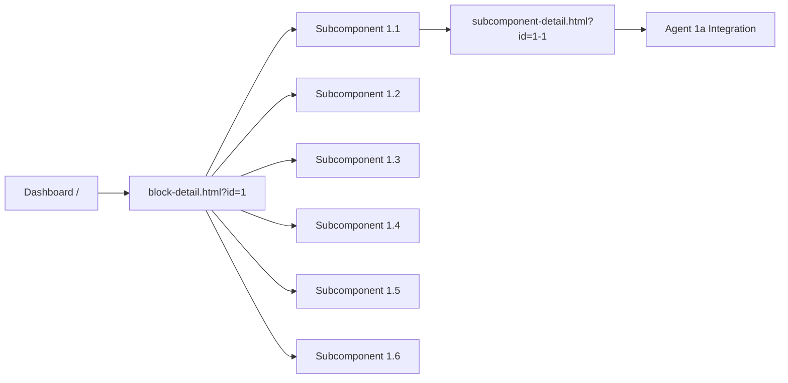

# ScaleOps6 Platform - Agent System Fix Implementation Plan

## Problem Statement
The current system has 96 individual `block-X-Y.html` files that were incorrectly updated with agent functionality. The correct architecture should use:
- `block-detail.html` as a dashboard showing 6 subcomponents
- `subcomponent-detail.html` for individual agent interactions
- URL-based navigation: `?id=X` for blocks, `?id=X-Y` for subcomponents

## Solution Architecture

### Correct System Flow


### Key Components

#### 1. Block Dashboard (`block-detail.html`)
- **Purpose**: Display overview of a block with 6 subcomponents
- **Features**:
  - Block score (aggregate of subcomponent scores)
  - 6 subcomponent cards with individual scores
  - Progress indicators
  - Navigation to subcomponent details
  - Score history chart
  - Recommendations section

#### 2. Subcomponent Detail (`subcomponent-detail.html`)
- **Purpose**: Individual agent interaction page
- **Features**:
  - Education tab with agent-specific content
  - Workspace tab with dynamic questions
  - Analysis tab with agent scoring
  - Templates/Output tab
  - Resources tab
  - Score History tab

#### 3. Agent Integration Layer
- **Agent Library**: 96 agents with unique configurations
- **Content Loader**: Dynamic content based on agent ID
- **Worksheet Generator**: Agent-specific questions
- **Scoring Engine**: Dimension-based evaluation
- **Persistence Manager**: Score and data storage

## Implementation Steps

### Step 1: Fix Navigation System
```javascript
// In block-detail.html
function navigateToSubcomponent(subcomponentId) {
    const blockId = getCurrentBlockId();
    window.location.href = `subcomponent-detail.html?id=${blockId}-${subcomponentId}`;
}

// In subcomponent-detail.html
function loadAgentContent() {
    const urlParams = new URLSearchParams(window.location.search);
    const id = urlParams.get('id'); // e.g., "1-1"
    const [blockId, subId] = id.split('-');
    const agentId = mapToAgentId(blockId, subId); // Convert to "1a" format
    loadAgent(agentId);
}
```

### Step 2: Agent ID Mapping
```javascript
// Map subcomponent IDs to agent IDs
function mapToAgentId(blockId, subcomponentNumber) {
    const suffixes = ['a', 'b', 'c', 'd', 'e', 'f'];
    return `${blockId}${suffixes[subcomponentNumber - 1]}`;
}

// Examples:
// 1-1 → 1a (Problem Definition Evaluator)
// 1-2 → 1b (Mission Alignment Advisor)
// 2-1 → 2a (Interview Cadence Analyzer)
// 16-6 → 16f (Expansion Risk Assessor)
```

### Step 3: API Integration
```javascript
// Server endpoints needed
app.get('/api/blocks/:id', (req, res) => {
    // Return block data with 6 subcomponents
});

app.get('/api/subcomponents/:id', (req, res) => {
    // Return agent-specific data
    const agentId = mapToAgentId(req.params.id);
    const agent = AgentLibrary[agentId];
    res.json({
        agent: agent,
        education: getEducationContent(agentId),
        workspace: getWorkspaceQuestions(agentId),
        resources: getResources(agentId)
    });
});

app.post('/api/analysis/:id', (req, res) => {
    // Process analysis with correct agent
});

app.get('/api/score-history/:id', (req, res) => {
    // Return score history for agent
});
```

### Step 4: Fix subcomponent-detail.html Integration

#### Current Issues:
1. Generic content loading
2. Missing agent integration
3. API calls not using agent IDs

#### Required Changes:
```javascript
// Load agent-specific content
async function loadSubcomponentData() {
    const subcomponentId = getSubcomponentId(); // e.g., "1-1"
    const agentId = mapToAgentId(subcomponentId); // e.g., "1a"
    
    // Get agent from library
    const agent = AgentLibrary[agentId];
    
    // Update UI with agent info
    updateHeader(agent);
    loadEducationContent(agent);
    loadWorkspaceQuestions(agent);
    setupAnalysis(agent);
    loadResources(agent);
}

// Education tab integration
function loadEducationContent(agent) {
    const educationTab = document.getElementById('education-tab');
    const content = generateEducationContent(agent);
    educationTab.innerHTML = content;
}

// Workspace tab integration
function loadWorkspaceQuestions(agent) {
    const generator = new DynamicWorksheetGenerator(
        agent.id,
        agent,
        scoringEngine
    );
    const worksheet = generator.generateDynamicWorksheet();
    renderWorksheet(worksheet);
}

// Analysis integration
function runAnalysis() {
    const agent = getCurrentAgent();
    const responses = collectResponses();
    const analysis = analyzeWithAgent(agent, responses);
    displayResults(analysis);
    saveToHistory(analysis);
}
```

### Step 5: Database Schema Updates
```sql
-- Ensure agent_id is properly stored
ALTER TABLE score_history ADD COLUMN IF NOT EXISTS agent_id VARCHAR(10);
ALTER TABLE workspace_responses ADD COLUMN IF NOT EXISTS agent_id VARCHAR(10);
ALTER TABLE analysis_results ADD COLUMN IF NOT EXISTS agent_id VARCHAR(10);

-- Index for performance
CREATE INDEX IF NOT EXISTS idx_agent_scores ON score_history(agent_id, created_at);
```

### Step 6: Clean Up Incorrect Files
```javascript
// Migration script to preserve any data from block-X-Y.html files
async function migrateData() {
    const blocks = 16;
    const subcomponents = 6;
    
    for (let b = 1; b <= blocks; b++) {
        for (let s = 1; s <= subcomponents; s++) {
            const oldFile = `block-${b}-${s}.html`;
            const agentId = mapToAgentId(b, s);
            
            // Extract any saved data
            const data = extractDataFromOldFile(oldFile);
            
            // Save to new structure
            if (data) {
                await saveToNewStructure(agentId, data);
            }
        }
    }
}
```

## Testing Checklist

### Navigation Testing
- [ ] Block dashboard loads correctly
- [ ] All 6 subcomponent cards display
- [ ] Clicking subcomponent navigates to detail page
- [ ] URL parameters are correct
- [ ] Back navigation works

### Agent Integration Testing
- [ ] Correct agent loads based on ID
- [ ] Education content is agent-specific
- [ ] Workspace questions match agent
- [ ] Analysis uses agent's dimensions
- [ ] Score saves with agent ID

### Visual Consistency Testing
- [ ] Dashboard matches design specs
- [ ] Subcomponent pages have consistent layout
- [ ] Dark theme with orange branding
- [ ] Responsive design works

### Data Persistence Testing
- [ ] Scores save correctly
- [ ] History displays properly
- [ ] Data survives page refresh
- [ ] Cross-session persistence

## Rollout Plan

### Phase 1: Development Environment
1. Update `subcomponent-detail.html` with agent integration
2. Fix API endpoints
3. Test with Block 1 (Mission Discovery)
4. Verify all 6 agents work

### Phase 2: Staging Environment
1. Deploy updated files
2. Run automated tests
3. Manual verification of 10% sample
4. Fix any issues found

### Phase 3: Production Deployment
1. Backup current system
2. Deploy during low-traffic period
3. Monitor for errors
4. Quick rollback if needed

## Success Metrics

### Functional Metrics
- ✅ 100% of agents load correctly
- ✅ All education content is specific
- ✅ All workspace questions are relevant
- ✅ Analysis uses correct dimensions
- ✅ Scores persist properly

### Performance Metrics
- ✅ Page load < 3 seconds
- ✅ API response < 500ms
- ✅ No JavaScript errors
- ✅ Mobile responsive

### User Experience Metrics
- ✅ Navigation is intuitive
- ✅ Content is relevant
- ✅ Visual consistency maintained
- ✅ No broken features

## Risk Management

### Identified Risks
1. **Data Loss**: Existing scores might be lost
   - **Mitigation**: Backup database before changes
   
2. **Breaking Changes**: System might break during update
   - **Mitigation**: Staged rollout with testing
   
3. **Performance Issues**: New system might be slower
   - **Mitigation**: Performance testing and optimization
   
4. **User Confusion**: Changed navigation might confuse users
   - **Mitigation**: Clear communication and documentation

## Timeline

### Week 1
- Day 1-2: Update subcomponent-detail.html
- Day 3-4: Fix API endpoints
- Day 5: Initial testing

### Week 2
- Day 1-2: Fix identified issues
- Day 3-4: Comprehensive testing
- Day 5: Staging deployment

### Week 3
- Day 1: Final testing
- Day 2: Production deployment
- Day 3-5: Monitoring and support

## Conclusion

This implementation plan provides a clear path to fix the agent system architecture. The key is to:
1. Use the correct navigation structure (block-detail → subcomponent-detail)
2. Properly integrate agents into subcomponent pages
3. Ensure data persistence with agent IDs
4. Maintain visual consistency
5. Test thoroughly before deployment

### Next Steps
1. Review and approve plan
2. Switch to Code mode for implementation
3. Begin with updating subcomponent-detail.html
4. Test with Block 1 agents
5. Roll out systematically

---

**Document Version**: 1.0  
**Created**: 2024-01-XX  
**Status**: Ready for Implementation