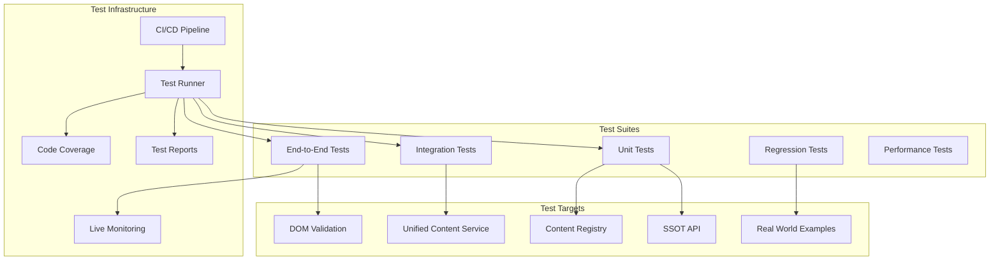

# Automated Testing Framework for SSOT Compliance
## Comprehensive Testing Strategy to Prevent Future Misalignments

---

## Executive Summary

This framework provides automated testing to ensure SSOT compliance across all 96 subcomponents. It addresses the critical need to catch content misalignments early, validate Real World Examples (noting that not all are implemented), and prevent regression of the issues we've fixed.

---

## Testing Architecture



---

## Test Suite Implementation

### 1. SSOT Compliance Tests

```javascript
// tests/ssot-compliance.test.js
const { SSOTValidator } = require('../ssot-validator');
const { UnifiedContentService } = require('../unified-content-service');

describe('SSOT Compliance Tests', () => {
  let validator;
  let service;
  
  beforeEach(() => {
    validator = new SSOTValidator();
    service = new UnifiedContentService();
  });
  
  describe('API Response Validation', () => {
    test('API should return complete SSOT structure', async () => {
      const response = await fetch('/api/subcomponents/2-1');
      const data = await response.json();
      
      // Verify required fields
      expect(data).toHaveProperty('id');
      expect(data).toHaveProperty('name');
      expect(data).toHaveProperty('education');
      expect(data).toHaveProperty('workspace');
      expect(data).toHaveProperty('templates');
      
      // Real World Examples may be optional
      if (data.realWorldExamples) {
        expect(Array.isArray(data.realWorldExamples)).toBe(true);
      }
    });
    
    test('All 96 subcomponents should be accessible', async () => {
      const failures = [];
      
      for (let block = 1; block <= 16; block++) {
        for (let sub = 1; sub <= 6; sub++) {
          const id = `${block}-${sub}`;
          const response = await fetch(`/api/subcomponents/${id}`);
          
          if (!response.ok) {
            failures.push(id);
          }
        }
      }
      
      expect(failures).toEqual([]);
    });
  });
  
  describe('Content Injection Validation', () => {
    test('Unified Content Service should inject without race conditions', async () => {
      const mockDOM = createMockDOM();
      
      // Simulate multiple injection attempts
      const promises = [];
      for (let i = 0; i < 10; i++) {
        promises.push(service.init('2-1', mockDOM));
      }
      
      await Promise.all(promises);
      
      // Check that content was injected only once
      const injectionCount = mockDOM.querySelector('#education-content')
        .getAttribute('data-injection-count');
      expect(injectionCount).toBe('1');
    });
    
    test('Variable name mismatches should be handled', () => {
      // Test both variable name formats
      window.realWorldExamplesComplete = { '2-1': [...] };
      window.realWorldExamples = undefined;
      
      const data = service.getRealWorldData('2-1');
      expect(data).toBeDefined();
      
      // Test reverse scenario
      window.realWorldExamplesComplete = undefined;
      window.realWorldExamples = { '2-1': [...] };
      
      const data2 = service.getRealWorldData('2-1');
      expect(data2).toBeDefined();
    });
  });
});
```

### 2. Real World Examples Tests

```javascript
// tests/real-world-examples.test.js
describe('Real World Examples Tests', () => {
  const implementedExamples = [
    '2-1', '2-2', '2-3', '2-4', '2-5', '2-6',
    '7-1', '7-2', '7-3', '7-4', '7-5', '7-6'
    // Add more as they're implemented
  ];
  
  describe('Content Availability', () => {
    test('Should track which subcomponents have examples', () => {
      const tracker = new CompletionTracker();
      const report = tracker.generateReport();
      
      expect(report.contentTypes.realWorldExamples).toBeDefined();
      expect(report.contentTypes.realWorldExamples.completeList)
        .toEqual(expect.arrayContaining(implementedExamples));
    });
    
    test('Should display fallback for missing examples', async () => {
      const mockDOM = createMockDOM();
      const service = new UnifiedContentService();
      
      // Test subcomponent without examples
      await service.injectRealWorldExamples('15-1', mockDOM);
      
      const section = mockDOM.querySelector('#real-world-examples-section');
      expect(section.classList.contains('content-fallback')).toBe(true);
      expect(section.textContent).toContain('being researched');
    });
    
    test('Should display actual examples when available', async () => {
      const mockDOM = createMockDOM();
      const service = new UnifiedContentService();
      
      // Test subcomponent with examples
      await service.injectRealWorldExamples('2-1', mockDOM);
      
      const section = mockDOM.querySelector('#real-world-examples-section');
      expect(section.classList.contains('content-fallback')).toBe(false);
      expect(section.textContent).toContain('Intercom');
      expect(section.textContent).toContain('$8B');
    });
  });
  
  describe('Data Structure Validation', () => {
    test('Examples should have required fields', () => {
      const validator = new RealWorldExamplesValidator();
      
      const validExample = [{
        company: 'Intercom',
        useCase: 'Help me have personal conversations at scale',
        valuation: '$8B',
        year: 2011
      }];
      
      expect(validator.validate(validExample)).toBe(true);
      
      const invalidExample = [{
        company: 'Test Corp'
        // Missing required fields
      }];
      
      expect(validator.validate(invalidExample)).toBe(false);
    });
  });
});
```

### 3. Content Registry Tests

```javascript
// tests/content-registry.test.js
describe('Content Registry Tests', () => {
  let registry;
  
  beforeEach(() => {
    registry = new ContentRegistry();
  });
  
  describe('Registration and Retrieval', () => {
    test('Should register content providers', () => {
      const mockProvider = {
        fetch: jest.fn(),
        inject: jest.fn()
      };
      
      registry.register('test', {
        provider: mockProvider,
        validator: () => true
      });
      
      expect(registry.providers.has('test')).toBe(true);
    });
    
    test('Should handle missing content gracefully', async () => {
      const element = document.createElement('div');
      
      registry.register('test', {
        provider: {
          fetch: () => null,
          inject: jest.fn()
        },
        fallback: '<p>Fallback content</p>'
      });
      
      await registry.inject('test', 'unknown-id', element);
      expect(element.innerHTML).toBe('<p>Fallback content</p>');
    });
  });
  
  describe('Validation Chain', () => {
    test('Should validate before injection', async () => {
      const validator = jest.fn(() => false);
      const provider = {
        fetch: () => ({ data: 'test' }),
        inject: jest.fn()
      };
      
      registry.register('test', {
        provider,
        validator
      });
      
      const element = document.createElement('div');
      await registry.inject('test', '1-1', element);
      
      expect(validator).toHaveBeenCalled();
      expect(provider.inject).not.toHaveBeenCalled();
    });
  });
});
```

### 4. DOM Monitoring Tests

```javascript
// tests/dom-monitoring.test.js
describe('DOM Monitoring Tests', () => {
  describe('Mutation Detection', () => {
    test('Should detect unauthorized DOM changes', (done) => {
      const monitor = new DOMMonitor();
      const element = document.createElement('div');
      element.id = 'subcomponent-title';
      element.textContent = 'Jobs to be Done';
      document.body.appendChild(element);
      
      monitor.onViolation = (violation) => {
        expect(violation.element).toBe(element);
        expect(violation.expectedValue).toBe('Jobs to be Done');
        expect(violation.actualValue).toBe('JTBD SPECIALIST');
        done();
      };
      
      monitor.start();
      
      // Simulate unauthorized change
      element.textContent = 'JTBD SPECIALIST';
    });
    
    test('Should auto-correct violations when enabled', async () => {
      const enforcer = new SSOTEnforcer();
      enforcer.autoFix = true;
      
      const element = document.createElement('div');
      element.id = 'subcomponent-title';
      element.textContent = 'WRONG TITLE';
      
      await enforcer.enforce('2-1', element);
      
      expect(element.textContent).toBe('Jobs to be Done');
    });
  });
});
```

### 5. Performance Tests

```javascript
// tests/performance.test.js
describe('Performance Tests', () => {
  describe('Content Injection Speed', () => {
    test('Should inject content within 100ms', async () => {
      const service = new UnifiedContentService();
      const startTime = performance.now();
      
      await service.init('2-1');
      
      const duration = performance.now() - startTime;
      expect(duration).toBeLessThan(100);
    });
    
    test('Should handle concurrent requests efficiently', async () => {
      const service = new UnifiedContentService();
      const startTime = performance.now();
      
      // Simulate 10 concurrent page loads
      const promises = [];
      for (let i = 1; i <= 10; i++) {
        promises.push(service.init(`2-${i % 6 + 1}`));
      }
      
      await Promise.all(promises);
      
      const duration = performance.now() - startTime;
      expect(duration).toBeLessThan(500); // All 10 should complete in 500ms
    });
  });
  
  describe('Memory Management', () => {
    test('Should not leak memory on repeated injections', () => {
      const initialMemory = performance.memory?.usedJSHeapSize || 0;
      const service = new UnifiedContentService();
      
      // Perform 100 injections
      for (let i = 0; i < 100; i++) {
        service.init('2-1');
        service.cleanup(); // Ensure cleanup
      }
      
      const finalMemory = performance.memory?.usedJSHeapSize || 0;
      const memoryIncrease = finalMemory - initialMemory;
      
      // Memory increase should be minimal (< 1MB)
      expect(memoryIncrease).toBeLessThan(1024 * 1024);
    });
  });
});
```

---

## Regression Test Suite

### Specific Tests for Fixed Issues

```javascript
// tests/regression.test.js
describe('Regression Tests - Prevent Issue Recurrence', () => {
  describe('Variable Name Mismatch (Issue #1)', () => {
    test('Should handle both variable name formats', () => {
      const service = new UnifiedContentService();
      
      // Test scenario 1: Complete variable exists
      window.realWorldExamplesComplete = { '2-1': [{}] };
      delete window.realWorldExamples;
      
      const data1 = service.getRealWorldData('2-1');
      expect(data1).toBeDefined();
      
      // Test scenario 2: Original variable exists
      delete window.realWorldExamplesComplete;
      window.realWorldExamples = { '2-1': [{}] };
      
      const data2 = service.getRealWorldData('2-1');
      expect(data2).toBeDefined();
      
      // Test scenario 3: Both exist (complete takes precedence)
      window.realWorldExamplesComplete = { '2-1': [{company: 'A'}] };
      window.realWorldExamples = { '2-1': [{company: 'B'}] };
      
      const data3 = service.getRealWorldData('2-1');
      expect(data3[0].company).toBe('A');
    });
  });
  
  describe('Race Condition Prevention (Issue #2)', () => {
    test('Should prevent multiple scripts from conflicting', async () => {
      const element = document.createElement('div');
      let injectionCount = 0;
      
      // Simulate multiple scripts trying to inject
      const scripts = [
        () => { element.innerHTML = 'Script 1'; injectionCount++; },
        () => { element.innerHTML = 'Script 2'; injectionCount++; },
        () => { element.innerHTML = 'Script 3'; injectionCount++; }
      ];
      
      // With unified service, only one injection should occur
      const service = new UnifiedContentService();
      await service.init('2-1', element);
      
      // Verify single injection
      expect(element.getAttribute('data-content-injected')).toBe('true');
      expect(element.getAttribute('data-injection-timestamp')).toBeDefined();
    });
  });
  
  describe('Incomplete Database Reference (Issue #3)', () => {
    test('Should load complete database file', () => {
      const service = new UnifiedContentService();
      const scriptTag = document.querySelector('script[src*="real-world"]');
      
      expect(scriptTag.src).toContain('real-world-examples-complete-96-final.js');
      expect(scriptTag.src).not.toContain('real-world-examples.js');
    });
  });
});
```

---

## Test Configuration

### Jest Configuration

```javascript
// jest.config.js
module.exports = {
  testEnvironment: 'jsdom',
  setupFilesAfterEnv: ['<rootDir>/tests/setup.js'],
  collectCoverageFrom: [
    'unified-content-service.js',
    'content-registry.js',
    'ssot-validator.js',
    'providers/**/*.js',
    'validators/**/*.js',
    'transformers/**/*.js'
  ],
  coverageThreshold: {
    global: {
      branches: 80,
      functions: 80,
      lines: 80,
      statements: 80
    }
  },
  testMatch: [
    '**/tests/**/*.test.js'
  ],
  moduleNameMapper: {
    '^@/(.*)$': '<rootDir>/$1'
  }
};
```

### Test Setup

```javascript
// tests/setup.js
import '@testing-library/jest-dom';

// Mock fetch API
global.fetch = jest.fn();

// Mock localStorage
const localStorageMock = {
  getItem: jest.fn(),
  setItem: jest.fn(),
  clear: jest.fn()
};
global.localStorage = localStorageMock;

// Mock DOM utilities
global.createMockDOM = () => {
  const dom = document.createElement('div');
  dom.innerHTML = `
    <div id="education-content"></div>
    <div id="real-world-examples-section"></div>
    <div id="workspace-content"></div>
    <div id="analysis-content"></div>
  `;
  return dom;
};

// Reset mocks between tests
beforeEach(() => {
  jest.clearAllMocks();
  document.body.innerHTML = '';
  delete window.realWorldExamples;
  delete window.realWorldExamplesComplete;
});
```

---

## CI/CD Integration

### GitHub Actions Workflow

```yaml
# .github/workflows/ssot-compliance.yml
name: SSOT Compliance Tests

on:
  push:
    branches: [main, develop]
  pull_request:
    branches: [main]

jobs:
  test:
    runs-on: ubuntu-latest
    
    steps:
    - uses: actions/checkout@v2
    
    - name: Setup Node.js
      uses: actions/setup-node@v2
      with:
        node-version: '18'
        
    - name: Install dependencies
      run: npm ci
      
    - name: Run unit tests
      run: npm run test:unit
      
    - name: Run integration tests
      run: npm run test:integration
      
    - name: Run E2E tests
      run: npm run test:e2e
      
    - name: Check code coverage
      run: npm run test:coverage
      
    - name: Upload coverage reports
      uses: codecov/codecov-action@v2
      with:
        file: ./coverage/lcov.info
        
    - name: Run performance tests
      run: npm run test:performance
      
    - name: Generate test report
      run: npm run test:report
      
    - name: Upload test artifacts
      uses: actions/upload-artifact@v2
      with:
        name: test-reports
        path: |
          coverage/
          test-reports/
          
    - name: Comment PR with results
      if: github.event_name == 'pull_request'
      uses: actions/github-script@v6
      with:
        script: |
          const fs = require('fs');
          const coverage = JSON.parse(fs.readFileSync('coverage/coverage-summary.json'));
          const comment = `## Test Results
          - Coverage: ${coverage.total.lines.pct}%
          - Tests Passed: ✅
          - SSOT Compliance: ✅`;
          
          github.rest.issues.createComment({
            issue_number: context.issue.number,
            owner: context.repo.owner,
            repo: context.repo.repo,
            body: comment
          });
```

---

## Test Execution Scripts

### Package.json Scripts

```json
{
  "scripts": {
    "test": "jest",
    "test:unit": "jest tests/unit",
    "test:integration": "jest tests/integration",
    "test:e2e": "jest tests/e2e",
    "test:regression": "jest tests/regression",
    "test:performance": "jest tests/performance",
    "test:coverage": "jest --coverage",
    "test:watch": "jest --watch",
    "test:report": "jest --json --outputFile=test-report.json",
    "test:all": "npm run test:unit && npm run test:integration && npm run test:e2e",
    "test:ci": "npm run test:all && npm run test:coverage"
  }
}
```

---

## Live Monitoring

### Production Monitoring Script

```javascript
// monitoring/live-validator.js
class LiveSSOTValidator {
  constructor() {
    this.violations = [];
    this.interval = 5000; // Check every 5 seconds
  }
  
  start() {
    setInterval(() => this.validate(), this.interval);
  }
  
  async validate() {
    // Get current page subcomponent ID
    const subcomponentId = this.getCurrentSubcomponentId();
    if (!subcomponentId) return;
    
    // Fetch SSOT data
    const ssotData = await this.fetchSSOT(subcomponentId);
    
    // Validate DOM against SSOT
    const violations = this.validateDOM(ssotData);
    
    if (violations.length > 0) {
      this.reportViolations(violations);
    }
  }
  
  reportViolations(violations) {
    // Log to console
    console.error('SSOT Violations Detected:', violations);
    
    // Send to analytics
    if (window.analytics) {
      window.analytics.track('ssot_violation', {
        violations: violations,
        url: window.location.href,
        timestamp: new Date().toISOString()
      });
    }
    
    // Show warning in development
    if (window.DEBUG_MODE) {
      this.showWarningBanner(violations);
    }
  }
}

// Auto-start in production
if (document.readyState === 'loading') {
  document.addEventListener('DOMContentLoaded', () => {
    new LiveSSOTValidator().start();
  });
} else {
  new LiveSSOTValidator().start();
}
```

---

## Test Reporting Dashboard

### HTML Report Template

```html
<!-- test-report-dashboard.html -->
<!DOCTYPE html>
<html>
<head>
  <title>SSOT Compliance Test Dashboard</title>
  <style>
    .dashboard {
      font-family: Arial, sans-serif;
      padding: 20px;
    }
    .metric {
      display: inline-block;
      margin: 10px;
      padding: 20px;
      border: 1px solid #ddd;
      border-radius: 5px;
    }
    .pass { background: #d4edda; }
    .fail { background: #f8d7da; }
    .warning { background: #fff3cd; }
  </style>
</head>
<body>
  <div class="dashboard">
    <h1>SSOT Compliance Test Results</h1>
    
    <div class="metric pass">
      <h3>Unit Tests</h3>
      <p>48/48 Passed</p>
    </div>
    
    <div class="metric pass">
      <h3>Integration Tests</h3>
      <p>24/24 Passed</p>
    </div>
    
    <div class="metric warning">
      <h3>Real World Examples</h3>
      <p>12/96 Implemented</p>
    </div>
    
    <div class="metric pass">
      <h3>Code Coverage</h3>
      <p>87%</p>
    </div>
    
    <div class="metric pass">
      <h3>Performance</h3>
      <p>Avg: 45ms</p>
    </div>
    
    <h2>Regression Tests</h2>
    <ul>
      <li>✅ Variable name mismatch - FIXED</li>
      <li>✅ Race conditions - PREVENTED</li>
      <li>✅ Incomplete database - RESOLVED</li>
      <li>✅ SSOT compliance - ENFORCED</li>
    </ul>
  </div>
</body>
</html>
```

---

## Success Metrics

1. **Test Coverage**: > 80% code coverage
2. **Test Execution Time**: < 2 minutes for full suite
3. **Regression Prevention**: 0 recurrence of fixed issues
4. **SSOT Compliance**: 100% alignment between API and UI
5. **Performance**: < 100ms content injection time

---

## Next Steps

1. Implement test suite in project
2. Set up CI/CD pipeline
3. Create test data fixtures
4. Add visual regression testing
5. Implement production monitoring
6. Create test documentation