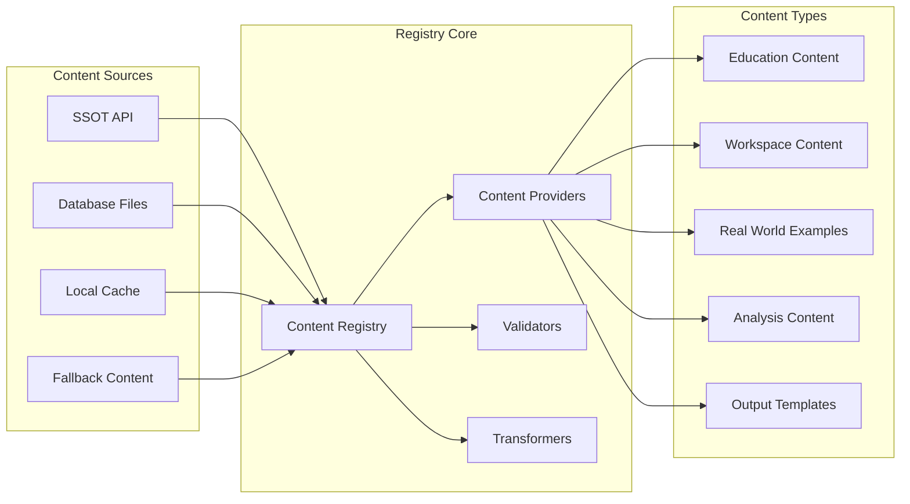

# Content Registry Pattern Specification
## Unified Content Management System

---

## Overview

The Content Registry Pattern provides a centralized, extensible system for managing all content injection across the application. This specification addresses the critical issue that **not all Real World Examples are implemented for all subcomponents**, providing graceful fallbacks and tracking mechanisms.

---

## Core Architecture



---

## Registry Implementation

### Base Registry Class
```javascript
// content-registry.js
class ContentRegistry {
  constructor() {
    this.providers = new Map();
    this.validators = new Map();
    this.transformers = new Map();
    this.fallbacks = new Map();
    this.completionTracker = new Map();
  }
  
  /**
   * Register a content type with its handlers
   */
  register(contentType, config) {
    this.providers.set(contentType, config.provider);
    this.validators.set(contentType, config.validator || this.defaultValidator);
    this.transformers.set(contentType, config.transformer || this.defaultTransformer);
    this.fallbacks.set(contentType, config.fallback || null);
    
    // Track which subcomponents have this content type
    if (config.availableFor) {
      this.completionTracker.set(contentType, new Set(config.availableFor));
    }
  }
  
  /**
   * Check if content exists for a specific subcomponent
   */
  hasContent(contentType, subcomponentId) {
    const tracker = this.completionTracker.get(contentType);
    return tracker ? tracker.has(subcomponentId) : false;
  }
  
  /**
   * Inject content with fallback handling
   */
  async inject(contentType, subcomponentId, targetElement) {
    try {
      // Check if content exists for this subcomponent
      if (!this.hasContent(contentType, subcomponentId)) {
        return this.injectFallback(contentType, targetElement);
      }
      
      // Get the provider
      const provider = this.providers.get(contentType);
      if (!provider) {
        throw new Error(`No provider registered for ${contentType}`);
      }
      
      // Fetch the data
      const data = await provider.fetch(subcomponentId);
      
      // Validate
      const validator = this.validators.get(contentType);
      if (!validator(data)) {
        console.warn(`Validation failed for ${contentType} on ${subcomponentId}`);
        return this.injectFallback(contentType, targetElement);
      }
      
      // Transform
      const transformer = this.transformers.get(contentType);
      const transformed = transformer(data, subcomponentId);
      
      // Inject
      await provider.inject(transformed, targetElement);
      
      // Audit
      this.audit('success', contentType, subcomponentId);
      
    } catch (error) {
      console.error(`Failed to inject ${contentType} for ${subcomponentId}:`, error);
      this.audit('failure', contentType, subcomponentId, error);
      return this.injectFallback(contentType, targetElement);
    }
  }
  
  /**
   * Inject fallback content when primary content unavailable
   */
  injectFallback(contentType, targetElement) {
    const fallback = this.fallbacks.get(contentType);
    if (fallback) {
      targetElement.innerHTML = fallback;
      targetElement.classList.add('content-fallback');
      this.audit('fallback', contentType);
    } else {
      targetElement.style.display = 'none';
      this.audit('hidden', contentType);
    }
  }
  
  /**
   * Audit trail for content operations
   */
  audit(status, contentType, subcomponentId, error = null) {
    const entry = {
      timestamp: new Date().toISOString(),
      status,
      contentType,
      subcomponentId,
      error: error ? error.message : null
    };
    
    // Log to console in development
    if (window.DEBUG_MODE) {
      console.log('Content Audit:', entry);
    }
    
    // Send to analytics
    if (window.analytics) {
      window.analytics.track('content_injection', entry);
    }
  }
}
```

---

## Content Providers

### Real World Examples Provider
```javascript
// providers/real-world-provider.js
class RealWorldExamplesProvider {
  constructor() {
    this.cache = new Map();
    this.implementedSubcomponents = new Set([
      '2-1', '2-2', '2-3', // Customer Insights block
      '7-1', '7-2', '7-3', // Quantifiable Impact block
      // ... list of subcomponents with real world examples
    ]);
  }
  
  /**
   * Check if examples exist for subcomponent
   */
  hasExamples(subcomponentId) {
    return this.implementedSubcomponents.has(subcomponentId);
  }
  
  /**
   * Fetch examples for a subcomponent
   */
  async fetch(subcomponentId) {
    // Check cache first
    if (this.cache.has(subcomponentId)) {
      return this.cache.get(subcomponentId);
    }
    
    // Check if implemented
    if (!this.hasExamples(subcomponentId)) {
      return null;
    }
    
    // Try to get from database
    const examples = window.realWorldExamplesComplete?.[subcomponentId] || 
                    window.realWorldExamples?.[subcomponentId];
    
    if (examples) {
      this.cache.set(subcomponentId, examples);
      return examples;
    }
    
    // Try API as last resort
    try {
      const response = await fetch(`/api/real-world-examples/${subcomponentId}`);
      if (response.ok) {
        const data = await response.json();
        this.cache.set(subcomponentId, data);
        return data;
      }
    } catch (error) {
      console.error('Failed to fetch from API:', error);
    }
    
    return null;
  }
  
  /**
   * Inject examples into DOM
   */
  async inject(examples, targetElement) {
    if (!examples || examples.length === 0) {
      targetElement.style.display = 'none';
      return;
    }
    
    const html = `
      <div class="real-world-examples">
        <h3>🌍 Real-World Examples</h3>
        <p>Learn from successful companies that built billion-dollar businesses:</p>
        ${examples.map(example => `
          <div class="example-card">
            <h4>${example.company}</h4>
            <div class="use-case">
              <strong>USE CASE:</strong>
              <p>"${example.useCase}"</p>
            </div>
            <div class="metrics">
              <span class="valuation">${example.valuation}</span>
              <span class="year">${example.year}</span>
            </div>
          </div>
        `).join('')}
      </div>
    `;
    
    targetElement.innerHTML = html;
    targetElement.style.display = 'block';
  }
}
```

### Education Content Provider
```javascript
// providers/education-provider.js
class EducationContentProvider {
  async fetch(subcomponentId) {
    // Education content comes from SSOT API
    const response = await fetch(`/api/subcomponents/${subcomponentId}`);
    const data = await response.json();
    return data.education;
  }
  
  async inject(content, targetElement) {
    // Implementation for education content injection
    targetElement.innerHTML = this.renderEducationContent(content);
  }
  
  renderEducationContent(content) {
    return `
      <div class="education-content">
        ${content.overview ? `<section>${content.overview}</section>` : ''}
        ${content.whyItMatters ? `<section>${content.whyItMatters}</section>` : ''}
        ${content.howToImplement ? `<section>${content.howToImplement}</section>` : ''}
      </div>
    `;
  }
}
```

---

## Content Validators

### Real World Examples Validator
```javascript
// validators/real-world-validator.js
class RealWorldExamplesValidator {
  validate(data) {
    if (!data) return false;
    if (!Array.isArray(data)) return false;
    
    return data.every(example => {
      return example.company && 
             example.useCase && 
             (example.valuation || example.metric) &&
             example.year;
    });
  }
}
```

### Generic Content Validator
```javascript
// validators/generic-validator.js
class GenericContentValidator {
  validate(data) {
    // Basic validation - data exists and is not empty
    if (!data) return false;
    if (typeof data === 'object' && Object.keys(data).length === 0) return false;
    if (Array.isArray(data) && data.length === 0) return false;
    return true;
  }
}
```

---

## Content Transformers

### Real World Examples Transformer
```javascript
// transformers/real-world-transformer.js
class RealWorldExamplesTransformer {
  transform(data, subcomponentId) {
    // Ensure consistent structure
    return data.map(example => ({
      company: example.company || example.name || 'Unknown',
      useCase: example.useCase || example.job || example.description || '',
      valuation: example.valuation || example.value || 'N/A',
      year: example.year || example.founded || 'N/A',
      category: example.category || this.inferCategory(subcomponentId)
    }));
  }
  
  inferCategory(subcomponentId) {
    const blockNumber = parseInt(subcomponentId.split('-')[0]);
    const categories = {
      1: 'Mission Discovery',
      2: 'Customer Insights',
      3: 'Strategic Prioritization',
      // ... etc
    };
    return categories[blockNumber] || 'General';
  }
}
```

---

## Fallback Content

### Real World Examples Fallback
```javascript
const realWorldFallback = `
  <div class="real-world-examples fallback">
    <h3>🌍 Real-World Examples</h3>
    <div class="coming-soon">
      <p>Real-world examples for this component are being researched and will be added soon.</p>
      <p>In the meantime, consider these general principles:</p>
      <ul>
        <li>Focus on solving specific customer problems</li>
        <li>Validate with real market feedback</li>
        <li>Iterate based on user behavior</li>
        <li>Measure impact quantitatively</li>
      </ul>
    </div>
  </div>
`;
```

---

## Registry Configuration

### Complete Registry Setup
```javascript
// registry-config.js
function setupContentRegistry() {
  const registry = new ContentRegistry();
  
  // Register Real World Examples
  registry.register('realWorldExamples', {
    provider: new RealWorldExamplesProvider(),
    validator: new RealWorldExamplesValidator(),
    transformer: new RealWorldExamplesTransformer(),
    fallback: realWorldFallback,
    availableFor: [
      '2-1', '2-2', '2-3', '2-4', '2-5', '2-6',
      '7-1', '7-2', '7-3', '7-4', '7-5', '7-6',
      // Add more as examples are created
    ]
  });
  
  // Register Education Content
  registry.register('education', {
    provider: new EducationContentProvider(),
    validator: new GenericContentValidator(),
    transformer: null, // Use default
    fallback: '<p>Education content loading...</p>',
    availableFor: 'all' // Available for all subcomponents
  });
  
  // Register Workspace Content
  registry.register('workspace', {
    provider: new WorkspaceContentProvider(),
    validator: new WorkspaceValidator(),
    transformer: new WorkspaceTransformer(),
    fallback: null, // No fallback - hide if unavailable
    availableFor: 'all'
  });
  
  // Register Analysis Content
  registry.register('analysis', {
    provider: new AnalysisContentProvider(),
    validator: new AnalysisValidator(),
    transformer: null,
    fallback: '<p>Run analysis to see results</p>',
    availableFor: 'all'
  });
  
  // Register Output Templates
  registry.register('templates', {
    provider: new TemplateProvider(),
    validator: new TemplateValidator(),
    transformer: new TemplateTransformer(),
    fallback: '<p>Templates not available for this component</p>',
    availableFor: 'all'
  });
  
  return registry;
}
```

---

## Usage Example

### In Unified Content Service
```javascript
// unified-content-service.js
class UnifiedContentService {
  constructor() {
    this.registry = setupContentRegistry();
  }
  
  async init(subcomponentId) {
    // Inject all content types
    await this.injectEducation(subcomponentId);
    await this.injectRealWorldExamples(subcomponentId);
    await this.injectWorkspace(subcomponentId);
  }
  
  async injectRealWorldExamples(subcomponentId) {
    const targetElement = document.getElementById('real-world-examples-section');
    if (!targetElement) return;
    
    // Registry handles everything: fetching, validation, transformation, injection, fallback
    await this.registry.inject('realWorldExamples', subcomponentId, targetElement);
  }
}
```

---

## Completion Tracking

### Real World Examples Tracker
```javascript
// tracking/completion-tracker.js
class CompletionTracker {
  constructor() {
    this.status = new Map();
  }
  
  async generateReport() {
    const report = {
      timestamp: new Date().toISOString(),
      totalSubcomponents: 96,
      contentTypes: {}
    };
    
    // Check Real World Examples
    const realWorldProvider = new RealWorldExamplesProvider();
    const realWorldComplete = [];
    const realWorldMissing = [];
    
    for (let block = 1; block <= 16; block++) {
      for (let sub = 1; sub <= 6; sub++) {
        const id = `${block}-${sub}`;
        if (realWorldProvider.hasExamples(id)) {
          realWorldComplete.push(id);
        } else {
          realWorldMissing.push(id);
        }
      }
    }
    
    report.contentTypes.realWorldExamples = {
      complete: realWorldComplete.length,
      missing: realWorldMissing.length,
      percentage: (realWorldComplete.length / 96 * 100).toFixed(1) + '%',
      completeList: realWorldComplete,
      missingList: realWorldMissing
    };
    
    return report;
  }
  
  async saveReport() {
    const report = await this.generateReport();
    const blob = new Blob([JSON.stringify(report, null, 2)], {type: 'application/json'});
    const url = URL.createObjectURL(blob);
    const a = document.createElement('a');
    a.href = url;
    a.download = `content-completion-report-${Date.now()}.json`;
    a.click();
  }
}
```

---

## Testing Strategy

### Registry Tests
```javascript
describe('Content Registry', () => {
  let registry;
  
  beforeEach(() => {
    registry = new ContentRegistry();
  });
  
  it('should handle missing content gracefully', async () => {
    const element = document.createElement('div');
    registry.register('test', {
      provider: {
        fetch: () => null,
        inject: jest.fn()
      },
      fallback: '<p>Fallback content</p>'
    });
    
    await registry.inject('test', 'unknown-id', element);
    expect(element.innerHTML).toBe('<p>Fallback content</p>');
  });
  
  it('should track content availability', () => {
    registry.register('realWorld', {
      provider: new RealWorldExamplesProvider(),
      availableFor: ['2-1', '2-2']
    });
    
    expect(registry.hasContent('realWorld', '2-1')).toBe(true);
    expect(registry.hasContent('realWorld', '3-1')).toBe(false);
  });
});
```

---

## Benefits

1. **Centralized Management**: Single point of control for all content
2. **Graceful Degradation**: Fallbacks when content unavailable
3. **Extensibility**: Easy to add new content types
4. **Tracking**: Know exactly what content is missing
5. **Consistency**: Uniform handling across all content types
6. **Testability**: Each component independently testable
7. **Performance**: Built-in caching and optimization

---

## Next Steps

1. Implement the registry pattern in code
2. Migrate existing content injectors to use registry
3. Create completion report for all content types
4. Add real-world examples for missing subcomponents
5. Set up automated testing
6. Deploy monitoring dashboard