# Educational Content Enhancement Plan
**Date:** 2025-10-06  
**Context:** Addressing feedback that educational content needs more explanation of what each subcomponent IS

---

## Current State Analysis

### What's Working Well ✅

Based on analysis of [`educational-content.js`](educational-content.js:1-3563), the current content excels at:

1. **Real-World Examples** (Lines 12-15, 53-57, etc.)
   - Concrete, specific examples
   - Quantified outcomes
   - Industry-relevant scenarios

2. **Key Success Metrics** (Lines 21-26, 63-68, etc.)
   - Measurable KPIs
   - Clear tracking methods
   - Actionable metrics

3. **Core Focus Areas** (Lines 27-46, 69-88, etc.)
   - Tools and templates
   - Best practices
   - Workspace guidance

### What Needs Enhancement ⚠️

**Issue:** The "what" section is often too brief and assumes prior knowledge

**Examples of Current "What" Sections:**

| Subcomponent | Current "What" | Issue |
|--------------|----------------|-------|
| 1-1 | "A focused, plain-language articulation..." | ✅ Good - explains concept clearly |
| 6-3 | "A quantitative framework for measuring..." | ⚠️ Vague - doesn't explain CS Dashboard specifically |
| 14-3 | "A comprehensive map of all business processes..." | ❌ Wrong - describes process automation, not dashboards |

---

## Enhancement Strategy

### 1. Expand "What" Sections

**Current Structure:**
```javascript
"what": "A brief one-sentence description"
```

**Enhanced Structure:**
```javascript
"what": {
    "definition": "One-sentence core definition",
    "purpose": "What this subcomponent accomplishes",
    "scope": "What it includes and excludes",
    "context": "Where it fits in the overall GTM journey",
    "keyComponents": ["Component 1", "Component 2", "Component 3"]
}
```

**Example Enhancement for "6-3: CS Dashboard":**

**Current:**
```javascript
"what": "A quantitative framework for measuring and scoring user engagement..."
```

**Enhanced:**
```javascript
"what": {
    "definition": "A Customer Success Dashboard is a centralized, real-time view of customer health, engagement, and outcome metrics designed specifically for CS teams to monitor accounts and drive proactive interventions.",
    
    "purpose": "The CS Dashboard serves as the command center for customer success operations, enabling teams to identify at-risk accounts, spot expansion opportunities, and track the overall health of the customer base at a glance.",
    
    "scope": {
        "includes": [
            "Customer health scores and trends",
            "Usage and engagement metrics",
            "Support ticket volume and sentiment",
            "Renewal risk indicators",
            "Expansion opportunity signals",
            "Team performance metrics"
        ],
        "excludes": [
            "Sales pipeline metrics (that's CRM)",
            "Product analytics (that's product team dashboards)",
            "Financial reporting (that's finance dashboards)"
        ]
    },
    
    "context": "The CS Dashboard sits at the intersection of product usage data, customer relationship data, and business outcome data. It's the primary tool CS teams use daily to prioritize their work and demonstrate value to leadership.",
    
    "keyComponents": [
        "Account health scoring system",
        "Real-time usage monitoring",
        "Renewal forecasting",
        "Expansion pipeline tracking",
        "Team productivity metrics",
        "Executive summary views"
    ]
}
```

### 2. Add "When to Use" Section

**New Section to Add:**
```javascript
"whenToUse": {
    "stage": "Post-PMF when you have 20+ customers",
    "triggers": [
        "CS team spending >2 hours/day gathering data manually",
        "Missing renewal opportunities due to lack of visibility",
        "Unable to prioritize which accounts need attention",
        "Leadership asking for CS metrics you can't easily provide"
    ],
    "prerequisites": [
        "Product analytics instrumented",
        "CRM data clean and current",
        "CS team established (at least 1 CSM)",
        "Defined customer health metrics"
    ]
}
```

### 3. Add "Common Misconceptions" Section

**New Section to Add:**
```javascript
"commonMisconceptions": [
    {
        "myth": "A CS Dashboard is just a report",
        "reality": "It's an operational tool for daily decision-making, not just reporting"
    },
    {
        "myth": "You need expensive software to build one",
        "reality": "Start with Google Sheets or Airtable, upgrade as you scale"
    },
    {
        "myth": "Only large companies need CS Dashboards",
        "reality": "Even with 10 customers, visibility prevents churn"
    }
]
```

### 4. Add "Maturity Levels" Section

**New Section to Add:**
```javascript
"maturityLevels": {
    "level1_basic": {
        "description": "Manual tracking in spreadsheets",
        "characteristics": [
            "Weekly manual data pulls",
            "Basic health scoring",
            "Reactive interventions"
        ],
        "suitableFor": "0-20 customers"
    },
    "level2_automated": {
        "description": "Automated dashboard with key metrics",
        "characteristics": [
            "Real-time data sync",
            "Automated health scoring",
            "Proactive alerts"
        ],
        "suitableFor": "20-100 customers"
    },
    "level3_predictive": {
        "description": "AI-powered predictive analytics",
        "characteristics": [
            "Churn prediction models",
            "Expansion opportunity scoring",
            "Automated playbook triggers"
        ],
        "suitableFor": "100+ customers"
    }
}
```

---

## Implementation Plan

### Phase 1: Content Audit (Week 1)

**Identify subcomponents with weak "what" sections:**

| Priority | Subcomponents | Issue |
|----------|---------------|-------|
| CRITICAL | 6-3, 6-4, 6-5, 6-6 | "What" doesn't explain the actual tool/framework |
| HIGH | 7-3, 7-4, 7-5, 7-6 | "What" is too generic |
| MEDIUM | 14-3, 14-4, 14-5, 14-6 | "What" describes wrong concept |
| LOW | 3-2, 3-3, 3-4, 3-5 | "What" could be more specific |

### Phase 2: Enhanced Schema Design (Week 1-2)

**Create new educational content schema:**

```javascript
const enhancedEducationalContent = {
    "subcomponent-id": {
        // ENHANCED: Expanded "what" section
        "what": {
            "definition": "One-sentence core definition",
            "purpose": "What this accomplishes",
            "scope": {
                "includes": ["Item 1", "Item 2"],
                "excludes": ["Not this", "Not that"]
            },
            "context": "Where it fits in GTM journey",
            "keyComponents": ["Component 1", "Component 2"]
        },
        
        // NEW: When to use this
        "whenToUse": {
            "stage": "Company stage/size",
            "triggers": ["Trigger 1", "Trigger 2"],
            "prerequisites": ["Prereq 1", "Prereq 2"]
        },
        
        // EXISTING: Keep these as-is (they're good)
        "why": "Importance and impact",
        "how": "Implementation guidance",
        "examples": ["Example 1", "Example 2"],
        "templates": ["Template 1", "Template 2"],
        "metrics": ["Metric 1", "Metric 2"],
        
        // NEW: Common misconceptions
        "commonMisconceptions": [
            {
                "myth": "Wrong belief",
                "reality": "Actual truth"
            }
        ],
        
        // NEW: Maturity levels
        "maturityLevels": {
            "level1_basic": { ... },
            "level2_automated": { ... },
            "level3_predictive": { ... }
        },
        
        // EXISTING: Workspace section (keep as-is)
        "workspace": { ... }
    }
};
```

### Phase 3: Content Generation (Week 2-3)

**Priority Order:**

1. **Week 2:** Fix CRITICAL subcomponents (6-3, 6-4, 6-5, 6-6)
2. **Week 3:** Fix HIGH priority (7-3, 7-4, 7-5, 7-6)
3. **Week 4:** Fix MEDIUM and LOW priority

**Generation Process:**

```mermaid
graph LR
    A[Read Current Content] --> B[Identify Gaps]
    B --> C[Research Subcomponent]
    C --> D[Write Enhanced What]
    D --> E[Add When To Use]
    E --> F[Add Misconceptions]
    F --> G[Add Maturity Levels]
    G --> H[Validate with SSOT]
    H --> I[Review & Approve]
    I --> J[Deploy]
```



### Phase 4: Integration with SSOT (Week 4)

**Ensure enhanced content aligns with SSOT Registry:**

```javascript
// In subcomponent-registry.js
const SUBCOMPONENT_REGISTRY = {
    "6-3": {
        id: "6-3",
        name: "CS Dashboard",  // SSOT name
        
        // Reference to enhanced educational content
        education: {
            source: "educational-content.js",
            key: "6-3",
            // Validation: content.what.definition must mention "CS Dashboard"
            validationRules: {
                titleMatch: true,
                definitionContainsName: true,
                scopeAligned: true
            }
        }
    }
};
```

---

## Specific Enhancements Needed

### Example 1: CS Dashboard (6-3)

**Current "What":**
> "A quantitative framework for measuring and scoring user engagement across multiple dimensions to predict retention and identify growth opportunities."

**Problem:** This describes an engagement scoring system, not a CS Dashboard

**Enhanced "What":**
```javascript
"what": {
    "definition": "A CS Dashboard is a centralized, real-time interface that aggregates customer health, usage, support, and outcome data into a single view for Customer Success teams to monitor account status and drive proactive interventions.",
    
    "purpose": "Provides CS teams with instant visibility into customer health across their entire book of business, enabling data-driven prioritization of outreach, early identification of churn risks, and systematic discovery of expansion opportunities.",
    
    "scope": {
        "includes": [
            "Customer health scores with trend indicators",
            "Product usage metrics and engagement levels",
            "Support ticket volume, type, and sentiment",
            "Renewal dates and risk assessments",
            "Expansion signals and upsell opportunities",
            "CS team activity and productivity metrics",
            "Executive summary views for leadership"
        ],
        "excludes": [
            "Sales pipeline and opportunity management (CRM function)",
            "Detailed product analytics (Product team's domain)",
            "Financial reporting and billing (Finance function)",
            "Marketing campaign performance (Marketing analytics)"
        ]
    },
    
    "context": "The CS Dashboard is the operational hub for post-sale customer management. It sits downstream from the CRM (which handles pre-sale) and upstream from renewal/expansion processes. Think of it as the 'mission control' for customer success operations.",
    
    "keyComponents": [
        "Account Health Scoring Engine - Combines usage, engagement, and outcome data",
        "At-Risk Account Alerts - Automated notifications for declining health",
        "Renewal Pipeline View - Upcoming renewals with risk assessment",
        "Expansion Opportunity Tracker - Accounts showing growth signals",
        "Team Performance Metrics - CSM productivity and effectiveness",
        "Executive Summary - High-level KPIs for leadership"
    ]
},

"whenToUse": {
    "stage": "Post-PMF with 20+ customers and at least 1 dedicated CSM",
    "triggers": [
        "CS team spending >2 hours/day manually gathering customer data",
        "Missing churn signals until it's too late to intervene",
        "Unable to prioritize which accounts need attention first",
        "Leadership asking for CS metrics you can't easily provide",
        "Renewals happening without proactive health assessment",
        "Expansion opportunities being missed due to lack of visibility"
    ],
    "prerequisites": [
        "Product usage analytics instrumented and tracking key events",
        "CRM data clean with accurate customer information",
        "At least 1 dedicated CSM or CS team established",
        "Defined customer health metrics and scoring methodology",
        "Support ticketing system with categorization",
        "Clear definition of customer success outcomes"
    ]
},

"commonMisconceptions": [
    {
        "myth": "A CS Dashboard is just a fancy report",
        "reality": "It's an operational tool for daily decision-making and intervention, not a static report. CS teams should be in it multiple times per day."
    },
    {
        "myth": "You need expensive CS platforms like Gainsight to have a dashboard",
        "reality": "Start with Google Sheets, Airtable, or Looker. Many companies run effective CS operations on simple tools until 100+ customers."
    },
    {
        "myth": "Only large companies with big CS teams need dashboards",
        "reality": "Even with 10 customers and 1 CSM, visibility prevents churn. The earlier you build visibility, the better your retention."
    },
    {
        "myth": "The dashboard should show every possible metric",
        "reality": "Focus on 5-7 key metrics that actually drive CS actions. Too many metrics create paralysis, not insight."
    }
],

"maturityLevels": {
    "level1_manual": {
        "description": "Spreadsheet-based tracking with weekly updates",
        "characteristics": [
            "Manual data entry from multiple sources",
            "Weekly or bi-weekly refresh cycle",
            "Basic health scoring (red/yellow/green)",
            "Reactive interventions based on obvious signals",
            "Limited historical trending"
        ],
        "suitableFor": "0-20 customers, 1 CSM",
        "tools": ["Google Sheets", "Excel", "Airtable"],
        "timeInvestment": "2-4 hours/week to maintain"
    },
    
    "level2_automated": {
        "description": "Automated dashboard with real-time data sync",
        "characteristics": [
            "Automated data pulls from product and CRM",
            "Daily or real-time refresh",
            "Multi-factor health scoring algorithm",
            "Proactive alerts for at-risk accounts",
            "Historical trending and cohort analysis",
            "Mobile access for on-the-go monitoring"
        ],
        "suitableFor": "20-100 customers, 2-5 CSMs",
        "tools": ["Looker", "Tableau", "Metabase", "ChartMogul"],
        "timeInvestment": "1-2 hours/week to maintain"
    },
    
    "level3_predictive": {
        "description": "AI-powered predictive analytics with automated playbooks",
        "characteristics": [
            "Machine learning churn prediction models",
            "Automated expansion opportunity scoring",
            "Triggered playbooks based on health changes",
            "Predictive analytics for renewal likelihood",
            "Sentiment analysis from support tickets",
            "Automated reporting to executives"
        ],
        "suitableFor": "100+ customers, 5+ CSMs",
        "tools": ["Gainsight", "Totango", "ChurnZero", "Catalyst"],
        "timeInvestment": "30 min/week to review and adjust"
    }
}
```

---

## Enhanced Content Template

### Standard Structure for All 96 Subcomponents

```javascript
{
    "title": "Exact Subcomponent Name from SSOT",
    
    // ENHANCED: Comprehensive "what" explanation
    "what": {
        "definition": "Clear, jargon-free one-sentence definition",
        "purpose": "What problem this solves and what outcome it delivers",
        "scope": {
            "includes": ["Specific element 1", "Specific element 2", "..."],
            "excludes": ["What this is NOT", "Common confusion", "..."]
        },
        "context": "Where this fits in the GTM journey and how it relates to other subcomponents",
        "keyComponents": ["Core component 1", "Core component 2", "..."]
    },
    
    // NEW: When to implement this
    "whenToUse": {
        "stage": "Company stage, size, or milestone",
        "triggers": ["Signal 1 that you need this", "Signal 2", "..."],
        "prerequisites": ["What must exist first", "Required foundation", "..."]
    },
    
    // EXISTING: Keep as-is (these are good)
    "why": "Importance, impact, and business case",
    "how": "Step-by-step implementation guidance with HTML formatting",
    "examples": ["Real-world example 1", "Example 2", "..."],
    "templates": ["Template 1", "Template 2", "Template 3"],
    "metrics": ["KPI 1", "KPI 2", "..."],
    
    // NEW: Clear up confusion
    "commonMisconceptions": [
        {
            "myth": "Common wrong belief",
            "reality": "Actual truth with explanation"
        }
    ],
    
    // NEW: Progression path
    "maturityLevels": {
        "level1_basic": {
            "description": "Starting point",
            "characteristics": ["Trait 1", "Trait 2"],
            "suitableFor": "Company size/stage",
            "tools": ["Tool 1", "Tool 2"],
            "timeInvestment": "Hours per week"
        },
        "level2_intermediate": { ... },
        "level3_advanced": { ... }
    },
    
    // EXISTING: Keep workspace section (it's comprehensive)
    "workspace": {
        "tools": ["Tool 1", "Tool 2", "..."],
        "templates": ["Template 1", "Template 2", "..."],
        "bestPractices": ["Practice 1", "Practice 2", "..."]
    }
}
```

---

## Priority Subcomponents for Enhancement

### Tier 1: CRITICAL (Fix First)

These have the weakest "what" sections or misaligned content:

1. **6-3: CS Dashboard** - Current "what" describes engagement scoring, not dashboards
2. **6-4: Activation Metric Model** - Too vague about what activation metrics are
3. **6-5: Feedback Collector** - Doesn't explain the collection system
4. **6-6: Power User Behavior Signals** - Unclear what signals to track
5. **14-3: Internal Dashboards** - Describes process automation instead
6. **14-4: Tool Consolidation Tracker** - Describes data infrastructure instead
7. **14-5: RevOps Playbook** - Describes security instead
8. **14-6: Internal SLA Policy** - Describes scalability instead

### Tier 2: HIGH (Fix Second)

These need more depth and context:

9. **7-3: Productivity Lift Metrics** - Needs clearer scope definition
10. **7-4: Net Retention Trends** - Should explain trend analysis specifically
11. **7-5: Downstream System Reductions** - Unclear what "downstream" means
12. **7-6: Friction Reduction Evidence** - Needs concrete examples of friction
13. **8-2: Team Expansion Signals** - Should detail specific signals
14. **8-3: Organic Adoption Pattern** - Needs pattern explanation
15. **8-4: Champion Mapping** - Should explain mapping methodology
16. **8-5: CSAT/NPS Tracking** - Needs tracking system details

### Tier 3: MEDIUM (Enhance for Completeness)

These are adequate but could benefit from enhancements:

17-32. Various subcomponents in Blocks 3, 5, 9-13

---

## Content Generation Guidelines

### Writing Standards

1. **Definition (First Sentence)**
   - Start with "A [subcomponent name] is..."
   - Use plain language, avoid jargon
   - Include the WHO, WHAT, and WHY in one sentence
   - Maximum 25 words

2. **Purpose (Second Paragraph)**
   - Explain the specific problem it solves
   - Describe the outcome it delivers
   - Connect to business impact
   - 2-3 sentences maximum

3. **Scope (Bulleted Lists)**
   - "Includes" list: 5-7 specific elements
   - "Excludes" list: 3-5 common confusions
   - Be concrete and specific
   - Use parallel structure

4. **Context (Third Paragraph)**
   - Explain where it fits in the GTM journey
   - Reference related subcomponents
   - Describe dependencies
   - 2-3 sentences maximum

5. **Key Components (Bulleted List)**
   - List 4-6 core elements
   - Each with brief description
   - Ordered by importance
   - Actionable and specific

### Quality Checklist

Before finalizing enhanced content, verify:

- [ ] Definition mentions subcomponent name explicitly
- [ ] Purpose is clear to someone unfamiliar with the concept
- [ ] Scope clearly differentiates from similar concepts
- [ ] Context explains GTM journey placement
- [ ] Key components are specific and actionable
- [ ] "When to use" provides clear triggers
- [ ] Misconceptions address real confusion points
- [ ] Maturity levels show progression path
- [ ] All content aligns with SSOT subcomponent name
- [ ] No jargon without explanation

---

## Integration with SSOT Architecture

### Validation Rules

The enhanced educational content must pass these validations:

```javascript
// In validation-engine.js
class EducationalContentValidator {
    validate(registry, educationalContent) {
        const errors = [];
        
        for (const [id, subcomponent] of Object.entries(registry)) {
            const content = educationalContent[id];
            
            // Rule 1: Content must exist
            if (!content) {
                errors.push({
                    type: 'MISSING_CONTENT',
                    subcomponentId: id,
                    severity: 'CRITICAL'
                });
                continue;
            }
            
            // Rule 2: Title must match SSOT name exactly
            if (content.title !== subcomponent.name) {
                errors.push({
                    type: 'TITLE_MISMATCH',
                    subcomponentId: id,
                    expected: subcomponent.name,
                    actual: content.title,
                    severity: 'CRITICAL'
                });
            }
            
            // Rule 3: Definition must mention subcomponent name
            if (content.what?.definition) {
                const defLower = content.what.definition.toLowerCase();
                const nameLower = subcomponent.name.toLowerCase();
                
                if (!defLower.includes(nameLower)) {
                    errors.push({
                        type: 'DEFINITION_MISSING_NAME',
                        subcomponentId: id,
                        name: subcomponent.name,
                        severity: 'HIGH'
                    });
                }
            }
            
            // Rule 4: Required sections must exist
            const requiredSections = ['what', 'why', 'how', 'examples'];
            requiredSections.forEach(section => {
                if (!content[section]) {
                    errors.push({
                        type: 'MISSING_SECTION',
                        subcomponentId: id,
                        section,
                        severity: 'HIGH'
                    });
                }
            });
        }
        
        return {
            passed: errors.length === 0,
            errors
        };
    }
}
```

---

## Migration Strategy for Enhanced Content

### Backward Compatibility

**Approach:** Support both old and new formats during transition

```javascript
// Content accessor with fallback
function getEducationalContent(subcomponentId) {
    const content = educationalContent[subcomponentId];
    
    if (!content) return null;
    
    // Handle both old and new formats
    return {
        title: content.title,
        
        // New format
        what: typeof content.what === 'object' 
            ? content.what.definition 
            : content.what,
        
        // Expanded what (if available)
        whatExpanded: typeof content.what === 'object'
            ? content.what
            : null,
        
        // Rest of content
        why: content.why,
        how: content.how,
        examples: content.examples,
        templates: content.templates,
        metrics: content.metrics,
        workspace: content.workspace,
        
        // New sections (optional)
        whenToUse: content.whenToUse || null,
        commonMisconceptions: content.commonMisconceptions || [],
        maturityLevels: content.maturityLevels || null
    };
}
```

### Gradual Rollout

**Phase 1:** Enhance 8 CRITICAL subcomponents  
**Phase 2:** Enhance 8 HIGH priority subcomponents  
**Phase 3:** Enhance remaining 80 subcomponents  

Each phase includes:
1. Content generation
2. Validation against SSOT
3. User testing with 2-3 subcomponents
4. Deployment
5. Monitoring for issues

---

## Success Metrics

### Content Quality Metrics

- **Clarity Score:** User survey rating (target: 4.5/5)
- **Comprehension:** % users who understand after reading (target: 90%)
- **Completeness:** All required sections present (target: 100%)
- **Accuracy:** Content matches subcomponent purpose (target: 100%)

### User Experience Metrics

- **Time to Understanding:** How long to grasp concept (target: <3 min)
- **Confidence Score:** User confidence in applying concept (target: 4/5)
- **Engagement:** % users who read full content (target: 70%)
- **Satisfaction:** Overall content satisfaction (target: 4.5/5)

### Business Impact Metrics

- **Completion Rate:** % users who complete worksheets (target: +20%)
- **Quality of Responses:** Depth and relevance of answers (target: +30%)
- **Time to Complete:** Efficiency improvement (target: -15%)
- **Support Tickets:** Reduction in "what is this?" questions (target: -50%)

---

## Recommendation

**Immediate Action:** Enhance the 8 CRITICAL subcomponents (Tier 1) as a proof of concept

**Rationale:**
1. These have the most significant content gaps
2. They're in high-traffic blocks (6, 14)
3. Quick win demonstrates value of enhancement
4. Can validate approach before scaling to all 96

**Estimated Effort:**
- 2-3 hours per subcomponent for research and writing
- 16-24 hours total for 8 subcomponents
- 1 week with dedicated focus

**Next Steps:**
1. Approve enhanced content schema
2. Select 2-3 subcomponents for pilot enhancement
3. Generate enhanced content
4. User test with 5-10 users
5. Refine based on feedback
6. Scale to remaining subcomponents

---

**Prepared by:** Kilo Code (Architect Mode)  
**Status:** Ready for review and pilot implementation