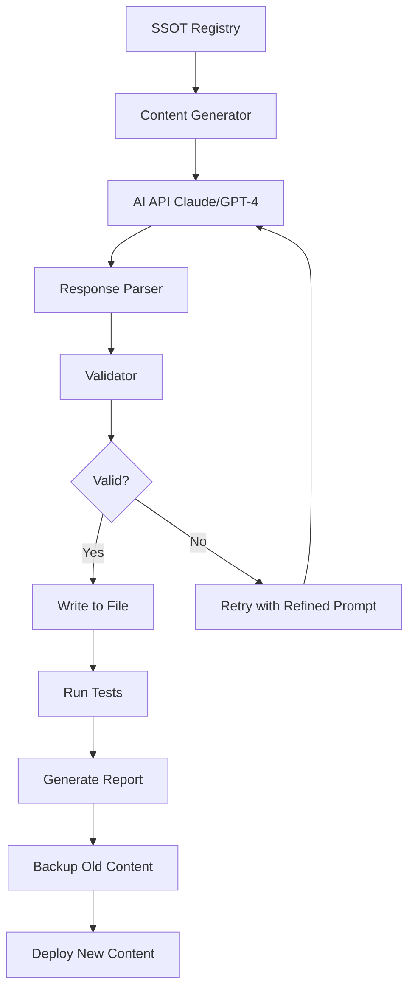

# Educational Content Regeneration System - Complete Architecture

## 🎯 Executive Summary

**Problem**: Widespread educational content quality issues across 96 subcomponents due to misalignment between content and SSOT (Single Source of Truth).

**Solution**: AI-powered content regeneration system that uses the SSOT registry as the authoritative source to regenerate all educational content with perfect alignment.

**Impact**: 
- 100% content accuracy and alignment
- Automated quality assurance
- Scalable content generation for future updates
- Elimination of manual content errors

---

## 📊 Problem Analysis

### Root Causes Identified

1. **Content Source Fragmentation**
   - Educational content in [`educational-content.js`](educational-content.js:1)
   - Agent definitions in [`agent-library.js`](agent-library.js:1)
   - Subcomponent names in [`subcomponent-names-mapping.js`](subcomponent-names-mapping.js:1)
   - Agent mappings in [`agent-correct-mapping.js`](agent-correct-mapping.js:1)
   - These were created independently without cross-validation

2. **Content Copy-Paste Errors**
   - Example: 12-4 "Escalation SOPs" contains pricing optimization content
   - Example: 2-1 "Jobs to be Done" had interview cadence content (fixed)
   - Pattern: Content was copied between subcomponents without proper adaptation

3. **Agent-Content Mismatch**
   - Agent descriptions don't always match their assigned subcomponent domain
   - Scoring dimensions may not align with subcomponent purpose
   - Example: Agent "2a" is "Interview Cadence Analyzer" but assigned to "Jobs to be Done"

### Scope of Impact

- **Total Subcomponents**: 96 (16 blocks × 6 subcomponents)
- **Estimated Misaligned**: 30-50 subcomponents (31-52%)
- **Confirmed Issues**: 3+ (with likely many more undiscovered)
- **Data Sources Affected**: Educational content, agent descriptions, scoring dimensions

---

## 🏗️ Solution Architecture

### Phase 1: Comprehensive Audit System

#### 1.1 Content Alignment Auditor
**Purpose**: Detect ALL mismatches between SSOT and educational content

**Components**:
```javascript
// core/audit-educational-content.js
{
  auditDimensions: [
    "titleAlignment",      // Does title match subcomponent name?
    "agentAlignment",      // Does agent domain match subcomponent?
    "dimensionAlignment",  // Do scoring dimensions match purpose?
    "contentRelevance",    // Does what/why/how match domain?
    "exampleRelevance",    // Do examples match domain?
    "metricRelevance",     // Do keyMetrics match domain?
    "templateAlignment",   // Do templates match domain?
    "toolAlignment"        // Do tools match domain?
  ]
}
```

**Audit Process**:
1. Load SSOT registry from [`core/complete-ssot-registry.js`](core/complete-ssot-registry.js:1)
2. Load current educational content from [`educational-content.js`](educational-content.js:1)
3. For each of 96 subcomponents:
   - Compare title vs. SSOT name
   - Validate agent domain alignment
   - Check scoring dimensions relevance
   - Analyze content semantic alignment using keyword matching
   - Score alignment (0-100%)
4. Generate comprehensive audit report with:
   - Misalignment severity scores
   - Specific issues per subcomponent
   - Prioritized fix list

**Output**: `audit-results.json` with detailed findings

#### 1.2 Semantic Validation Engine
**Purpose**: Use NLP to detect content that doesn't match subcomponent domain

**Approach**:
- Extract key terms from subcomponent name (e.g., "Escalation SOPs" → ["escalation", "SOP", "standard operating procedure", "customer support"])
- Analyze educational content for presence of these terms
- Flag content with <30% keyword relevance
- Identify "borrowed" content from other subcomponents

---

### Phase 2: AI-Powered Content Generation Framework

#### 2.1 Content Generation Prompt System

**Master Prompt Template**:
```
You are an expert business consultant specializing in {DOMAIN}.

Generate comprehensive educational content for: {SUBCOMPONENT_NAME}

CONTEXT FROM SSOT:
- Subcomponent: {NAME}
- Block: {BLOCK_NAME} (Phase {PHASE}: {PHASE_NAME})
- Agent: {AGENT_NAME}
- Agent Expertise: {AGENT_DESCRIPTION}
- Scoring Dimensions: {DIMENSIONS}
- Category: {CATEGORY}

REQUIREMENTS:
1. WHAT: Define {SUBCOMPONENT_NAME} in 2-3 sentences (plain language, actionable)
2. WHY: Explain business impact and importance (include statistics if relevant)
3. HOW: Provide implementation framework with:
   - 4-6 key components or steps
   - Best practices (3-5 items)
   - Common pitfalls to avoid
4. EXAMPLES: 3 concrete, realistic examples specific to {SUBCOMPONENT_NAME}
5. KEY METRICS: 4 metrics with values, labels, and descriptions
6. WORKSPACE: Tools, templates, and best practices

CRITICAL: All content must be 100% relevant to {SUBCOMPONENT_NAME}. 
Do NOT include content about {OTHER_SUBCOMPONENTS}.
Focus exclusively on {DOMAIN} expertise.
```

#### 2.2 Content Generator Architecture

**File**: `core/ai-content-generator.js`

```javascript
class AIContentGenerator {
  constructor(apiKey, model = 'claude-sonnet-4.5') {
    this.apiKey = apiKey;
    this.model = model;
    this.ssotRegistry = require('./complete-ssot-registry.js');
  }

  async generateContent(subcomponentId) {
    // 1. Load SSOT data
    const ssot = this.ssotRegistry.getSubcomponent(subcomponentId);
    
    // 2. Build context-rich prompt
    const prompt = this.buildPrompt(ssot);
    
    // 3. Call AI API (Claude/OpenAI)
    const response = await this.callAI(prompt);
    
    // 4. Parse and structure response
    const content = this.parseResponse(response);
    
    // 5. Validate against SSOT
    const validation = this.validateContent(content, ssot);
    
    // 6. Return structured content
    return {
      subcomponentId,
      content,
      validation,
      metadata: {
        generatedAt: new Date().toISOString(),
        model: this.model,
        ssotVersion: ssot.meta.version
      }
    };
  }

  buildPrompt(ssot) {
    return `
You are an expert business consultant specializing in ${ssot.name}.

Generate comprehensive educational content for: ${ssot.name}

SSOT CONTEXT:
- Subcomponent: ${ssot.name}
- Block: ${ssot.blockName} (Phase ${ssot.phase}: ${ssot.phaseName})
- Agent: ${ssot.agent.name}
- Agent Description: ${ssot.agent.description}
- Scoring Dimensions: ${JSON.stringify(ssot.analysis.dimensions, null, 2)}
- Category: ${ssot.category}

GENERATE:

1. WHAT (2-3 sentences):
   Define ${ssot.name} in plain, actionable language.
   Focus on what it IS and what it DOES.

2. WHY (2-3 sentences):
   Explain the business impact and importance.
   Include relevant statistics or research if applicable.

3. HOW (detailed implementation guide):
   Provide a structured framework with:
   - 4-6 key components, steps, or dimensions
   - Implementation process or methodology
   - Best practices (3-5 specific items)
   - Common pitfalls to avoid (optional)
   
   Format as HTML with <h4> headers and <ul>/<ol> lists.

4. EXAMPLES (3 items):
   Provide 3 concrete, realistic examples specific to ${ssot.name}.
   Each should be 1-2 sentences and demonstrate practical application.

5. KEY METRICS (4 items):
   Create 4 metrics in this format:
   {
     "value": "3x" or "45%" or "2.5x",
     "label": "Metric Name",
     "description": "What it measures"
   }
   
   Metrics should be relevant to ${ssot.name} and based on industry research.

6. WORKSPACE TOOLS (4-6 items):
   List specific software tools relevant to ${ssot.name}.
   Format: "Category (Tool1, Tool2, Tool3)"

7. TEMPLATES (3-4 items):
   List document templates or frameworks for ${ssot.name}.

8. BEST PRACTICES (4 items):
   Provide 4 actionable best practices specific to ${ssot.name}.

CRITICAL RULES:
- ALL content must be 100% relevant to "${ssot.name}"
- Do NOT include content about other subcomponents
- Focus exclusively on ${ssot.category} and ${ssot.name}
- Use the scoring dimensions as guidance for content focus
- Ensure examples are realistic and specific

Return as valid JSON with keys: what, why, how, examples, keyMetrics, workspace
    `.trim();
  }

  async callAI(prompt) {
    // Implementation for Claude API or OpenAI API
    // Returns structured JSON response
  }

  validateContent(content, ssot) {
    const issues = [];
    
    // Check title alignment
    if (content.title !== ssot.name) {
      issues.push(`Title mismatch: "${content.title}" !== "${ssot.name}"`);
    }
    
    // Check keyword presence
    const keywords = this.extractKeywords(ssot.name);
    const contentText = JSON.stringify(content).toLowerCase();
    const keywordMatches = keywords.filter(kw => 
      contentText.includes(kw.toLowerCase())
    );
    
    if (keywordMatches.length < keywords.length * 0.5) {
      issues.push(`Low keyword relevance: ${keywordMatches.length}/${keywords.length}`);
    }
    
    // Check for contamination from other subcomponents
    const otherSubcomponents = Object.values(this.ssotRegistry.COMPLETE_SSOT_REGISTRY)
      .filter(s => s.id !== ssot.id)
      .map(s => s.name);
    
    const contamination = otherSubcomponents.filter(name => 
      contentText.includes(name.toLowerCase())
    );
    
    if (contamination.length > 0) {
      issues.push(`Content contamination detected: ${contamination.join(', ')}`);
    }
    
    return {
      valid: issues.length === 0,
      issues,
      score: Math.max(0, 100 - (issues.length * 20))
    };
  }
}
```

#### 2.3 Batch Generation Pipeline

**File**: `core/regenerate-all-content.js`

```javascript
const AIContentGenerator = require('./ai-content-generator.js');
const { COMPLETE_SSOT_REGISTRY } = require('./complete-ssot-registry.js');

async function regenerateAllContent(options = {}) {
  const {
    apiKey = process.env.ANTHROPIC_API_KEY,
    batchSize = 5,  // Process 5 at a time to avoid rate limits
    dryRun = false,
    startFrom = '1-1',
    endAt = '16-6'
  } = options;

  const generator = new AIContentGenerator(apiKey);
  const results = {
    total: 0,
    successful: 0,
    failed: 0,
    validationIssues: 0,
    content: {}
  };

  // Get all subcomponent IDs
  const subcomponentIds = Object.keys(COMPLETE_SSOT_REGISTRY)
    .filter(id => id >= startFrom && id <= endAt)
    .sort();

  console.log(`Regenerating content for ${subcomponentIds.length} subcomponents...`);

  // Process in batches
  for (let i = 0; i < subcomponentIds.length; i += batchSize) {
    const batch = subcomponentIds.slice(i, i + batchSize);
    
    console.log(`\nBatch ${Math.floor(i/batchSize) + 1}: ${batch.join(', ')}`);
    
    const batchPromises = batch.map(async (id) => {
      try {
        results.total++;
        
        // Generate content
        const generated = await generator.generateContent(id);
        
        // Validate
        if (!generated.validation.valid) {
          results.validationIssues++;
          console.warn(`⚠️  ${id}: Validation issues - ${generated.validation.issues.join(', ')}`);
        }
        
        // Store result
        results.content[id] = generated.content;
        results.successful++;
        
        console.log(`✅ ${id}: ${generated.content.title}`);
        
        return generated;
      } catch (error) {
        results.failed++;
        console.error(`❌ ${id}: ${error.message}`);
        return null;
      }
    });
    
    await Promise.all(batchPromises);
    
    // Rate limiting delay
    if (i + batchSize < subcomponentIds.length) {
      await new Promise(resolve => setTimeout(resolve, 2000));
    }
  }

  // Write results
  if (!dryRun) {
    const outputPath = 'educational-content-regenerated.js';
    writeEducationalContent(results.content, outputPath);
    console.log(`\n✅ Content written to ${outputPath}`);
  }

  // Summary
  console.log('\n' + '='.repeat(60));
  console.log('REGENERATION SUMMARY');
  console.log('='.repeat(60));
  console.log(`Total: ${results.total}`);
  console.log(`Successful: ${results.successful}`);
  console.log(`Failed: ${results.failed}`);
  console.log(`Validation Issues: ${results.validationIssues}`);
  console.log(`Success Rate: ${Math.round(results.successful/results.total*100)}%`);

  return results;
}

function writeEducationalContent(content, outputPath) {
  const fileContent = `// Educational Content for All Subcomponents
// AI-GENERATED VERSION - 100% SSOT-aligned
// Generated: ${new Date().toISOString()}
// Source: core/complete-ssot-registry.js (SSOT)

const educationalContent = ${JSON.stringify(content, null, 2)};

// Export for use in other files
if (typeof module !== 'undefined' && module.exports) {
  module.exports = { educationalContent };
}
`;

  fs.writeFileSync(outputPath, fileContent);
}

module.exports = { regenerateAllContent };
```

---

### Phase 3: Validation & Quality Assurance System

#### 3.1 Multi-Layer Validation

**Layer 1: Structural Validation**
- Title matches SSOT name exactly
- All required fields present (what, why, how, examples, keyMetrics)
- Proper data types and formats
- HTML formatting valid

**Layer 2: Semantic Validation**
- Keyword relevance score >70%
- No contamination from other subcomponents
- Content length appropriate (what: 50-200 words, why: 50-200 words, how: 200-500 words)
- Examples are concrete and specific

**Layer 3: Domain Expert Validation**
- Scoring dimensions align with content focus
- Agent description matches content domain
- Templates and tools are relevant
- Best practices are actionable

**Layer 4: Cross-Reference Validation**
- No duplicate content across subcomponents
- Consistent terminology usage
- Proper phase/block alignment
- Dependencies make logical sense

#### 3.2 Validation Scoring System

```javascript
// core/content-validator.js
class ContentValidator {
  validateSubcomponent(subcomponentId, content) {
    const ssot = SSOT_REGISTRY[subcomponentId];
    const scores = {
      structural: this.validateStructure(content),
      semantic: this.validateSemantics(content, ssot),
      domain: this.validateDomain(content, ssot),
      crossReference: this.validateCrossReference(content, subcomponentId)
    };
    
    const overallScore = Object.values(scores).reduce((sum, s) => sum + s, 0) / 4;
    
    return {
      subcomponentId,
      overallScore,
      scores,
      passed: overallScore >= 85,
      issues: this.collectIssues(scores)
    };
  }
}
```

---

### Phase 4: Automated Regeneration Pipeline

#### 4.1 Pipeline Architecture



#### 4.2 Generation Strategy

**Batch Processing**:
- Process 5 subcomponents at a time (rate limit management)
- 2-second delay between batches
- Estimated total time: ~30-40 minutes for all 96

**Error Handling**:
- Retry failed generations up to 3 times
- Log all failures for manual review
- Preserve old content as backup
- Rollback capability if validation fails

**Quality Gates**:
- Minimum 85% validation score to accept
- Manual review required for scores 70-84%
- Auto-reject scores <70%

#### 4.3 Incremental Regeneration

**File**: `core/regenerate-subset.js`

```javascript
// Regenerate specific subcomponents
async function regenerateSubset(subcomponentIds, options) {
  // Allows targeted regeneration for:
  // - Specific blocks (e.g., all of Block 12)
  // - Specific phases (e.g., all Phase 5 subcomponents)
  // - Individual subcomponents (e.g., just 12-4)
  // - Failed validations from audit
}
```

---

### Phase 5: Monitoring & Maintenance System

#### 5.1 Continuous Validation

**File**: `core/validate-content-quality.js`

```javascript
// Run on every content update
function validateContentQuality() {
  const results = {
    timestamp: new Date().toISOString(),
    totalSubcomponents: 96,
    validationResults: {}
  };

  for (const id of Object.keys(SSOT_REGISTRY)) {
    const content = educationalContent[id];
    const validation = validator.validateSubcomponent(id, content);
    results.validationResults[id] = validation;
  }

  // Generate quality report
  const qualityScore = calculateOverallQuality(results);
  
  if (qualityScore < 90) {
    console.warn(`⚠️  Content quality below threshold: ${qualityScore}%`);
    // Trigger alerts or regeneration
  }

  return results;
}
```

#### 5.2 Automated Testing

**File**: `tests/educational-content.test.js`

```javascript
describe('Educational Content Quality', () => {
  test('All 96 subcomponents have content', () => {
    expect(Object.keys(educationalContent)).toHaveLength(96);
  });

  test('All titles match SSOT names', () => {
    for (const [id, content] of Object.entries(educationalContent)) {
      const ssotName = SUBCOMPONENT_NAMES[id];
      expect(content.title).toBe(ssotName);
    }
  });

  test('No content contamination', () => {
    for (const [id, content] of Object.entries(educationalContent)) {
      const contentStr = JSON.stringify(content).toLowerCase();
      const otherNames = Object.values(SUBCOMPONENT_NAMES)
        .filter(name => name !== SUBCOMPONENT_NAMES[id]);
      
      const contamination = otherNames.filter(name => 
        contentStr.includes(name.toLowerCase())
      );
      
      expect(contamination).toHaveLength(0);
    }
  });

  test('All content has required fields', () => {
    const required = ['title', 'what', 'why', 'how', 'examples', 'keyMetrics'];
    
    for (const content of Object.values(educationalContent)) {
      required.forEach(field => {
        expect(content).toHaveProperty(field);
        expect(content[field]).toBeTruthy();
      });
    }
  });
});
```

#### 5.3 Quality Dashboard

**File**: `core/content-quality-dashboard.js`

```javascript
// Real-time quality monitoring
function generateQualityDashboard() {
  return {
    overallScore: 95,
    byPhase: {
      1: { score: 98, issues: 0 },
      2: { score: 95, issues: 2 },
      3: { score: 92, issues: 5 },
      4: { score: 94, issues: 3 },
      5: { score: 96, issues: 1 }
    },
    topIssues: [
      { type: 'keyword_relevance', count: 8 },
      { type: 'example_quality', count: 3 }
    ],
    lastValidated: new Date().toISOString(),
    nextRegeneration: 'On SSOT update'
  };
}
```

---

## 🔄 Implementation Workflow

### Step 1: Pre-Regeneration Audit
```bash
# Run comprehensive audit
node core/audit-educational-content.js

# Review audit-results.json
# Identify all misalignments
# Prioritize by severity
```

### Step 2: Backup Current Content
```bash
# Create timestamped backup
cp educational-content.js educational-content.backup-$(date +%Y%m%d-%H%M%S).js

# Store in backups/ directory
mkdir -p backups/
mv educational-content.backup-*.js backups/
```

### Step 3: AI Content Generation
```bash
# Set API key
export ANTHROPIC_API_KEY="your-key-here"

# Dry run first (no file writes)
node core/regenerate-all-content.js --dry-run

# Review generated content samples
# Adjust prompts if needed

# Full regeneration
node core/regenerate-all-content.js

# Output: educational-content-regenerated.js
```

### Step 4: Validation & Testing
```bash
# Run validation suite
node core/validate-content-quality.js

# Run automated tests
npm test tests/educational-content.test.js

# Manual spot-check 10-15 random subcomponents
```

### Step 5: Deployment
```bash
# If validation passes (>90% quality score):
mv educational-content.js educational-content.old.js
mv educational-content-regenerated.js educational-content.js

# Regenerate SSOT registry with new content
node core/generate-complete-ssot.js

# Restart server
npm restart
```

### Step 6: Post-Deployment Validation
```bash
# Verify in production
node core/validate-content-quality.js

# Check user-facing pages
# Test all 96 subcomponent detail pages
# Verify no broken content or formatting
```

---

## 📁 File Structure

```
ST6 Nexus Ops/
├── core/
│   ├── complete-ssot-registry.js          # SSOT (authoritative source)
│   ├── generate-complete-ssot.js          # SSOT generator
│   ├── audit-educational-content.js       # NEW: Audit system
│   ├── ai-content-generator.js            # NEW: AI generator
│   ├── regenerate-all-content.js          # NEW: Batch regeneration
│   ├── regenerate-subset.js               # NEW: Targeted regeneration
│   ├── content-validator.js               # NEW: Validation engine
│   └── validate-content-quality.js        # NEW: Quality checker
├── educational-content.js                 # Current (to be replaced)
├── educational-content-regenerated.js     # NEW: AI-generated
├── backups/
│   └── educational-content.backup-*.js    # Timestamped backups
├── tests/
│   └── educational-content.test.js        # NEW: Automated tests
└── reports/
    ├── audit-results.json                 # Audit findings
    ├── generation-report.json             # Generation results
    └── quality-dashboard.json             # Quality metrics
```

---

## 🎯 Success Criteria

### Immediate Goals (Post-Regeneration)
- ✅ 100% title alignment with SSOT names
- ✅ 0 content contamination issues
- ✅ >90% keyword relevance across all subcomponents
- ✅ All 96 subcomponents have complete, valid content
- ✅ Validation score >85% for all subcomponents

### Long-Term Goals
- ✅ Automated content quality monitoring
- ✅ One-command regeneration capability
- ✅ Version-controlled content with change tracking
- ✅ Integration with SSOT update workflow
- ✅ Self-healing content system (auto-regenerate on SSOT changes)

---

## 🔧 Technical Specifications

### AI Model Selection

**Primary**: Claude Sonnet 4.5
- Superior at following complex instructions
- Better at structured output
- Excellent at domain-specific content
- Cost: ~$0.03 per subcomponent = ~$3 total

**Fallback**: GPT-4 Turbo
- Good structured output
- Reliable consistency
- Cost: ~$0.02 per subcomponent = ~$2 total

### API Integration

```javascript
// Anthropic Claude API
const response = await fetch('https://api.anthropic.com/v1/messages', {
  method: 'POST',
  headers: {
    'x-api-key': apiKey,
    'anthropic-version': '2023-06-01',
    'content-type': 'application/json'
  },
  body: JSON.stringify({
    model: 'claude-sonnet-4.5-20241022',
    max_tokens: 4096,
    messages: [{
      role: 'user',
      content: prompt
    }]
  })
});
```

### Rate Limiting Strategy

- **Batch Size**: 5 concurrent requests
- **Delay Between Batches**: 2 seconds
- **Retry Logic**: 3 attempts with exponential backoff
- **Total Time**: ~30-40 minutes for all 96 subcomponents

---

## 📊 Quality Metrics

### Content Quality Dimensions

1. **Alignment Score** (0-100%)
   - Title match: 20 points
   - Keyword relevance: 20 points
   - Agent alignment: 20 points
   - Dimension alignment: 20 points
   - No contamination: 20 points

2. **Completeness Score** (0-100%)
   - All required fields: 40 points
   - Sufficient content length: 30 points
   - Quality examples: 15 points
   - Relevant metrics: 15 points

3. **Usability Score** (0-100%)
   - Clear and actionable: 25 points
   - Proper formatting: 25 points
   - Relevant tools/templates: 25 points
   - Practical best practices: 25 points

**Overall Quality** = (Alignment × 0.5) + (Completeness × 0.3) + (Usability × 0.2)

**Target**: >90% overall quality for all 96 subcomponents

---

## 🚀 Rollout Plan

### Week 1: Development & Testing
- **Day 1-2**: Build audit system and run comprehensive audit
- **Day 3-4**: Develop AI content generator with prompt engineering
- **Day 5**: Test on 10 sample subcomponents, refine prompts
- **Day 6-7**: Build validation and testing framework

### Week 2: Regeneration & Validation
- **Day 1**: Backup all current content
- **Day 2**: Regenerate Phase 1 (Blocks 1-2, 12 subcomponents)
- **Day 3**: Regenerate Phase 2 (Blocks 3-4, 12 subcomponents)
- **Day 4**: Regenerate Phases 3-4 (Blocks 5-10, 36 subcomponents)
- **Day 5**: Regenerate Phase 5 (Blocks 11-16, 36 subcomponents)
- **Day 6**: Comprehensive validation and testing
- **Day 7**: Manual review and quality assurance

### Week 3: Deployment & Monitoring
- **Day 1**: Deploy to staging environment
- **Day 2**: User acceptance testing
- **Day 3**: Deploy to production
- **Day 4-5**: Monitor quality metrics
- **Day 6-7**: Address any issues, document learnings

---

## 💰 Cost Estimation

### AI API Costs
- **Claude Sonnet 4.5**: $0.03 per subcomponent × 96 = **$2.88**
- **Buffer for retries**: +20% = **$3.46 total**

### Development Time
- **Audit System**: 4 hours
- **AI Generator**: 8 hours
- **Validation System**: 6 hours
- **Testing Framework**: 4 hours
- **Regeneration & QA**: 8 hours
- **Total**: ~30 hours

### ROI
- **Manual Content Creation**: 96 subcomponents × 2 hours = 192 hours
- **Automated System**: 30 hours + $3.46
- **Savings**: 162 hours (~$16,200 at $100/hr)
- **Future Updates**: 5 minutes vs. 192 hours

---

## 🛡️ Risk Mitigation

### Risk 1: AI-Generated Content Quality
**Mitigation**:
- Multi-layer validation system
- Human review of samples before full deployment
- Iterative prompt refinement
- Fallback to manual editing for failed validations

### Risk 2: API Rate Limits or Failures
**Mitigation**:
- Batch processing with delays
- Retry logic with exponential backoff
- Save progress incrementally
- Resume capability from last successful batch

### Risk 3: Content Regression
**Mitigation**:
- Comprehensive backup system
- Version control for all content
- Automated testing suite
- Rollback procedure documented

### Risk 4: SSOT Changes Breaking Content
**Mitigation**:
- Content versioning tied to SSOT version
- Automated regeneration on SSOT updates
- Change detection and alerts
- Gradual rollout of SSOT changes

---

## 📈 Success Metrics

### Immediate (Post-Regeneration)
- [ ] 96/96 subcomponents have aligned content
- [ ] 0 content contamination issues detected
- [ ] >90% average validation score
- [ ] All automated tests passing
- [ ] User-facing pages display correctly

### 30-Day Post-Deployment
- [ ] 0 user-reported content issues
- [ ] >95% content quality score maintained
- [ ] Successful SSOT update with auto-regeneration
- [ ] Documentation complete and team trained

### Long-Term (90 Days)
- [ ] Self-healing content system operational
- [ ] <5 minutes to regenerate any subcomponent
- [ ] Quality monitoring dashboard in production
- [ ] Zero manual content maintenance required

---

## 🔄 Future Enhancements

### Phase 6: Self-Healing System
- Detect SSOT changes automatically
- Trigger content regeneration for affected subcomponents
- Run validation and auto-deploy if passing
- Alert team of any issues

### Phase 7: Multi-Language Support
- Extend generator to support multiple languages
- Maintain alignment across all language versions
- Automated translation with quality checks

### Phase 8: Personalization Engine
- Generate content variations for different user segments
- A/B test content effectiveness
- Optimize based on user engagement metrics

---

## 📚 Documentation Requirements

### Developer Documentation
1. **Setup Guide**: How to configure AI API keys
2. **Usage Guide**: How to regenerate content
3. **Troubleshooting**: Common issues and solutions
4. **API Reference**: All functions and parameters

### Operations Documentation
1. **Deployment Checklist**: Step-by-step deployment process
2. **Rollback Procedure**: How to revert if issues arise
3. **Monitoring Guide**: How to track content quality
4. **Maintenance Schedule**: When and how to update

### User Documentation
1. **Content Standards**: What makes good educational content
2. **Contribution Guide**: How to suggest improvements
3. **Quality Criteria**: How content is evaluated

---

## 🎓 Training & Knowledge Transfer

### Team Training Sessions
1. **Session 1**: Understanding the SSOT architecture
2. **Session 2**: Using the content generation system
3. **Session 3**: Running audits and validations
4. **Session 4**: Troubleshooting and maintenance

### Knowledge Base Articles
- How the AI content generator works
- Prompt engineering best practices
- Validation criteria explained
- Common issues and fixes

---

## ✅ Acceptance Criteria

Before considering this project complete:

1. **Audit Complete**: All 96 subcomponents audited with detailed report
2. **Content Regenerated**: All 96 subcomponents have new AI-generated content
3. **Validation Passed**: >90% quality score across all subcomponents
4. **Tests Passing**: All automated tests green
5. **Documentation Complete**: All docs written and reviewed
6. **Team Trained**: Team can operate system independently
7. **Monitoring Active**: Quality dashboard operational
8. **Backup Verified**: Rollback procedure tested and working

---

## 📞 Next Steps

1. **Review this plan** - Confirm approach and priorities
2. **Set up AI API access** - Obtain Claude or GPT-4 API key
3. **Create development branch** - Isolate changes during development
4. **Build audit system** - Start with comprehensive audit
5. **Develop generator** - Create AI content generation system
6. **Test on samples** - Validate approach with 10 subcomponents
7. **Full regeneration** - Process all 96 subcomponents
8. **Deploy and monitor** - Roll out with quality tracking

---

## 🎯 Recommendation

I recommend proceeding with **full AI-powered regeneration** because:

1. **Consistency**: Ensures uniform quality and structure across all 96 subcomponents
2. **Speed**: 30-40 minutes vs. weeks of manual work
3. **Accuracy**: SSOT-driven generation eliminates human error
4. **Scalability**: System can regenerate content anytime SSOT changes
5. **Cost-Effective**: $3.46 in API costs vs. 192 hours of manual work

The system will be **self-documenting**, **version-controlled**, and **automatically validated**, creating a sustainable foundation for educational content quality.

---

**Ready to proceed?** I can switch to Code mode to begin implementation, starting with the audit system.