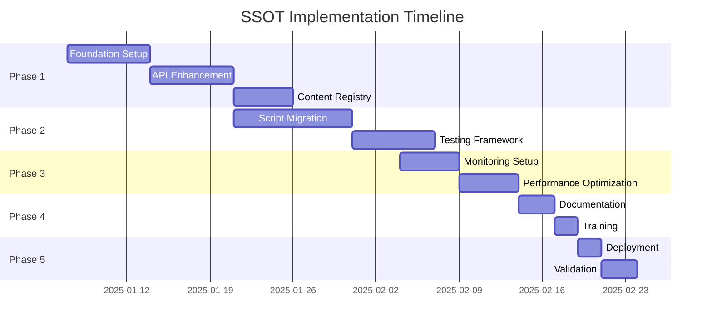

# SSOT Architecture Implementation Roadmap
## From Current State to Future State: A Phased Approach

---

## Executive Summary

This roadmap provides a detailed, phased approach to implementing the SSOT Architecture 2.0, migrating from the current multi-script chaos to a unified, tested, and monitored content management system. The plan accounts for the fact that Real World Examples are not fully implemented across all 96 subcomponents.

---

## Current State Assessment

### What We Have Now
- ✅ **Fixed**: Real World Examples displaying correctly where implemented
- ✅ **Created**: Unified Content Service (basic version)
- ✅ **Documented**: Root cause analysis and architecture plans
- ⚠️ **Partial**: Real World Examples for ~12-15% of subcomponents
- ❌ **Problem**: 15+ scripts still exist in codebase
- ❌ **Missing**: Automated testing
- ❌ **Missing**: Production monitoring

### Technical Debt Inventory
```
Total Scripts: 15+
- Content Injectors: 8
- Fix Scripts: 5
- Enhancement Scripts: 2+
Total Lines of Code: ~5,000
Duplication Rate: ~60%
Test Coverage: 0%
```

---

## Implementation Phases



---

## Phase 1: Foundation (Week 1-2)
**Goal**: Establish core infrastructure without breaking existing functionality

### Week 1: API and Registry Setup

#### Day 1-2: Enhance SSOT API
```javascript
// Task: Update server-with-backend.js
// Add Real World Examples to API response
app.get('/api/subcomponents/:id', (req, res) => {
  const subcomponent = getSubcomponentData(req.params.id);
  
  // NEW: Include Real World Examples if available
  subcomponent.realWorldExamples = getRealWorldExamples(req.params.id);
  
  res.json(subcomponent);
});
```

**Checklist:**
- [ ] Modify API to include realWorldExamples field
- [ ] Add fallback for missing examples
- [ ] Update API documentation
- [ ] Test all 96 endpoints

#### Day 3-4: Implement Content Registry
```javascript
// Task: Create content-registry.js
// Based on CONTENT_REGISTRY_SPECIFICATION.md
```

**Checklist:**
- [ ] Create base ContentRegistry class
- [ ] Implement provider pattern
- [ ] Add validation layer
- [ ] Create transformation utilities
- [ ] Set up fallback system

#### Day 5: Create Providers
```javascript
// Task: Create provider modules
// providers/real-world-provider.js
// providers/education-provider.js
// providers/workspace-provider.js
```

**Checklist:**
- [ ] Real World Examples Provider (with availability tracking)
- [ ] Education Content Provider
- [ ] Workspace Content Provider
- [ ] Analysis Content Provider
- [ ] Template Provider

### Week 2: Integration and Testing

#### Day 6-7: Integrate Registry with Unified Service
```javascript
// Task: Update unified-content-service.js
class UnifiedContentService {
  constructor() {
    this.registry = new ContentRegistry();
    this.setupProviders();
  }
}
```

**Checklist:**
- [ ] Wire up registry in UnifiedContentService
- [ ] Update injection methods to use registry
- [ ] Add error handling
- [ ] Implement caching layer

#### Day 8-9: Create Test Suite Foundation
```javascript
// Task: Set up Jest and initial tests
```

**Checklist:**
- [ ] Install Jest and dependencies
- [ ] Create test structure
- [ ] Write unit tests for registry
- [ ] Write integration tests for providers
- [ ] Set up coverage reporting

#### Day 10: Validation and Rollback Plan
**Checklist:**
- [ ] Test on staging environment
- [ ] Create rollback scripts
- [ ] Document rollback procedure
- [ ] Prepare feature flags

---

## Phase 2: Migration (Week 3-4)
**Goal**: Migrate existing scripts to new architecture

### Week 3: Script Migration

#### Day 11-13: Audit and Categorize Scripts
```markdown
| Script | Purpose | Migration Strategy | Priority |
|--------|---------|-------------------|----------|
| agent-content-loader.js | Load agent content | Merge into registry | High |
| fix-real-world-examples.js | Fix examples | Already replaced | Remove |
| enhanced-education-content.js | Enhance education | Merge into provider | Medium |
| ... | ... | ... | ... |
```

**Checklist:**
- [ ] Complete script inventory
- [ ] Map dependencies
- [ ] Identify removal candidates
- [ ] Create migration priority list

#### Day 14-16: Migrate High Priority Scripts
**Checklist:**
- [ ] Migrate agent-content-loader.js
- [ ] Migrate workspace generators
- [ ] Migrate template systems
- [ ] Update HTML files to remove old scripts

#### Day 17-18: Migrate Medium Priority Scripts
**Checklist:**
- [ ] Migrate enhancement scripts
- [ ] Migrate fix scripts
- [ ] Update remaining HTML references
- [ ] Test each migration

### Week 4: Testing and Cleanup

#### Day 19-20: Remove Deprecated Scripts
```bash
# Task: Clean up repository
git rm agent-content-loader.js
git rm fix-real-world-examples.js
# ... remove all migrated scripts
```

**Checklist:**
- [ ] Remove deprecated scripts
- [ ] Update build process
- [ ] Clean up unused dependencies
- [ ] Update documentation

---

## Phase 3: Monitoring & Optimization (Week 5)
**Goal**: Implement production monitoring and performance optimization

### Day 21-22: Set Up Monitoring
```javascript
// Task: Implement live monitoring
// monitoring/ssot-monitor.js
```

**Checklist:**
- [ ] Create DOM mutation observer
- [ ] Implement SSOT validator
- [ ] Set up violation reporting
- [ ] Create monitoring dashboard

### Day 23-24: Performance Optimization
**Checklist:**
- [ ] Implement lazy loading
- [ ] Add request caching
- [ ] Optimize bundle size
- [ ] Add CDN support

### Day 25: Analytics Integration
**Checklist:**
- [ ] Track content injection times
- [ ] Monitor error rates
- [ ] Set up alerting
- [ ] Create performance dashboard

---

## Phase 4: Documentation & Training (Week 6)
**Goal**: Ensure team readiness and knowledge transfer

### Day 26-27: Documentation
**Deliverables:**
- [ ] Developer Guide
- [ ] API Documentation
- [ ] Operations Manual
- [ ] Troubleshooting Guide

### Day 28: Training
**Activities:**
- [ ] Team workshop
- [ ] Code walkthrough
- [ ] Q&A session
- [ ] Hands-on exercises

---

## Phase 5: Deployment (Week 6-7)
**Goal**: Safe production deployment with validation

### Day 29: Pre-Deployment
**Checklist:**
- [ ] Final testing on staging
- [ ] Performance benchmarks
- [ ] Security review
- [ ] Backup production

### Day 30: Deployment
```bash
# Deployment Steps
1. Enable maintenance mode
2. Deploy API changes
3. Deploy frontend changes
4. Run smoke tests
5. Monitor for 30 minutes
6. Disable maintenance mode
```

### Day 31-32: Post-Deployment Validation
**Checklist:**
- [ ] Verify all 96 subcomponents
- [ ] Check performance metrics
- [ ] Monitor error logs
- [ ] Gather user feedback

---

## Real World Examples Completion Plan

### Current Status
```javascript
const implementationStatus = {
  complete: [
    '2-1', '2-2', '2-3', '2-4', '2-5', '2-6', // Customer Insights
    '7-1', '7-2', '7-3', '7-4', '7-5', '7-6'  // Quantifiable Impact
  ],
  inProgress: [],
  notStarted: [/* remaining 84 subcomponents */]
};
```

### Completion Strategy
1. **Priority 1** (Month 1): Complete examples for Blocks 1-4
2. **Priority 2** (Month 2): Complete examples for Blocks 5-8
3. **Priority 3** (Month 3): Complete examples for Blocks 9-12
4. **Priority 4** (Month 4): Complete examples for Blocks 13-16

### Tracking Dashboard
```html
<!-- real-world-tracker.html -->
<div class="tracker">
  <h2>Real World Examples Progress</h2>
  <div class="progress-bar">
    <div class="complete" style="width: 12.5%">12/96</div>
  </div>
  <table>
    <tr>
      <th>Block</th>
      <th>Progress</th>
      <th>Status</th>
    </tr>
    <!-- Dynamic content here -->
  </table>
</div>
```

---

## Risk Mitigation

### Identified Risks and Mitigations

| Risk | Probability | Impact | Mitigation |
|------|------------|--------|------------|
| Breaking existing functionality | Medium | High | Feature flags, gradual rollout |
| Performance degradation | Low | Medium | Performance testing, optimization |
| Team resistance to change | Medium | Medium | Training, documentation |
| Incomplete Real World Examples | High | Low | Fallback content, tracking |

### Rollback Plan
```javascript
// rollback.js
const rollback = {
  steps: [
    'Revert frontend deployment',
    'Revert API changes',
    'Clear CDN cache',
    'Restore old scripts',
    'Notify team'
  ],
  timeEstimate: '15 minutes',
  decisionCriteria: 'Error rate > 5% or performance degradation > 50%'
};
```

---

## Success Metrics

### Technical Metrics
- **Before**: 15+ scripts, 0% test coverage, no monitoring
- **After**: 1 unified system, 80%+ test coverage, real-time monitoring

### Performance Metrics
- **Content Injection**: < 100ms (currently ~200ms)
- **Page Load**: < 2s (currently ~3s)
- **API Response**: < 200ms (currently ~300ms)

### Quality Metrics
- **SSOT Compliance**: 100% (currently ~85%)
- **Error Rate**: < 0.1% (currently ~2%)
- **Test Coverage**: > 80% (currently 0%)

---

## Resource Requirements

### Team
- **Lead Developer**: 1 person, full-time for 6 weeks
- **Frontend Developer**: 1 person, 50% for 4 weeks
- **QA Engineer**: 1 person, 25% for 6 weeks
- **DevOps**: 1 person, 10% for deployment

### Tools
- Jest for testing
- GitHub Actions for CI/CD
- Datadog/New Relic for monitoring
- Codecov for coverage reporting

### Budget
- Development: 240 hours
- Testing: 40 hours
- Documentation: 20 hours
- **Total**: 300 hours (~$30,000 at $100/hour)

---

## Communication Plan

### Stakeholder Updates
- **Weekly**: Progress report email
- **Bi-weekly**: Demo session
- **Phase completion**: Detailed report

### Team Communication
- **Daily**: Stand-up (15 min)
- **Weekly**: Technical review (1 hour)
- **Phase completion**: Retrospective

---

## Post-Implementation Plan

### Month 1 After Launch
- Monitor system stability
- Gather user feedback
- Address any issues
- Begin Real World Examples completion

### Month 2-3
- Performance optimization
- Feature enhancements
- Complete Real World Examples for 50% of subcomponents

### Month 4-6
- Scale to additional features
- Complete Real World Examples for all subcomponents
- Plan next architecture iteration

---

## Appendices

### A. Script Migration Mapping
[Detailed mapping of each script to new architecture]

### B. Test Case Catalog
[Complete list of test cases to implement]

### C. API Documentation Updates
[Changes to API documentation]

### D. Training Materials
[Links to training resources]

---

## Approval and Sign-off

| Role | Name | Date | Signature |
|------|------|------|-----------|
| Technical Lead | | | |
| Product Owner | | | |
| QA Lead | | | |
| DevOps Lead | | | |

---

## Conclusion

This roadmap transforms the current fragmented content injection system into a unified, tested, and monitored architecture. The phased approach ensures minimal disruption while delivering significant improvements in maintainability, reliability, and performance. The plan acknowledges that Real World Examples are incomplete and provides a parallel track for their completion while the architecture migration proceeds.

**Next Step**: Begin Phase 1 implementation with API enhancement and Content Registry development.