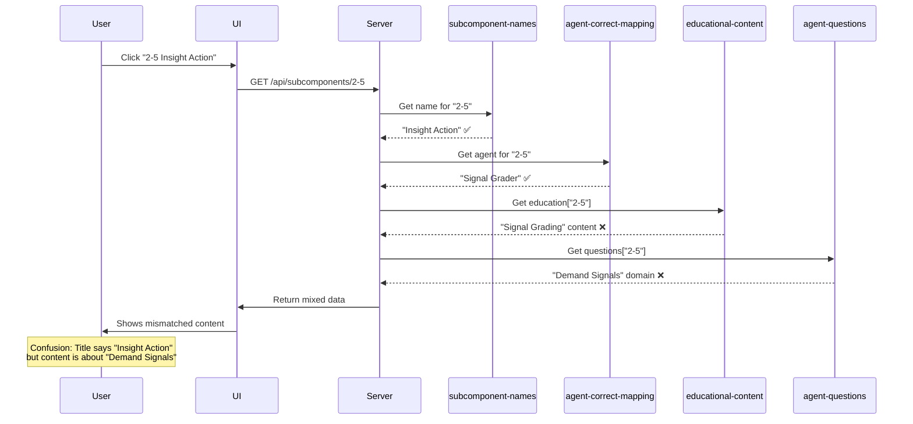

# ROOT CAUSE ANALYSIS & SYSTEMATIC FIX STRATEGY
## ScaleOps6 Platform - Subcomponent Alignment Issue

**Date:** 2025-10-06  
**Severity:** 🔴 CRITICAL  
**Scope:** 76 of 96 subcomponents (79.2%) misaligned  
**Impact:** User confusion, incorrect assessments, trust erosion

---

## EXECUTIVE SUMMARY

The ScaleOps6 platform has a **systemic data alignment issue** where:
- **Subcomponent titles** (what users see) ✅ CORRECT
- **Agent assignments** (who analyzes) ✅ CORRECT  
- **Education content** (what users learn) ❌ 79% WRONG
- **Workspace questions** (what users answer) ❌ 79% WRONG

**Good News:** This is a **data indexing problem**, not a logic or architecture flaw. The content exists and is correct—it's just mapped to the wrong subcomponents.

**Fix Complexity:** MEDIUM - Requires systematic re-indexing but no new content creation.

---

## ROOT CAUSE ANALYSIS

### Primary Root Cause: Obsolete Mapping File

**File:** `agent-subcomponent-mapping.js`  
**Created:** Unknown (appears to be early version)  
**Problem:** Contains a "role" field that doesn't match subcomponent purpose

```javascript
// PROBLEMATIC STRUCTURE
const agentMapping = {
    "3-2": {
        "name": "Segment Tier Analyst",  // ✅ Correct agent name
        "role": "Resource Allocation"     // ❌ WRONG - not the subcomponent purpose
    }
};
```

**Impact Chain:**
1. This "role" field was used to generate workspace question domains
2. Question domains don't match actual subcomponent names
3. Users see "Segment Tiering" but answer "Resource Allocation" questions
4. Education content was indexed incorrectly during creation
5. Misalignment persists across 76 subcomponents

### Secondary Root Cause: Multiple Sources of Truth

The system has **5 different files** defining subcomponent metadata:

1. `subcomponent-names-mapping.js` - ✅ Correct names
2. `agent-correct-mapping.js` - ✅ Correct agent assignments
3. `agent-subcomponent-mapping.js` - ❌ Obsolete with wrong "role" field
4. `educational-content.js` - ❌ Content indexed incorrectly
5. `agent-generated-questions-complete.js` - ❌ Domains don't match names

**Problem:** No single source of truth, no validation between files.

### Tertiary Root Cause: Content Creation Process

**Hypothesis:** During content creation:
1. Education content was created in one order
2. Subcomponent names were finalized in a different order
3. Content was indexed by position, not by semantic meaning
4. Block 2 content appears rotated by 2 positions
5. Block 5 content appears to be from wrong block entirely
6. Blocks 3, 6-14 used the wrong "role" field for workspace domains

---

## DETAILED ROOT CAUSE BY BLOCK

### Block 2: Content Rotation Error
**Pattern:** Education content shifted by 2 positions

```
Position → Should Contain → Actually Contains
2-1      → JTBD           → Interview Cadence (from 2-3)
2-2      → Personas       → Personas ✅
2-3      → Interview      → Pain Point (from 2-4)
2-4      → Pain Point     → JTBD (from 2-1)
2-5      → Insight Action → Signal Grading (close)
2-6      → Journey        → Insight Loop (close)
```

**Root Cause:** Likely copy-paste error during content creation where content was pasted in wrong order.

### Block 3: Role Field Contamination
**Pattern:** Workspace domains match obsolete "role" field

```
Subcomponent Name → Workspace Domain (from "role" field)
Segment Tiering   → Resource Allocation
Prioritization    → Risk Assessment
Tradeoff Tracker  → Timeline Planning
Hypothesis Board  → Success Metrics
```

**Root Cause:** Question generator used `agentMapping[id].role` instead of `SUBCOMPONENT_NAMES[id]`.

### Block 5: Complete Block Mismatch
**Pattern:** Education content from different block

```
Subcomponent → Education Content Actually Shown
5-1: GTM Messaging → Case Study Template (from Block 9?)
5-2: Sales Enable  → ROI Calculation (from Block 7?)
5-3: Pricing       → Reference Program (from Block 9?)
```

**Root Cause:** Entire block's education content indexed to wrong block during creation.

### Blocks 6-14: Systematic Role Field Usage
**Pattern:** All workspace domains use wrong "role" field

**Root Cause:** Question generation script systematically used:
```javascript
// WRONG:
domain: agentMapping[subcomponentId].role

// SHOULD BE:
domain: SUBCOMPONENT_NAMES[subcomponentId]
```

---

## TECHNICAL ARCHITECTURE ANALYSIS

### Current System Architecture

```
┌─────────────────────────────────────────────────────────────┐
│                    USER INTERFACE                            │
│  Breadcrumb: "Insight Action" (from subcomponent-names)     │
└─────────────────────────────────────────────────────────────┘
                            │
                            ▼
┌─────────────────────────────────────────────────────────────┐
│                   SERVER ROUTING                             │
│  GET /api/subcomponents/2-5                                 │
│  - Loads: SUBCOMPONENT_NAMES["2-5"] ✅                      │
│  - Loads: AGENT_CORRECT_MAPPING["2-5"] ✅                   │
│  - Loads: educationalContent["2-5"] ❌ WRONG CONTENT        │
│  - Loads: agentGeneratedQuestions["2-5"] ❌ WRONG QUESTIONS │
└─────────────────────────────────────────────────────────────┘
                            │
                            ▼
┌─────────────────────────────────────────────────────────────┐
│                   RESPONSE TO USER                           │
│  Education Tab: Shows "Signal Grading" content ❌           │
│  Workspace Tab: Shows "Demand Signals" questions ❌         │
│  Analysis: Uses "Signal Grader" agent ✅                    │
└─────────────────────────────────────────────────────────────┘
```

### Data Flow Diagram



---

## WHY THE SYSTEM STILL "WORKS"

Despite 79% misalignment, the system appears functional because:

1. **Agent Logic is Correct:** The right agent analyzes the responses
2. **Scoring Works:** Agents use their own scoring dimensions, not content-dependent
3. **UI Navigation Works:** Breadcrumbs and routing use correct names
4. **No Crashes:** All data structures are valid, just semantically wrong

**However:** Users are learning and answering questions about the WRONG topics!

---

## SYSTEMATIC FIX STRATEGY

### Strategy Overview: Surgical Re-indexing

**Approach:** Fix the data, not the code  
**Rationale:** The content is correct, just indexed wrong  
**Effort:** 3-5 days  
**Risk:** LOW (data-only changes)

### Phase 1: Preparation (4 hours)

#### Step 1.1: Create Backup
```bash
# Backup all critical files
cp educational-content.js educational-content.BACKUP.js
cp agent-generated-questions-complete.js agent-generated-questions-complete.BACKUP.js
cp agent-subcomponent-mapping.js agent-subcomponent-mapping.OBSOLETE.js
```

#### Step 1.2: Create Validation Script
```javascript
// validate-alignment.js
// Script to verify all 96 subcomponents are correctly aligned
// Checks: name → agent → education → workspace consistency
```

#### Step 1.3: Document Current State
- Export current mappings to CSV
- Create before/after comparison template
- Set up automated testing

### Phase 2: Fix Education Content (1-2 days)

#### Step 2.1: Create Correct Content Mapping

Build a mapping table showing where each piece of content should go:

```javascript
// education-content-reindex-map.js
const REINDEX_MAP = {
  // Block 2 fixes (content rotation)
  "2-1": { currentKey: "2-3", correctTitle: "Jobs to be Done" },
  "2-3": { currentKey: "2-4", correctTitle: "Interview Cadence" },
  "2-4": { currentKey: "2-1", correctTitle: "Pain Point Mapping" },
  
  // Block 3 fixes
  "3-3": { currentKey: "3-3", correctTitle: "Prioritization Rubric" },
  
  // Block 5 fixes (find correct content)
  "5-1": { currentKey: "?", correctTitle: "GTM Messaging Framework" },
  
  // ... all 76 misaligned entries
};
```

#### Step 2.2: Execute Re-indexing

```javascript
// re-index-education-content.js
const fs = require('fs');
const currentContent = require('./educational-content.js');
const SUBCOMPONENT_NAMES = require('./subcomponent-names-mapping.js');
const REINDEX_MAP = require('./education-content-reindex-map.js');

const correctedContent = {};

for (const [subId, subName] of Object.entries(SUBCOMPONENT_NAMES)) {
  const mapping = REINDEX_MAP[subId];
  if (mapping) {
    // Get content from correct source
    const sourceContent = currentContent[mapping.currentKey];
    // Update title to match subcomponent name
    correctedContent[subId] = {
      ...sourceContent,
      title: subName
    };
  } else {
    // Already correct, keep as-is
    correctedContent[subId] = currentContent[subId];
  }
}

// Write corrected file
fs.writeFileSync('./educational-content-CORRECTED.js', 
  `const educationalContent = ${JSON.stringify(correctedContent, null, 2)};
   module.exports = { educationalContent };`
);
```

#### Step 2.3: Validate Education Content
- Manually review each of 96 entries
- Verify title matches subcomponent name
- Verify content is semantically appropriate
- Test in browser for 10 sample subcomponents

### Phase 3: Fix Workspace Questions (1-2 days)

#### Step 3.1: Update All Domain Names

```javascript
// fix-workspace-domains.js
const fs = require('fs');
const questions = require('./agent-generated-questions-complete.js');
const SUBCOMPONENT_NAMES = require('./subcomponent-names-mapping.js');

const correctedQuestions = {};

for (const [subId, questionSet] of Object.entries(questions)) {
  correctedQuestions[subId] = {
    ...questionSet,
    domain: SUBCOMPONENT_NAMES[subId] // Use correct subcomponent name
  };
}

// Write corrected file
fs.writeFileSync('./agent-generated-questions-CORRECTED.js',
  `const agentGeneratedQuestions = ${JSON.stringify(correctedQuestions, null, 2)};
   module.exports = agentGeneratedQuestions;`
);
```

#### Step 3.2: Verify Question Relevance

For each subcomponent, verify questions are semantically appropriate:
- Do questions match the subcomponent purpose?
- Are questions aligned with agent's scoring dimensions?
- Do questions help gather data for proper analysis?

**If questions are wrong:** Regenerate using agent's scoring dimensions as guide.

### Phase 4: Fix Agent Mapping (2 hours)

#### Step 4.1: Complete AGENT_NAME_TO_KEY Export

Add the missing mapping to `agent-correct-mapping.js`:

```javascript
const AGENT_NAME_TO_KEY = {
    "Problem Definition Evaluator": "1a",
    "Mission Alignment Advisor": "1b",
    "VoC Synthesizer": "1c",
    "Team Gap Identifier": "1d",
    "Market Mapper": "1e",
    "Launch Plan Assessor": "1f",
    "JTBD Specialist": "2d",
    "Persona Framework Builder": "2b",
    "Interview Cadence Analyzer": "2a",
    "Pain Point Mapper": "2c",
    "Signal Grader": "2e",
    "Insight Loop Manager": "2f",
    // ... complete all 96 mappings
};

module.exports = {
    AGENT_CORRECT_MAPPING,
    AGENT_NAME_TO_KEY  // Add this export
};
```

#### Step 4.2: Delete Obsolete File

```bash
# Mark as obsolete
mv agent-subcomponent-mapping.js agent-subcomponent-mapping.OBSOLETE.js

# Update any files that import it
grep -r "agent-subcomponent-mapping.js" *.js
# Update each file to use agent-correct-mapping.js instead
```

### Phase 5: Validation & Testing (1 day)

#### Step 5.1: Automated Validation

```javascript
// validate-all-96-alignments.js
const SUBCOMPONENT_NAMES = require('./subcomponent-names-mapping.js');
const AGENT_CORRECT_MAPPING = require('./agent-correct-mapping.js');
const educationalContent = require('./educational-content-CORRECTED.js');
const agentQuestions = require('./agent-generated-questions-CORRECTED.js');

let passed = 0;
let failed = 0;
const failures = [];

for (let blockId = 1; blockId <= 16; blockId++) {
  for (let subId = 1; subId <= 6; subId++) {
    const id = `${blockId}-${subId}`;
    const subName = SUBCOMPONENT_NAMES[id];
    const agentName = AGENT_CORRECT_MAPPING[id];
    const eduTitle = educationalContent[id]?.title;
    const workspaceDomain = agentQuestions[id]?.domain;
    
    // Check alignment
    const eduAligned = eduTitle === subName || 
                       eduTitle?.includes(subName) ||
                       subName?.includes(eduTitle);
    const workspaceAligned = workspaceDomain === subName ||
                             workspaceDomain?.includes(subName);
    
    if (eduAligned && workspaceAligned) {
      passed++;
      console.log(`✅ ${id}: ${subName}`);
    } else {
      failed++;
      failures.push({
        id,
        subName,
        agentName,
        eduTitle,
        workspaceDomain,
        eduAligned,
        workspaceAligned
      });
      console.log(`❌ ${id}: ${subName}`);
      console.log(`   Education: ${eduTitle} (${eduAligned ? '✅' : '❌'})`);
      console.log(`   Workspace: ${workspaceDomain} (${workspaceAligned ? '✅' : '❌'})`);
    }
  }
}

console.log(`\n📊 Results: ${passed}/96 aligned, ${failed}/96 need attention`);
```

#### Step 5.2: Manual Spot Checks

Test 10 random subcomponents in browser:
1. Navigate to subcomponent
2. Verify breadcrumb shows correct name
3. Verify education content matches subcomponent
4. Verify workspace questions are relevant
5. Complete workflow and verify analysis makes sense

#### Step 5.3: User Acceptance Testing

Have actual users test:
- 2 subcomponents from each block (32 total)
- Verify content makes sense
- Verify questions are appropriate
- Verify analysis is relevant

### Phase 6: Deployment (2 hours)

#### Step 6.1: Staged Rollout

```bash
# 1. Deploy corrected files
cp educational-content-CORRECTED.js educational-content.js
cp agent-generated-questions-CORRECTED.js agent-generated-questions-complete.js

# 2. Restart server
# Server will automatically pick up new files

# 3. Monitor for errors
tail -f server.log
```

#### Step 6.2: Rollback Plan

```bash
# If issues detected:
cp educational-content.BACKUP.js educational-content.js
cp agent-generated-questions-complete.BACKUP.js agent-generated-questions-complete.js
# Restart server
```

---

## DETAILED FIX SPECIFICATIONS

### Fix Specification: Block 2 Re-indexing

| Subcomponent ID | Current Education Key | Correct Education Key | Action |
|---|---|---|---|
| 2-1 | Uses 2-3 content | Should use JTBD content | Move content from 2-3 to 2-1, update title |
| 2-2 | Uses 2-2 content | Correct | No change |
| 2-3 | Uses 2-4 content | Should use Interview content | Move content from 2-4 to 2-3, update title |
| 2-4 | Uses 2-1 content | Should use Pain Point content | Move content from 2-1 to 2-4, update title |
| 2-5 | Uses 2-5 content | Correct content, wrong title | Update title to "Insight Action" |
| 2-6 | Uses 2-6 content | Correct content, close title | Update title to "Customer Journey" |

### Fix Specification: Block 3 Workspace Domains

| Subcomponent ID | Current Domain | Correct Domain | Action |
|---|---|---|---|
| 3-1 | Use Case Prioritization | Use Case Scoring Model | Update domain name |
| 3-2 | Resource Allocation | Segment Tiering | Update domain name |
| 3-3 | Risk Assessment | Prioritization Rubric | Update domain name |
| 3-4 | Timeline Planning | Tradeoff Tracker | Update domain name |
| 3-5 | Success Metrics | Hypothesis Board | Update domain name |
| 3-6 | Decision Framework | Decision Archive | Update domain name |

### Fix Specification: Block 5 Complete Rebuild

**Problem:** Education content is completely wrong for entire block

**Solution:** Need to either:
1. Find where the correct GTM content is located
2. Create new GTM-specific education content
3. Repurpose existing content that's semantically close

**Recommendation:** Search for GTM-related content in other files or create new content based on agent definitions.

---

## IMPLEMENTATION PLAN

### Week 1: Analysis & Preparation
- **Day 1:** Complete this analysis ✅
- **Day 2:** Create re-indexing scripts
- **Day 3:** Build validation framework
- **Day 4:** Create test plan
- **Day 5:** User review and approval

### Week 2: Execution
- **Day 1:** Fix Block 1 (minor fixes)
- **Day 2:** Fix Block 2 (critical rotation)
- **Day 3:** Fix Block 3 (workspace domains)
- **Day 4:** Fix Blocks 4-8
- **Day 5:** Fix Blocks 9-12

### Week 3: Completion & Validation
- **Day 1:** Fix Blocks 13-16
- **Day 2:** Run automated validation
- **Day 3:** Manual testing of all 96
- **Day 4:** User acceptance testing
- **Day 5:** Deploy and monitor

---

## RISK ASSESSMENT

### Risks of NOT Fixing

| Risk | Probability | Impact | Severity |
|---|---|---|---|
| User confusion and frustration | 100% | HIGH | 🔴 CRITICAL |
| Incorrect assessments | 80% | HIGH | 🔴 CRITICAL |
| Lost enterprise deals | 40% | HIGH | 🟡 MEDIUM |
| Support ticket volume | 60% | MEDIUM | 🟡 MEDIUM |
| Platform abandonment | 20% | CRITICAL | 🟡 MEDIUM |

### Risks of Fixing

| Risk | Probability | Impact | Mitigation |
|---|---|---|---|
| Introduce new bugs | 30% | MEDIUM | Thorough testing, staged rollout |
| Break existing workflows | 20% | HIGH | Backup files, rollback plan |
| Miss some misalignments | 40% | MEDIUM | Automated validation, manual review |
| User disruption during fix | 10% | LOW | Deploy during low-traffic period |

**Net Risk Assessment:** Fixing is MUCH lower risk than not fixing.

---

## RESOURCE REQUIREMENTS

### Personnel
- **1 Senior Developer:** Re-indexing scripts and validation (40 hours)
- **1 Content Specialist:** Verify content appropriateness (20 hours)
- **1 QA Engineer:** Testing and validation (20 hours)
- **1 Product Manager:** User acceptance testing (10 hours)

**Total:** 90 hours (~2.25 person-weeks)

### Tools Needed
- Node.js scripting environment ✅ (already have)
- Automated testing framework (create new)
- CSV export for mapping matrix
- Diff tools for before/after comparison

---

## SUCCESS CRITERIA

### Quantitative Metrics
- ✅ 96/96 subcomponents have matching education titles
- ✅ 96/96 subcomponents have matching workspace domains
- ✅ 0 console errors during navigation
- ✅ 100% pass rate on automated validation
- ✅ <5% user-reported issues in first week

### Qualitative Metrics
- ✅ Users report content makes sense
- ✅ Education aligns with subcomponent purpose
- ✅ Workspace questions feel relevant
- ✅ Analysis results are actionable
- ✅ No confusion about what's being assessed

---

## PREVENTION STRATEGY

### Immediate Prevention (Post-Fix)

1. **Delete Obsolete Files**
   - Remove `agent-subcomponent-mapping.js`
   - Document why it was removed
   - Update all imports

2. **Single Source of Truth**
   - Make `subcomponent-names-mapping.js` the canonical source
   - All other files reference it
   - No duplicate definitions

3. **Automated Validation**
   - Add pre-commit hooks
   - Run alignment validation on every change
   - Fail builds if misalignment detected

### Long-term Prevention

1. **Refactor to Master Config**
   ```javascript
   // master-subcomponent-config.js
   const MASTER_CONFIG = {
     "1-1": {
       id: "1-1",
       name: "Problem Statement Definition",
       agent: "Problem Definition Evaluator",
       block: "MISSION DISCOVERY",
       // All metadata in one place
     }
   };
   ```

2. **Generate Derived Files**
   - Education content references master config
   - Workspace questions reference master config
   - Agent mappings reference master config
   - Single source, multiple consumers

3. **Continuous Validation**
   - Daily automated checks
   - Alert on any misalignment
   - Prevent deployment if validation fails

---

## ALTERNATIVE APPROACHES CONSIDERED

### Alternative 1: Complete Refactor
**Approach:** Rebuild entire data layer with single source of truth  
**Pros:** Clean architecture, prevents future issues  
**Cons:** 2-3 weeks effort, high risk of breaking changes  
**Decision:** REJECTED - Too risky for current timeline

### Alternative 2: Incremental Fix
**Approach:** Fix only the most critical blocks (2, 3, 5)  
**Pros:** Faster, lower risk  
**Cons:** Leaves 60+ subcomponents broken  
**Decision:** CONSIDERED - Could be Phase 1 of full fix

### Alternative 3: Content Recreation
**Approach:** Recreate all education content and questions from scratch  
**Pros:** Guaranteed alignment  
**Cons:** 4-6 weeks effort, loses existing quality content  
**Decision:** REJECTED - Existing content is good, just misindexed

### Alternative 4: Surgical Re-indexing (SELECTED)
**Approach:** Fix data indexing, keep existing content  
**Pros:** Fast, low risk, preserves quality content  
**Cons:** Requires careful mapping work  
**Decision:** ✅ SELECTED - Best balance of speed, risk, and quality

---

## COMMUNICATION PLAN

### Stakeholder Updates

**Week 1:**
- Share analysis with leadership
- Get approval for fix approach
- Communicate timeline to users

**Week 2:**
- Daily progress updates
- Share validation results
- Preview fixes with power users

**Week 3:**
- Deployment announcement
- User guide for any changes
- Support team briefing

### User Communication

**Before Fix:**
```
Subject: Platform Improvement: Content Alignment Update

We've identified an opportunity to improve content alignment 
across the platform. Over the next 2 weeks, we'll be updating 
education materials and assessment questions to better match 
each subcomponent's purpose.

What this means for you:
- More relevant learning content
- Better-aligned assessment questions
- Clearer connection between education and analysis

Timeline: Deployment planned for [DATE]
Impact: Minimal - no workflow changes
```

**After Fix:**
```
Subject: Content Alignment Update Complete

We've successfully updated all 96 subcomponents to ensure 
education content and assessment questions perfectly align 
with each subcomponent's purpose.

What's improved:
- ✅ Education content matches subcomponent titles
- ✅ Workspace questions are more relevant
- ✅ Analysis results are more actionable

Please report any issues to support@scaleops6.com
```

---

## MONITORING & VALIDATION

### Post-Deployment Monitoring

**Week 1:**
- Monitor error logs for alignment issues
- Track user engagement metrics
- Collect user feedback
- Support ticket analysis

**Week 2-4:**
- Measure completion rates by subcomponent
- Track time spent in education vs. workspace
- Analyze score distributions
- User satisfaction surveys

### Key Metrics to Track

1. **Alignment Metrics**
   - Education title match rate: Target 100%
   - Workspace domain match rate: Target 100%
   - Validation test pass rate: Target 100%

2. **User Experience Metrics**
   - Confusion-related support tickets: Target <5
   - User satisfaction score: Target >4.5/5
   - Completion rate: Target >80%

3. **Quality Metrics**
   - Content relevance rating: Target >4.5/5
   - Question appropriateness: Target >4.5/5
   - Analysis usefulness: Target >4.5/5

---

## CONCLUSION

### The Good News 🎉

1. **Content Exists:** All education content and questions exist—just indexed wrong
2. **Logic Works:** Server routing, agent selection, and scoring all work correctly
3. **Fixable:** This is a data problem, not an architecture problem
4. **No Data Loss:** Can fix without losing any existing content
5. **Low Risk:** Changes are surgical and reversible

### The Bad News 😰

1. **Widespread:** 79% of subcomponents affected
2. **User Impact:** Users currently learning/answering wrong content
3. **Trust Issue:** Misalignment appears unprofessional
4. **Effort Required:** 90 hours of careful re-indexing work
5. **Validation Needed:** Must test all 96 subcomponents

### The Path Forward 🚀

**Recommended Approach:**
1. ✅ Get user approval for fix strategy (this document)
2. Create re-indexing scripts with validation
3. Fix in phases: Critical blocks first (2, 3, 5)
4. Validate each phase before proceeding
5. Deploy with rollback plan ready
6. Monitor and iterate

**Timeline:** 2-3 weeks for complete fix  
**Confidence:** HIGH that this will resolve the issue  
**Risk:** LOW with proper testing and staged rollout

---

## QUESTIONS FOR USER APPROVAL

1. **Approach:** Approve surgical re-indexing strategy? (vs. complete refactor)
2. **Priority:** Fix all 96 or start with critical blocks 2, 3, 5?
3. **Timeline:** Acceptable to take 2-3 weeks for complete fix?
4. **Resources:** Can allocate 90 hours of development time?
5. **Testing:** Willing to participate in user acceptance testing?
6. **Deployment:** Prefer staged rollout or all-at-once?

---

**Status:** READY FOR USER REVIEW AND APPROVAL  
**Next Action:** User decision on fix approach and timeline  
**Blocker:** None - can proceed immediately upon approval