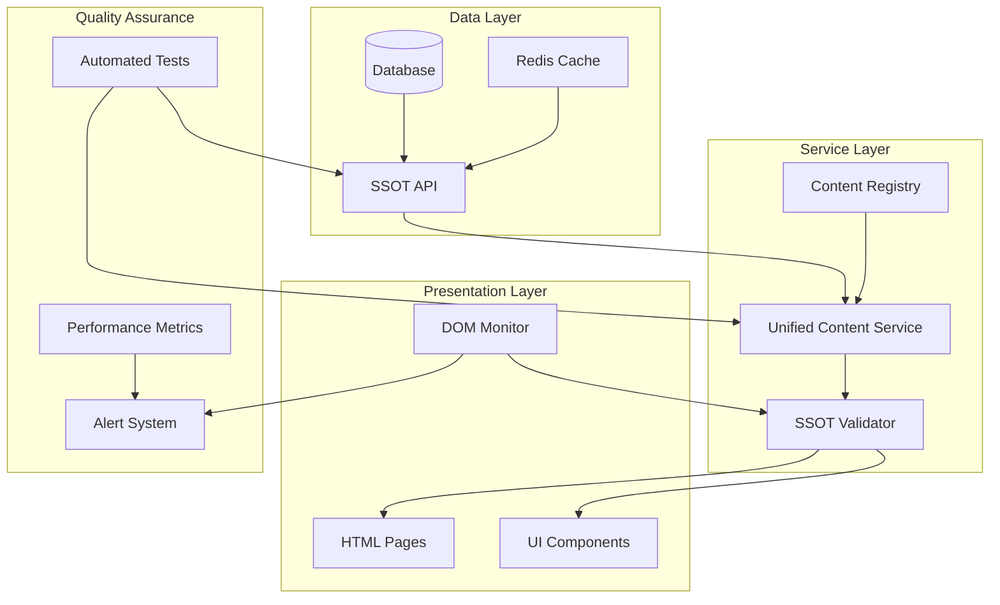

# SSOT Architecture 2.0: Systemic Solution Design
## Preventing Future Misalignments Through Architectural Governance

---

## Executive Summary

This document outlines a comprehensive architectural solution to prevent future SSOT (Single Source of Truth) misalignments. Based on the root cause analysis of the Real World Examples display issue, we're establishing architectural patterns, governance processes, and automated safeguards to ensure system integrity.

---

## Why This Architecture Matters

### Current Problem Context
- **Issue**: UI not reflecting SSOT data (Real World Examples missing)
- **Impact**: Affected all 96 subcomponents across 16 blocks
- **Root Causes**: Variable mismatches, race conditions, no central authority
- **Business Risk**: Loss of user trust, unpredictable behavior, maintenance nightmare

### Strategic Goals
1. **Prevent Recurrence**: Architectural safeguards against SSOT violations
2. **Simplify Maintenance**: Reduce from 15+ scripts to unified system
3. **Enable Scalability**: Support growth beyond 96 subcomponents
4. **Ensure Testability**: Automated validation of SSOT compliance

---

## Architecture Principles

### 1. Single Source of Truth (SSOT)
- **One API, One Authority**: All data flows from `/api/subcomponents/{id}`
- **No Side Loading**: Eliminate separate database files
- **Immutable Data Flow**: API → Service → UI (no reverse mutations)

### 2. Centralized Content Management
- **Unified Service Pattern**: Single service manages all content injection
- **Registry Pattern**: All content types registered and validated
- **Event-Driven Updates**: Content changes trigger controlled updates

### 3. Fail-Safe Mechanisms
- **Validation Layer**: Every content injection validated against SSOT
- **Rollback Capability**: Automatic reversion on validation failure
- **Audit Trail**: Complete logging of all content modifications

---

## System Architecture



---

## Core Components

### 1. Enhanced SSOT API
```javascript
// Enhanced API Response Structure
{
  "subcomponent": {
    "id": "2-1",
    "name": "Jobs to be Done",
    "content": {
      "education": {...},
      "workspace": {...},
      "realWorldExamples": [  // Now included in API
        {
          "company": "Intercom",
          "useCase": "...",
          "valuation": "$8B",
          "year": 2011
        }
      ]
    },
    "metadata": {
      "version": "2.0.0",
      "lastModified": "2025-01-06T19:00:00Z",
      "checksum": "sha256:..."
    }
  }
}
```

### 2. Content Registry Pattern
```javascript
// content-registry.js
class ContentRegistry {
  constructor() {
    this.providers = new Map();
    this.validators = new Map();
    this.transformers = new Map();
  }
  
  register(contentType, config) {
    this.providers.set(contentType, config.provider);
    this.validators.set(contentType, config.validator);
    this.transformers.set(contentType, config.transformer);
  }
  
  async inject(contentType, data, targetElement) {
    // Validate
    const validator = this.validators.get(contentType);
    if (!validator(data)) {
      throw new ValidationError(`Invalid ${contentType} data`);
    }
    
    // Transform
    const transformer = this.transformers.get(contentType);
    const transformed = transformer(data);
    
    // Inject
    const provider = this.providers.get(contentType);
    await provider.inject(transformed, targetElement);
    
    // Audit
    this.audit(contentType, data, targetElement);
  }
}
```

### 3. SSOT Validator 2.0
```javascript
// ssot-validator.js
class SSOTValidator {
  constructor() {
    this.rules = new Map();
    this.cache = new Map();
  }
  
  addRule(elementId, rule) {
    this.rules.set(elementId, rule);
  }
  
  async validate(element, expectedData) {
    const rule = this.rules.get(element.id);
    if (!rule) return true; // No rule = no validation
    
    const actualData = this.extractData(element);
    const isValid = rule.validate(actualData, expectedData);
    
    if (!isValid) {
      this.reportViolation(element, actualData, expectedData);
      if (this.autoFix) {
        await this.fix(element, expectedData);
      }
    }
    
    return isValid;
  }
  
  enableRealTimeMonitoring() {
    const observer = new MutationObserver((mutations) => {
      mutations.forEach((mutation) => {
        this.validateMutation(mutation);
      });
    });
    
    observer.observe(document.body, {
      childList: true,
      subtree: true,
      characterData: true
    });
  }
}
```

---

## Implementation Phases

### Phase 1: Foundation (Week 1-2)
- [ ] Extend API to include all content types
- [ ] Implement Content Registry
- [ ] Create SSOT Validator 2.0
- [ ] Set up monitoring infrastructure

### Phase 2: Migration (Week 3-4)
- [ ] Migrate existing scripts to registry pattern
- [ ] Remove redundant content injectors
- [ ] Update all HTML pages to use new system
- [ ] Implement rollback mechanism

### Phase 3: Validation (Week 5)
- [ ] Create comprehensive test suite
- [ ] Performance testing and optimization
- [ ] Security audit
- [ ] Documentation update

### Phase 4: Monitoring (Week 6)
- [ ] Deploy real-time monitoring
- [ ] Set up alerting system
- [ ] Create dashboard for SSOT compliance
- [ ] Train team on new architecture

---

## Testing Strategy

### 1. Unit Tests
```javascript
describe('Content Registry', () => {
  it('should validate content before injection', async () => {
    const registry = new ContentRegistry();
    const invalidData = { /* missing required fields */ };
    
    await expect(
      registry.inject('realWorldExamples', invalidData, element)
    ).rejects.toThrow(ValidationError);
  });
  
  it('should maintain SSOT compliance', async () => {
    const validator = new SSOTValidator();
    const element = document.getElementById('real-world-examples');
    const ssotData = await fetchSSOT('2-1');
    
    const isValid = await validator.validate(element, ssotData);
    expect(isValid).toBe(true);
  });
});
```

### 2. Integration Tests
- Test all 96 subcomponents
- Verify content injection sequence
- Validate API → UI data flow
- Check performance metrics

### 3. E2E Tests
- User journey validation
- Cross-browser compatibility
- Load testing
- Failover scenarios

---

## Migration Strategy

### Step 1: Inventory Existing Scripts
```javascript
// Current State (15+ scripts)
const scriptsToMigrate = [
  'agent-content-loader.js',
  'fix-real-world-examples.js',
  'enhanced-education-content.js',
  // ... 12+ more
];

// Target State (1 unified system)
const unifiedSystem = {
  service: 'unified-content-service.js',
  registry: 'content-registry.js',
  validator: 'ssot-validator.js'
};
```

### Step 2: Create Migration Map
| Old Script | Content Type | Migration Status | Notes |
|------------|--------------|------------------|-------|
| agent-content-loader.js | workspace | Pending | Merge into registry |
| fix-real-world-examples.js | realWorldExamples | Complete | Using UCS |
| enhanced-education-content.js | education | Pending | Needs refactor |

### Step 3: Gradual Migration
1. **Week 1**: Migrate critical content (Real World Examples) ✅
2. **Week 2**: Migrate workspace content
3. **Week 3**: Migrate analysis/output content
4. **Week 4**: Remove deprecated scripts

---

## Performance Considerations

### Optimization Strategies
1. **Lazy Loading**: Load content only when tab is activated
2. **Caching**: Cache SSOT responses for 5 minutes
3. **Debouncing**: Batch DOM updates to prevent thrashing
4. **Virtual DOM**: Consider React/Vue for complex updates

### Performance Metrics
```javascript
// performance-monitor.js
class PerformanceMonitor {
  trackContentInjection(contentType, startTime) {
    const duration = performance.now() - startTime;
    
    if (duration > 100) { // Alert if > 100ms
      console.warn(`Slow injection: ${contentType} took ${duration}ms`);
      this.reportToAnalytics(contentType, duration);
    }
  }
  
  trackSSOTCompliance() {
    const violations = document.querySelectorAll('[data-ssot-violation]');
    return {
      compliant: violations.length === 0,
      violations: violations.length,
      details: Array.from(violations).map(v => v.dataset)
    };
  }
}
```

---

## Security Considerations

### Content Security Policy
```javascript
// Prevent unauthorized content injection
const csp = {
  'default-src': ["'self'"],
  'script-src': ["'self'", "'unsafe-inline'"], // Will remove unsafe-inline
  'style-src': ["'self'", "'unsafe-inline'"],
  'img-src': ["'self'", "data:", "https:"],
  'connect-src': ["'self'", "/api/*"]
};
```

### Input Validation
- Sanitize all content before injection
- Validate against XSS patterns
- Escape HTML entities
- Use DOMPurify for user-generated content

---

## Monitoring & Alerting

### Real-Time Dashboard
```javascript
// monitoring-dashboard.js
class SSOTDashboard {
  constructor() {
    this.metrics = {
      compliance: 100,
      violations: 0,
      performance: {},
      errors: []
    };
  }
  
  update() {
    // Update every 5 seconds
    setInterval(() => {
      this.metrics.compliance = this.calculateCompliance();
      this.metrics.violations = this.countViolations();
      this.updateUI();
      
      if (this.metrics.compliance < 95) {
        this.sendAlert('SSOT Compliance below threshold');
      }
    }, 5000);
  }
}
```

### Alert Conditions
1. SSOT compliance < 95%
2. Content injection > 200ms
3. Validation failures > 5/minute
4. API response time > 1 second
5. Console errors related to content

---

## Documentation Requirements

### Developer Guide
- Architecture overview
- Content registry usage
- Adding new content types
- Testing procedures
- Troubleshooting guide

### API Documentation
- Enhanced endpoint specifications
- Response format changes
- Versioning strategy
- Migration guide

### Operations Manual
- Monitoring procedures
- Alert response playbook
- Performance tuning
- Backup/recovery procedures

---

## Success Metrics

### Technical Metrics
- **SSOT Compliance**: > 99.9%
- **Content Injection Time**: < 100ms average
- **Zero Race Conditions**: Measured over 30 days
- **Test Coverage**: > 90%

### Business Metrics
- **User Trust**: Measured via feedback
- **Development Velocity**: 50% faster feature delivery
- **Maintenance Time**: 75% reduction in debugging
- **System Reliability**: 99.99% uptime

---

## Risk Mitigation

### Identified Risks
1. **Migration Complexity**: Phased approach with rollback capability
2. **Performance Impact**: Extensive testing and optimization
3. **Team Training**: Comprehensive documentation and workshops
4. **Legacy Dependencies**: Gradual deprecation with compatibility layer

### Contingency Plans
- **Rollback Strategy**: Keep old system available for 30 days
- **Feature Flags**: Toggle between old/new systems
- **Canary Deployment**: Test with 5% of users first
- **Support Team**: Dedicated team during migration

---

## Conclusion

SSOT Architecture 2.0 transforms our content management from a chaotic collection of scripts into a unified, validated, and monitored system. This ensures:

1. **Data Integrity**: UI always reflects the true SSOT
2. **Maintainability**: Single system instead of 15+ scripts
3. **Scalability**: Ready for growth beyond 96 subcomponents
4. **Reliability**: Automated validation and monitoring

The investment in this architecture will pay dividends in reduced debugging time, increased user trust, and faster feature delivery.

---

## Appendix A: Current Script Inventory

[List of all 15+ scripts currently managing content]

## Appendix B: Content Type Specifications

[Detailed specs for each content type]

## Appendix C: Migration Checklist

[Step-by-step migration procedures]