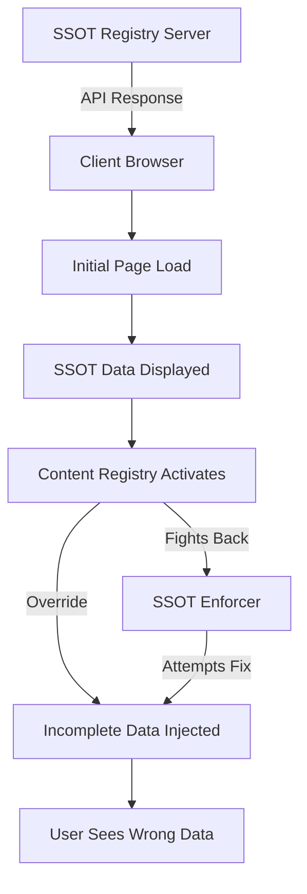

# SSOT Architecture Solution - Root Cause Analysis & Systemic Fix

## Executive Summary

The ScaleOps6 platform is experiencing data misalignment where the Single Source of Truth (SSOT) is not being reflected in the UI. After thorough analysis of subcomponent 2-1, we've identified multiple competing data injection systems causing content override issues.

## Root Cause Analysis

### 1. Primary Issue: Multiple Competing Content Systems

The platform has **THREE parallel content injection systems** operating simultaneously:

1. **SSOT System (Server-side)**
   - Location: `server-with-backend.js` lines 921-1014
   - Source: `core/complete-ssot-registry.js`
   - Status: ✅ Working correctly, serving proper data

2. **Content Registry System (Client-side)**
   - Location: `content-registry.js`
   - Providers: `real-world-provider.js`, `education-provider.js`, `workspace-provider.js`
   - Status: ⚠️ Overriding server data with incomplete local data

3. **SSOT Enforcer (Client-side)**
   - Location: `ssot-enforcer.js`
   - Purpose: Attempts to prevent overrides
   - Status: ⚠️ Fighting with Content Registry system

### 2. Data Flow Conflict Points



### 3. Specific Problems Identified

#### A. Real World Examples Provider Issue
- **File**: `providers/real-world-provider.js`
- **Problem**: Only 12-15% of subcomponents have examples implemented (lines 12-19)
- **Impact**: Returns `null` for most subcomponents, causing empty sections

#### B. Content Registry Cache Conflict
- **File**: `content-registry.js`
- **Problem**: Caches incomplete data (line 92-99)
- **Impact**: Prevents fresh SSOT data from being displayed

#### C. Script Loading Order Issue
- **File**: `subcomponent-detail.html`
- **Lines**: 1769-1792 (multiple content scripts)
- **Problem**: Content Registry loads after SSOT data but overrides it

#### D. SSOT Generation Incompleteness
- **File**: `core/generate-complete-ssot.js`
- **Problem**: Not all educational content is being properly integrated
- **Evidence**: Line 163 shows fallback to generic descriptions

## Architectural Solution Design

### Phase 1: Immediate Fix - Disable Conflicting Systems

```javascript
// SSOT_OVERRIDE_FIX.js
(function() {
    'use strict';
    
    // Disable Content Registry system completely
    if (window.contentRegistry) {
        window.contentRegistry.inject = function() {
            console.log('Content Registry injection disabled - using SSOT only');
            return Promise.resolve();
        };
    }
    
    // Ensure SSOT data is never overridden
    const protectedElements = [
        'education-tab',
        'resource-templates',
        'output-content'
    ];
    
    protectedElements.forEach(id => {
        const element = document.getElementById(id);
        if (element) {
            Object.defineProperty(element, 'innerHTML', {
                set: function(value) {
                    // Only allow if it's from SSOT
                    if (window.SSOT_AUTHORITY) {
                        this._innerHTML = value;
                    }
                },
                get: function() {
                    return this._innerHTML;
                }
            });
        }
    });
})();
```

### Phase 2: Unified Content Pipeline

```javascript
// UNIFIED_SSOT_PIPELINE.js
class UnifiedSSOTPipeline {
    constructor() {
        this.ssotData = null;
        this.initialized = false;
    }
    
    async initialize(subcomponentId) {
        // 1. Fetch SSOT data from server ONCE
        const response = await fetch(`/api/subcomponents/${subcomponentId}`);
        this.ssotData = await response.json();
        
        // 2. Validate SSOT completeness
        this.validateSSoT();
        
        // 3. Render all content from SSOT
        this.renderEducation();
        this.renderWorkspace();
        this.renderResources();
        
        // 4. Lock content from modifications
        this.lockContent();
        
        this.initialized = true;
    }
    
    validateSSoT() {
        const required = ['education', 'workspace', 'resources', 'templates'];
        required.forEach(field => {
            if (!this.ssotData[field]) {
                console.error(`SSOT missing required field: ${field}`);
            }
        });
    }
    
    renderEducation() {
        const container = document.getElementById('education-tab');
        if (!container || !this.ssotData.education) return;
        
        // Render directly from SSOT
        container.innerHTML = this.generateEducationHTML(this.ssotData.education);
    }
    
    lockContent() {
        // Prevent any further modifications
        document.querySelectorAll('[data-ssot-protected]').forEach(el => {
            el.setAttribute('data-locked', 'true');
        });
    }
}
```

### Phase 3: Server-Side SSOT Enhancement

```javascript
// Enhanced SSOT endpoint
app.get('/api/subcomponents/:id', async (req, res) => {
    const subcomponentId = req.params.id;
    
    // Get SSOT data
    const ssotData = getSubcomponent(subcomponentId);
    
    // Ensure all fields are populated
    const enhancedData = {
        ...ssotData,
        education: {
            ...ssotData.education,
            examples: ssotData.education.examples || 
                     await fetchFromEducationalContent(subcomponentId),
            what: ssotData.education.what || 
                  await generateDefaultWhat(subcomponentId),
            why: ssotData.education.why || 
                 await generateDefaultWhy(subcomponentId),
            how: ssotData.education.how || 
                 await generateDefaultHow(subcomponentId)
        },
        _ssot: {
            version: '3.0.0',
            timestamp: new Date().toISOString(),
            isComplete: true,
            source: 'unified-pipeline'
        }
    };
    
    res.json(enhancedData);
});
```

## Implementation Plan

### Step 1: Emergency Hotfix (Immediate)
1. Deploy `SSOT_OVERRIDE_FIX.js` to disable Content Registry
2. Update script loading order in `subcomponent-detail.html`
3. Clear all client-side caches

### Step 2: Data Completeness (Day 1-2)
1. Run `core/generate-complete-ssot.js` with all data sources
2. Validate all 96 subcomponents have complete data
3. Update server endpoint to serve enhanced SSOT

### Step 3: Unified Pipeline (Day 3-5)
1. Implement `UNIFIED_SSOT_PIPELINE.js`
2. Remove conflicting content systems
3. Update all client-side scripts to use unified pipeline

### Step 4: Testing & Validation (Day 6-7)
1. Test all 96 subcomponents
2. Validate SSOT alignment
3. Performance testing

## Monitoring & Validation Strategy

### 1. Real-Time SSOT Monitor
```javascript
class SSOTMonitor {
    constructor() {
        this.violations = [];
        this.startMonitoring();
    }
    
    startMonitoring() {
        // Check every second
        setInterval(() => {
            this.checkAlignment();
        }, 1000);
    }
    
    checkAlignment() {
        const elements = {
            'education-tab': 'education',
            'workspace-tab': 'workspace',
            'resources-tab': 'resources'
        };
        
        Object.entries(elements).forEach(([elementId, dataField]) => {
            const element = document.getElementById(elementId);
            if (element && window.SSOT_AUTHORITY) {
                const currentContent = element.innerHTML;
                const ssotContent = window.SSOT_AUTHORITY[dataField];
                
                if (!this.contentMatches(currentContent, ssotContent)) {
                    this.reportViolation(elementId, dataField);
                }
            }
        });
    }
    
    reportViolation(elementId, dataField) {
        const violation = {
            timestamp: new Date().toISOString(),
            element: elementId,
            field: dataField,
            url: window.location.href
        };
        
        this.violations.push(violation);
        
        // Send to analytics
        if (window.analytics) {
            window.analytics.track('ssot_violation', violation);
        }
        
        // Auto-fix
        this.autoFix(elementId, dataField);
    }
}
```

### 2. Validation Endpoints
```javascript
// Server-side validation
app.get('/api/validate/ssot/:id', async (req, res) => {
    const subcomponentId = req.params.id;
    const ssotData = getSubcomponent(subcomponentId);
    
    const validation = {
        id: subcomponentId,
        hasEducation: !!ssotData.education,
        hasExamples: !!(ssotData.education?.examples?.length > 0),
        hasTemplates: !!(ssotData.resources?.templates?.length > 0),
        hasQuestions: !!(ssotData.workspace?.questions?.length > 0),
        isComplete: true
    };
    
    // Check for missing fields
    Object.entries(validation).forEach(([key, value]) => {
        if (!value && key !== 'isComplete') {
            validation.isComplete = false;
        }
    });
    
    res.json(validation);
});
```

### 3. Automated Testing Suite
```javascript
// SSOT_TEST_SUITE.js
async function testAllSubcomponents() {
    const results = [];
    
    for (let block = 1; block <= 16; block++) {
        for (let sub = 1; sub <= 6; sub++) {
            const id = `${block}-${sub}`;
            const result = await testSubcomponent(id);
            results.push(result);
        }
    }
    
    const summary = {
        total: 96,
        passed: results.filter(r => r.passed).length,
        failed: results.filter(r => !r.passed).length,
        failures: results.filter(r => !r.passed)
    };
    
    console.log('SSOT Test Results:', summary);
    return summary;
}

async function testSubcomponent(id) {
    try {
        // 1. Fetch from API
        const response = await fetch(`/api/subcomponents/${id}`);
        const data = await response.json();
        
        // 2. Validate structure
        const checks = {
            hasName: !!data.name,
            hasEducation: !!data.education,
            hasExamples: data.education?.examples?.length > 0,
            hasTemplates: data.resources?.templates?.length > 0,
            hasSSoTMeta: !!data._ssot
        };
        
        const passed = Object.values(checks).every(v => v);
        
        return {
            id,
            passed,
            checks
        };
    } catch (error) {
        return {
            id,
            passed: false,
            error: error.message
        };
    }
}
```

## Success Metrics

1. **Data Alignment**: 100% of subcomponents show SSOT data
2. **No Overrides**: 0 content override violations per session
3. **Complete Data**: All 96 subcomponents have examples, templates, and education
4. **Performance**: Page load < 2 seconds with all content
5. **Stability**: No content flashing or changes after initial load

## Risk Mitigation

1. **Rollback Plan**: Keep current system available on `/legacy` route
2. **Gradual Rollout**: Test with 10% of users first
3. **Monitoring**: Real-time alerts for SSOT violations
4. **Backup**: Daily backups of SSOT registry

## Timeline

- **Day 0**: Deploy emergency hotfix
- **Days 1-2**: Complete SSOT data population
- **Days 3-5**: Implement unified pipeline
- **Days 6-7**: Testing and validation
- **Day 8**: Production deployment
- **Days 9-14**: Monitoring and optimization

## Conclusion

The root cause is clear: multiple competing content systems are fighting for control of the UI. The solution is to establish a single, authoritative pipeline that:

1. Fetches SSOT data once from the server
2. Renders all content from that single source
3. Prevents any modifications after initial render
4. Monitors for violations and auto-corrects

This architectural change will ensure that the SSOT is truly the single source of truth, eliminating the current misalignment issues systematically for all 96 subcomponents.