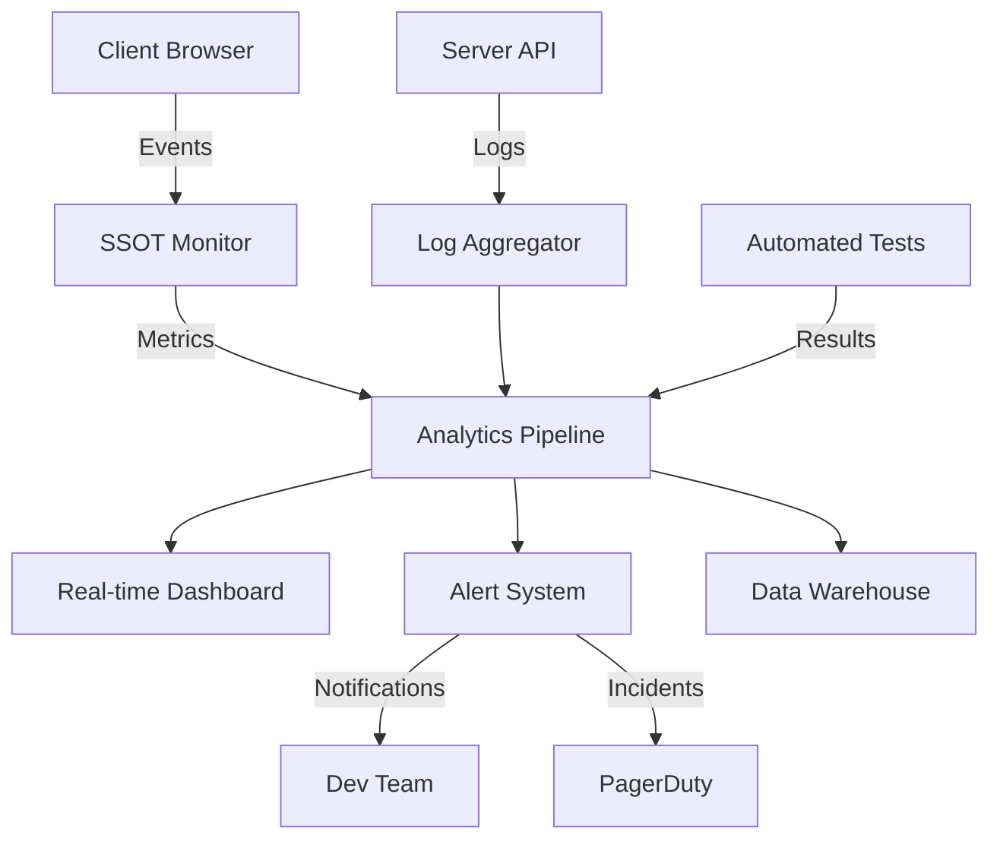

# SSOT Monitoring & Validation Strategy

## Executive Summary

This document outlines the comprehensive monitoring and validation strategy to ensure the Single Source of Truth (SSOT) remains the authoritative data source for all 96 subcomponents, preventing future misalignment issues.

## Monitoring Architecture



## 1. Client-Side Monitoring

### 1.1 SSOT Integrity Monitor
```javascript
class SSOTIntegrityMonitor {
    constructor() {
        this.config = {
            checkInterval: 1000,      // Check every second
            reportInterval: 60000,    // Report every minute
            maxViolations: 5,         // Alert threshold
            enableAutoFix: true       // Auto-correct violations
        };
        
        this.metrics = {
            violations: [],
            corrections: 0,
            performance: [],
            errors: [],
            sessionStart: Date.now()
        };
        
        this.initialize();
    }
    
    initialize() {
        // Start monitoring
        this.startIntegrityChecks();
        this.startPerformanceTracking();
        this.startErrorCapture();
        this.startReporting();
    }
    
    startIntegrityChecks() {
        setInterval(() => {
            const violations = this.checkDataIntegrity();
            if (violations.length > 0) {
                this.handleViolations(violations);
            }
        }, this.config.checkInterval);
    }
    
    checkDataIntegrity() {
        const violations = [];
        
        // Check 1: SSOT data exists
        if (!window.SSOT_AUTHORITY) {
            violations.push({
                type: 'missing_ssot',
                severity: 'critical',
                element: 'global',
                timestamp: Date.now()
            });
        }
        
        // Check 2: Education content matches SSOT
        const educationTab = document.getElementById('education-tab');
        if (educationTab && window.SSOT_AUTHORITY?.education) {
            const displayedExamples = educationTab.querySelectorAll('.bullet-list li').length;
            const ssotExamples = window.SSOT_AUTHORITY.education.examples?.length || 0;
            
            if (displayedExamples !== ssotExamples) {
                violations.push({
                    type: 'content_mismatch',
                    severity: 'high',
                    element: 'education-examples',
                    expected: ssotExamples,
                    actual: displayedExamples,
                    timestamp: Date.now()
                });
            }
        }
        
        // Check 3: Templates match SSOT
        const templatesContainer = document.getElementById('resource-templates');
        if (templatesContainer && window.SSOT_AUTHORITY?.resources?.templates) {
            const displayedTemplates = templatesContainer.querySelectorAll('.template-item').length;
            const ssotTemplates = window.SSOT_AUTHORITY.resources.templates.length;
            
            if (displayedTemplates !== ssotTemplates) {
                violations.push({
                    type: 'template_mismatch',
                    severity: 'medium',
                    element: 'resource-templates',
                    expected: ssotTemplates,
                    actual: displayedTemplates,
                    timestamp: Date.now()
                });
            }
        }
        
        return violations;
    }
    
    handleViolations(violations) {
        // Log violations
        this.metrics.violations.push(...violations);
        
        // Auto-fix if enabled
        if (this.config.enableAutoFix) {
            violations.forEach(violation => {
                this.autoFixViolation(violation);
            });
        }
        
        // Alert if threshold exceeded
        if (this.metrics.violations.length > this.config.maxViolations) {
            this.sendAlert('critical', 'SSOT violations exceeded threshold');
        }
    }
    
    autoFixViolation(violation) {
        console.warn('🔧 Auto-fixing violation:', violation);
        
        switch(violation.type) {
            case 'missing_ssot':
                // Reload SSOT data
                this.reloadSSoT();
                break;
                
            case 'content_mismatch':
                // Re-render from SSOT
                if (window.SSOT_AUTHORITY) {
                    this.rerenderContent('education');
                }
                break;
                
            case 'template_mismatch':
                // Re-render templates
                if (window.SSOT_AUTHORITY) {
                    this.rerenderContent('templates');
                }
                break;
        }
        
        this.metrics.corrections++;
    }
    
    startPerformanceTracking() {
        // Track page load performance
        if (window.performance && window.performance.timing) {
            const timing = window.performance.timing;
            const loadTime = timing.loadEventEnd - timing.navigationStart;
            const domReady = timing.domContentLoadedEventEnd - timing.navigationStart;
            const ssotLoadTime = window.SSOT_LOAD_TIME || 0;
            
            this.metrics.performance.push({
                loadTime,
                domReady,
                ssotLoadTime,
                timestamp: Date.now()
            });
        }
        
        // Track render performance
        if (window.PerformanceObserver) {
            const observer = new PerformanceObserver((list) => {
                for (const entry of list.getEntries()) {
                    if (entry.name.includes('ssot')) {
                        this.metrics.performance.push({
                            type: 'render',
                            name: entry.name,
                            duration: entry.duration,
                            timestamp: Date.now()
                        });
                    }
                }
            });
            observer.observe({ entryTypes: ['measure', 'navigation'] });
        }
    }
    
    startErrorCapture() {
        window.addEventListener('error', (event) => {
            if (event.message.includes('SSOT') || 
                event.message.includes('content') ||
                event.filename.includes('ssot')) {
                this.metrics.errors.push({
                    message: event.message,
                    filename: event.filename,
                    line: event.lineno,
                    column: event.colno,
                    timestamp: Date.now()
                });
            }
        });
    }
    
    startReporting() {
        setInterval(() => {
            this.sendReport();
        }, this.config.reportInterval);
    }
    
    sendReport() {
        const report = {
            sessionId: this.getSessionId(),
            subcomponentId: this.getSubcomponentId(),
            metrics: {
                violationCount: this.metrics.violations.length,
                correctionCount: this.metrics.corrections,
                errorCount: this.metrics.errors.length,
                avgLoadTime: this.calculateAvgLoadTime(),
                uptime: Date.now() - this.metrics.sessionStart
            },
            violations: this.metrics.violations.slice(-10), // Last 10
            errors: this.metrics.errors.slice(-5),          // Last 5
            timestamp: Date.now()
        };
        
        // Send to analytics
        if (window.analytics) {
            window.analytics.track('ssot_monitoring_report', report);
        }
        
        // Send to server
        fetch('/api/monitoring/ssot', {
            method: 'POST',
            headers: { 'Content-Type': 'application/json' },
            body: JSON.stringify(report)
        }).catch(err => console.error('Failed to send monitoring report:', err));
        
        // Log to console in debug mode
        if (window.location.hostname === 'localhost') {
            console.log('📊 SSOT Monitoring Report:', report);
        }
    }
    
    calculateAvgLoadTime() {
        const loadTimes = this.metrics.performance
            .filter(p => p.loadTime)
            .map(p => p.loadTime);
        
        if (loadTimes.length === 0) return 0;
        return loadTimes.reduce((a, b) => a + b, 0) / loadTimes.length;
    }
    
    getSessionId() {
        return window.sessionId || 'unknown';
    }
    
    getSubcomponentId() {
        const urlParams = new URLSearchParams(window.location.search);
        return urlParams.get('id') || 'unknown';
    }
}

// Auto-initialize
if (typeof window !== 'undefined') {
    window.SSOTMonitor = new SSOTIntegrityMonitor();
}
```

### 1.2 Content Change Detector
```javascript
class ContentChangeDetector {
    constructor() {
        this.observers = new Map();
        this.changes = [];
        this.setupObservers();
    }
    
    setupObservers() {
        const criticalElements = [
            'education-tab',
            'workspace-tab',
            'resources-tab',
            'output-tab'
        ];
        
        criticalElements.forEach(id => {
            const element = document.getElementById(id);
            if (element) {
                this.observeElement(id, element);
            }
        });
    }
    
    observeElement(id, element) {
        const observer = new MutationObserver((mutations) => {
            mutations.forEach(mutation => {
                this.recordChange(id, mutation);
            });
        });
        
        observer.observe(element, {
            childList: true,
            subtree: true,
            characterData: true,
            attributes: true
        });
        
        this.observers.set(id, observer);
    }
    
    recordChange(elementId, mutation) {
        const change = {
            elementId,
            type: mutation.type,
            timestamp: Date.now(),
            target: mutation.target.nodeName,
            isAuthorized: this.isAuthorizedChange(mutation)
        };
        
        this.changes.push(change);
        
        if (!change.isAuthorized) {
            console.warn('⚠️ Unauthorized content change detected:', change);
            this.revertChange(mutation);
        }
    }
    
    isAuthorizedChange(mutation) {
        // Check if change came from SSOT system
        return mutation.target.hasAttribute('data-ssot-authorized');
    }
    
    revertChange(mutation) {
        // Revert unauthorized changes
        if (mutation.type === 'childList' && mutation.removedNodes.length > 0) {
            mutation.removedNodes.forEach(node => {
                mutation.target.appendChild(node);
            });
        }
    }
}
```

## 2. Server-Side Monitoring

### 2.1 API Endpoint Monitoring
```javascript
// server-monitoring.js
const monitoringMiddleware = (req, res, next) => {
    const start = Date.now();
    
    // Capture original send
    const originalSend = res.send;
    
    res.send = function(data) {
        const duration = Date.now() - start;
        
        // Log SSOT API calls
        if (req.path.includes('/api/subcomponents')) {
            const metrics = {
                path: req.path,
                method: req.method,
                duration,
                statusCode: res.statusCode,
                subcomponentId: req.params.id,
                timestamp: new Date().toISOString()
            };
            
            // Check for data completeness
            if (typeof data === 'string') {
                try {
                    const jsonData = JSON.parse(data);
                    metrics.hasEducation = !!jsonData.education;
                    metrics.hasExamples = !!(jsonData.education?.examples?.length > 0);
                    metrics.hasTemplates = !!(jsonData.resources?.templates?.length > 0);
                    metrics.isComplete = metrics.hasEducation && 
                                       metrics.hasExamples && 
                                       metrics.hasTemplates;
                } catch (e) {
                    metrics.parseError = true;
                }
            }
            
            // Log to monitoring system
            logMetrics('ssot_api', metrics);
            
            // Alert if incomplete data
            if (!metrics.isComplete) {
                sendAlert('warning', `Incomplete SSOT data for ${req.params.id}`);
            }
        }
        
        originalSend.call(this, data);
    };
    
    next();
};

app.use(monitoringMiddleware);
```

### 2.2 Data Validation Endpoint
```javascript
app.get('/api/validate/ssot/:id', async (req, res) => {
    const subcomponentId = req.params.id;
    
    try {
        const ssotData = getSubcomponent(subcomponentId);
        const educationalData = educationalContent[subcomponentId];
        
        const validation = {
            subcomponentId,
            timestamp: new Date().toISOString(),
            
            // Data existence checks
            exists: {
                ssot: !!ssotData,
                educational: !!educationalData,
                name: !!ssotData?.name,
                education: !!ssotData?.education,
                workspace: !!ssotData?.workspace,
                resources: !!ssotData?.resources
            },
            
            // Content completeness
            content: {
                what: !!ssotData?.education?.what,
                why: !!ssotData?.education?.why,
                how: !!ssotData?.education?.how,
                examples: ssotData?.education?.examples?.length || 0,
                templates: ssotData?.resources?.templates?.length || 0,
                questions: ssotData?.workspace?.questions?.length || 0
            },
            
            // Data alignment
            alignment: {
                nameMatch: ssotData?.name === educationalData?.title,
                examplesMatch: JSON.stringify(ssotData?.education?.examples) === 
                              JSON.stringify(educationalData?.examples),
                templatesConsistent: ssotData?.resources?.templates?.length === 
                                   ssotData?.outputs?.templates?.length
            },
            
            // Overall status
            isValid: false,
            issues: []
        };
        
        // Determine overall validity
        validation.isValid = Object.values(validation.exists).every(v => v) &&
                           validation.content.examples > 0 &&
                           validation.content.templates > 0 &&
                           Object.values(validation.alignment).every(v => v);
        
        // Collect issues
        if (!validation.exists.ssot) validation.issues.push('Missing SSOT data');
        if (validation.content.examples === 0) validation.issues.push('No examples');
        if (validation.content.templates === 0) validation.issues.push('No templates');
        if (!validation.alignment.nameMatch) validation.issues.push('Name mismatch');
        
        res.json(validation);
        
    } catch (error) {
        res.status(500).json({
            error: error.message,
            subcomponentId,
            timestamp: new Date().toISOString()
        });
    }
});
```

## 3. Automated Validation

### 3.1 Continuous Integration Tests
```yaml
# .github/workflows/ssot-validation.yml
name: SSOT Validation

on:
  push:
    paths:
      - 'core/**'
      - 'educational-content.js'
      - 'server-with-backend.js'
  schedule:
    - cron: '0 */6 * * *'  # Every 6 hours

jobs:
  validate:
    runs-on: ubuntu-latest
    
    steps:
      - uses: actions/checkout@v2
      
      - name: Setup Node.js
        uses: actions/setup-node@v2
        with:
          node-version: '16'
      
      - name: Install dependencies
        run: npm ci
      
      - name: Validate SSOT Registry
        run: |
          node core/validate-ssot-alignment.js
          
      - name: Test All Subcomponents
        run: |
          npm run test:ssot
          
      - name: Generate Report
        run: |
          node scripts/generate-ssot-report.js > ssot-report.json
          
      - name: Upload Report
        uses: actions/upload-artifact@v2
        with:
          name: ssot-validation-report
          path: ssot-report.json
          
      - name: Alert on Failure
        if: failure()
        uses: 8398a7/action-slack@v3
        with:
          status: ${{ job.status }}
          text: 'SSOT Validation Failed!'
          webhook_url: ${{ secrets.SLACK_WEBHOOK }}
```

### 3.2 Scheduled Validation Script
```javascript
// scheduled-validator.js
const cron = require('node-cron');
const { validateAllSubcomponents } = require('./core/validate-ssot-alignment');

// Run every hour
cron.schedule('0 * * * *', async () => {
    console.log('Starting scheduled SSOT validation...');
    
    const results = await validateAllSubcomponents();
    
    // Store results
    const report = {
        timestamp: new Date().toISOString(),
        total: 96,
        passed: results.passCount,
        failed: 96 - results.passCount,
        errors: results.errors,
        warnings: results.warnings
    };
    
    // Save to database
    await saveValidationReport(report);
    
    // Alert if issues found
    if (results.errors.length > 0) {
        await sendAlert('error', `SSOT Validation: ${results.errors.length} errors found`);
    }
    
    console.log('Validation complete:', report);
});
```

## 4. Real-Time Dashboard

### 4.1 Monitoring Dashboard Components
```javascript
// dashboard-config.js
const dashboardConfig = {
    widgets: [
        {
            id: 'ssot-health',
            type: 'status',
            title: 'SSOT System Health',
            metrics: ['uptime', 'violations', 'corrections']
        },
        {
            id: 'subcomponent-coverage',
            type: 'progress',
            title: 'Subcomponent Data Coverage',
            total: 96,
            metric: 'complete_subcomponents'
        },
        {
            id: 'violation-timeline',
            type: 'timeline',
            title: 'Violation History (24h)',
            metric: 'violations_per_hour'
        },
        {
            id: 'performance-metrics',
            type: 'chart',
            title: 'Load Time Performance',
            metrics: ['avg_load_time', 'p95_load_time']
        },
        {
            id: 'error-log',
            type: 'log',
            title: 'Recent Errors',
            limit: 20,
            metric: 'ssot_errors'
        }
    ]
};
```

### 4.2 Alert Configuration
```javascript
const alertRules = [
    {
        name: 'High Violation Rate',
        condition: 'violations_per_minute > 5',
        severity: 'critical',
        channels: ['slack', 'pagerduty', 'email']
    },
    {
        name: 'Incomplete Data Served',
        condition: 'incomplete_responses > 0',
        severity: 'high',
        channels: ['slack', 'email']
    },
    {
        name: 'Slow Response Time',
        condition: 'avg_response_time > 2000',
        severity: 'medium',
        channels: ['slack']
    },
    {
        name: 'SSOT Registry Outdated',
        condition: 'registry_age_hours > 24',
        severity: 'low',
        channels: ['email']
    }
];
```

## 5. Validation Checkpoints

### 5.1 Pre-Deployment Validation
```bash
#!/bin/bash
# pre-deploy-validation.sh

echo "Running SSOT Pre-Deployment Validation..."

# 1. Validate registry completeness
node core/validate-ssot-alignment.js
if [ $? -ne 0 ]; then
    echo "❌ Registry validation failed"
    exit 1
fi

# 2. Test sample subcomponents
for id in "1-1" "2-1" "7-3" "16-6"; do
    curl -s "http://localhost:3001/api/validate/ssot/$id" | jq '.isValid'
    if [ $? -ne 0 ]; then
        echo "❌ Subcomponent $id validation failed"
        exit 1
    fi
done

# 3. Performance test
npm run test:performance
if [ $? -ne 0 ]; then
    echo "❌ Performance test failed"
    exit 1
fi

echo "✅ All validations passed"
exit 0
```

### 5.2 Post-Deployment Validation
```javascript
// post-deploy-validator.js
async function validateDeployment() {
    const checks = [];
    
    // 1. Check all endpoints responsive
    for (let i = 1; i <= 16; i++) {
        for (let j = 1; j <= 6; j++) {
            const id = `${i}-${j}`;
            const response = await fetch(`/api/subcomponents/${id}`);
            checks.push({
                id,
                status: response.status,
                hasData: response.ok
            });
        }
    }
    
    // 2. Verify no client-side errors
    const browser = await puppeteer.launch();
    const page = await browser.newPage();
    
    const errors = [];
    page.on('console', msg => {
        if (msg.type() === 'error') {
            errors.push(msg.text());
        }
    });
    
    await page.goto('http://localhost:3001/subcomponent-detail.html?id=2-1');
    await page.waitForTimeout(5000);
    await browser.close();
    
    // 3. Generate report
    const report = {
        timestamp: new Date().toISOString(),
        totalChecks: checks.length,
        successful: checks.filter(c => c.hasData).length,
        failed: checks.filter(c => !c.hasData),
        clientErrors: errors,
        status: checks.every(c => c.hasData) && errors.length === 0 ? 'PASS' : 'FAIL'
    };
    
    console.log('Post-Deployment Validation:', report);
    return report;
}
```

## 6. Key Performance Indicators (KPIs)

### 6.1 SSOT Health Metrics
- **Data Completeness**: % of subcomponents with all required fields
- **Alignment Score**: % of time SSOT matches displayed content
- **Violation Rate**: Number of content overrides per hour
- **Correction Success**: % of auto-corrections that succeed
- **Load Performance**: Average time to load SSOT data

### 6.2 Target Metrics
| Metric | Target | Critical Threshold |
|--------|--------|-------------------|
| Data Completeness | 100% | < 95% |
| Alignment Score | 99.9% | < 98% |
| Violation Rate | < 1/hour | > 10/hour |
| Correction Success | 100% | < 90% |
| Load Performance | < 500ms | > 2000ms |

## 7. Incident Response

### 7.1 Escalation Matrix
| Severity | Response Time | Team | Actions |
|----------|--------------|------|---------|
| Critical | < 15 min | On-call Dev + SRE | Immediate fix or rollback |
| High | < 1 hour | Dev Team Lead | Investigation and fix |
| Medium | < 4 hours | Dev Team | Schedule fix for next release |
| Low | < 24 hours | Dev Team | Add to backlog |

### 7.2 Runbook for Common Issues
```markdown
## Issue: Content Override Detected

1. Check SSOT Enforcer status: `window.SSOT_ENFORCER.getStats()`
2. Verify SSOT data loaded: `window.SSOT_AUTHORITY`
3. Check for conflicting scripts in Network tab
4. Force reload SSOT: `window.SSOT_ENFORCER.reload()`
5. If persists, disable Content Registry: `window.contentRegistry = null`

## Issue: Missing Real World Examples

1. Validate server response: `curl /api/subcomponents/[ID]`
2. Check educational content: `node -e "console.log(require('./educational-content')[ID])"`
3. Regenerate SSOT: `node core/generate-complete-ssot.js`
4. Clear cache and reload

## Issue: Performance Degradation

1. Check monitoring dashboard for bottlenecks
2. Review recent deployments
3. Check database query performance
4. Verify CDN cache hit rates
5. Scale servers if needed
```

## Conclusion

This comprehensive monitoring and validation strategy ensures:

1. **Real-time Detection**: Issues are caught within seconds
2. **Automatic Remediation**: Most problems self-correct
3. **Continuous Validation**: Automated tests run constantly
4. **Clear Visibility**: Dashboard shows system health at a glance
5. **Rapid Response**: Clear escalation paths for incidents

By implementing this strategy, we maintain SSOT integrity across all 96 subcomponents, ensuring users always see the correct, authoritative data.