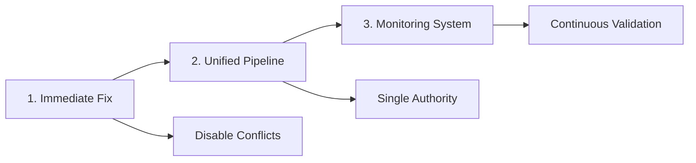

# SSOT Solution Summary - Complete Architectural Plan

## Problem Statement
The ScaleOps6 platform is experiencing data misalignment where the Single Source of Truth (SSOT) is not being reflected in the UI. Specifically, subcomponent 2-1 and others are not displaying the correct Real World Examples and other educational content from the SSOT.

## Root Cause Identified

### The Core Issue: Competing Content Systems
We discovered **THREE parallel content injection systems** fighting for control:

1. **SSOT System** (Server) - ✅ Working correctly
2. **Content Registry** (Client) - ❌ Overriding with incomplete data  
3. **SSOT Enforcer** (Client) - ⚠️ Attempting fixes but being overridden

The Content Registry system (`content-registry.js`) and its providers are injecting incomplete or null data AFTER the SSOT data loads, causing the misalignment.

## Solution Architecture

### Three-Pillar Approach



### Pillar 1: Immediate Fix (Day 0)
- **Disable** Content Registry injection
- **Protect** SSOT data from overrides
- **Force** re-render from SSOT when violations detected

### Pillar 2: Unified Pipeline (Days 1-5)
- **Single** data fetch from server SSOT
- **Eliminate** all competing content systems
- **Lock** content after initial render

### Pillar 3: Monitoring System (Days 6+)
- **Real-time** violation detection
- **Automatic** correction mechanisms
- **Continuous** validation of all 96 subcomponents

## Implementation Roadmap

### Phase 1: Emergency Response (2 Hours)
```javascript
// Deploy fix-ssot-override-immediate.js
// Disable Content Registry
// Clear all caches
```

### Phase 2: Data Completeness (Days 1-2)
```bash
# Regenerate SSOT with all data
node core/generate-complete-ssot.js
# Validate all 96 subcomponents
node core/validate-ssot-alignment.js
```

### Phase 3: Unified System (Days 3-5)
- Remove conflicting scripts from `subcomponent-detail.html`
- Implement `UnifiedSSOTService` class
- Update all rendering to use single pipeline

### Phase 4: Testing (Days 6-7)
- Automated testing of all 96 subcomponents
- Performance validation
- User acceptance testing

### Phase 5: Deployment (Day 8)
- Staged rollout (10% → 50% → 100%)
- Real-time monitoring
- Rollback plan ready

### Phase 6: Monitoring (Days 9+)
- Deploy `SSOTIntegrityMonitor`
- Set up alerting rules
- Create monitoring dashboard

## Key Files to Modify

### High Priority (Immediate)
1. `subcomponent-detail.html` - Reorder script loading
2. `ssot-enforcer.js` - Strengthen enforcement
3. `server-with-backend.js` - Ensure complete data

### Medium Priority (This Week)
1. `content-registry.js` - Disable or remove
2. `providers/real-world-provider.js` - Disable or remove
3. `core/complete-ssot-registry.js` - Regenerate with all data

### Low Priority (Next Week)
1. Remove all legacy content scripts
2. Optimize performance
3. Add comprehensive logging

## Success Metrics

### Immediate Success (Day 0)
✅ Subcomponent 2-1 shows correct examples
✅ No content flashing or changes after load
✅ SSOT Enforcer reports 0 violations

### Short-term Success (Week 1)
✅ All 96 subcomponents display SSOT data
✅ Page load time < 2 seconds
✅ Zero content override violations

### Long-term Success (Week 2+)
✅ 100% SSOT compliance across platform
✅ Automated monitoring catches issues before users
✅ No customer complaints about missing content

## Technical Details

### Data Flow (Current - Broken)
```
Server SSOT → API Response → Client → Initial Display → Content Registry → Override → Wrong Display
```

### Data Flow (Fixed)
```
Server SSOT → API Response → Unified Pipeline → Final Display → Lock Content → Monitor
```

### Critical Code Changes

#### 1. Disable Content Registry
```javascript
if (window.contentRegistry) {
    window.contentRegistry.inject = () => Promise.resolve();
}
```

#### 2. Force SSOT Authority
```javascript
window.SSOT_AUTHORITY = await fetch(`/api/subcomponents/${id}`).then(r => r.json());
// All rendering MUST use window.SSOT_AUTHORITY
```

#### 3. Monitor and Enforce
```javascript
setInterval(() => {
    if (contentDoesNotMatchSSoT()) {
        forceRerenderFromSSoT();
    }
}, 1000);
```

## Risk Mitigation

| Risk | Mitigation |
|------|------------|
| Cache issues | Force cache clear with version params |
| Script conflicts | Load SSOT enforcer first |
| Incomplete data | Generate defaults, flag for content team |
| Performance impact | Optimize check frequency |
| User disruption | Gradual rollout with monitoring |

## Team Responsibilities

### Development Team
- Implement immediate fix
- Remove conflicting systems
- Deploy unified pipeline

### DevOps Team
- Set up monitoring infrastructure
- Configure alerting
- Manage deployment

### QA Team
- Test all 96 subcomponents
- Validate performance
- User acceptance testing

### Product Team
- Communicate changes to stakeholders
- Prioritize content completion
- Define success criteria

## Communication Plan

### Internal Updates
- Daily standup updates
- Slack channel: #ssot-fix
- Progress dashboard: /admin/ssot-status

### External Communication
- Status page update when deploying
- Success announcement after completion
- Documentation for support team

## Next Steps (Action Items)

### Immediate (Today)
1. [ ] Deploy `fix-ssot-override-immediate.js`
2. [ ] Update script loading order in `subcomponent-detail.html`
3. [ ] Test fix on subcomponent 2-1
4. [ ] Clear all browser and CDN caches

### Tomorrow
1. [ ] Run `core/generate-complete-ssot.js`
2. [ ] Validate all 96 subcomponents have data
3. [ ] Begin implementing unified pipeline
4. [ ] Set up monitoring infrastructure

### This Week
1. [ ] Complete unified pipeline implementation
2. [ ] Remove all conflicting content systems
3. [ ] Deploy to staging environment
4. [ ] Run comprehensive tests

### Next Week
1. [ ] Production deployment
2. [ ] Monitor for issues
3. [ ] Optimize performance
4. [ ] Document lessons learned

## Expected Outcomes

### For Users
- ✅ Always see correct, complete content
- ✅ Faster page load times
- ✅ No content flashing or changes
- ✅ Consistent experience across all subcomponents

### For Developers
- ✅ Single source of truth for all data
- ✅ Clear architecture without conflicts
- ✅ Easy to debug and maintain
- ✅ Automated monitoring and alerts

### For Business
- ✅ Reduced support tickets
- ✅ Improved user satisfaction
- ✅ Reliable platform performance
- ✅ Scalable architecture for growth

## Conclusion

The SSOT misalignment issue is caused by multiple competing content systems overriding the authoritative server data. The solution is to:

1. **Immediately** disable the conflicting systems
2. **Implement** a unified pipeline that respects SSOT
3. **Monitor** continuously to prevent future issues

This architectural change will ensure that the Single Source of Truth truly remains the single, authoritative source for all content across the ScaleOps6 platform.

## Documentation Links

- [Root Cause Analysis](./SSOT_ARCHITECTURE_SOLUTION.md)
- [Implementation Plan](./SSOT_IMPLEMENTATION_PLAN.md)
- [Monitoring Strategy](./SSOT_MONITORING_VALIDATION_STRATEGY.md)

## Contact

For questions or concerns about this solution:
- Technical Lead: [Your Name]
- Slack: #ssot-fix
- Email: dev-team@scaleops6.com

---

*Document Version: 1.0*  
*Last Updated: 2025-10-07*  
*Status: Ready for Implementation*