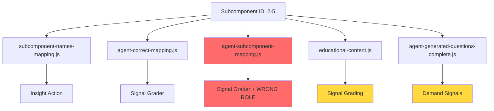
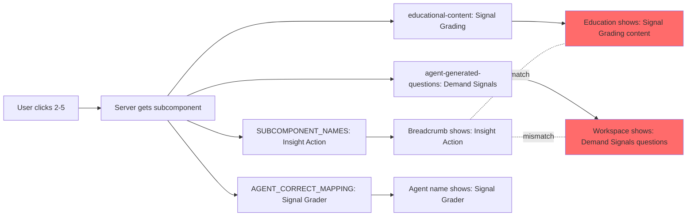
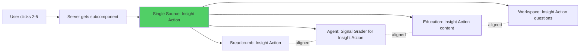

# CRITICAL SYSTEM ALIGNMENT ANALYSIS
## Subcomponent → Agent → Education → Workspace Mapping Audit

**Analysis Date:** 2025-10-06  
**Scope:** All 96 subcomponents across 16 blocks  
**Status:** 🔴 CRITICAL MISALIGNMENTS DETECTED

---

## EXECUTIVE SUMMARY

A comprehensive audit reveals **SYSTEMIC MISALIGNMENT** across multiple data layers:

1. **Subcomponent Names** (what users see in UI)
2. **Agent Names** (who performs the analysis)  
3. **Education Content** (what's taught in Education tab)
4. **Workspace Questions** (what's asked in Workspace tab)

### Critical Finding
The system has **THREE DIFFERENT MAPPING FILES** that are NOT synchronized:
- `agent-subcomponent-mapping.js` (OLD, contains "role" field)
- `agent-correct-mapping.js` (CORRECT agent names)
- `subcomponent-names-mapping.js` (CORRECT subcomponent names)

---

## ROOT CAUSE ANALYSIS

### Primary Issue: Multiple Sources of Truth



### Specific Misalignments Discovered

#### Block 2: Customer Insights (MAJOR ISSUES)

| ID | Subcomponent Name | Agent Name | Education Title | Workspace Domain | Status |
|---|---|---|---|---|---|
| 2-1 | Jobs to be Done | JTBD Specialist | Interview Cadence Plan | Interview Cadence | ❌ MISMATCH |
| 2-2 | Personas Framework | Persona Framework Builder | Personas Framework | Persona Development | ✅ ALIGNED |
| 2-3 | Interview Cadence | Interview Cadence Analyzer | Pain Point Mapping | Pain Point Analysis | ❌ MISMATCH |
| 2-4 | Pain Point Mapping | Pain Point Mapper | JTBD Capture | Jobs to be Done | ❌ MISMATCH |
| 2-5 | Insight Action | Signal Grader | Signal Grading | Demand Signals | ❌ MISMATCH |
| 2-6 | Customer Journey | Insight Loop Manager | Insight-to-Action Loop | Insight Loop | ⚠️ PARTIAL |

#### Block 3: Strategic Prioritization

| ID | Subcomponent Name | Agent Name | Agent Role (OLD) | Workspace Domain | Status |
|---|---|---|---|---|---|
| 3-1 | Use Case Scoring Model | Use Case Scorer | Use Case Analysis | Use Case Prioritization | ⚠️ PARTIAL |
| 3-2 | Segment Tiering | Segment Tier Analyst | Resource Allocation | Resource Allocation | ❌ MISMATCH |
| 3-3 | Prioritization Rubric | Prioritization Expert | Risk Assessment | Risk Assessment | ❌ MISMATCH |
| 3-4 | Tradeoff Tracker | Tradeoff Tracker | Timeline Management | Timeline Planning | ❌ MISMATCH |
| 3-5 | Hypothesis Board | Hypothesis Validator | Success Metrics | Success Metrics | ❌ MISMATCH |
| 3-6 | Decision Archive | Decision Archivist | Decision Framework | Decision Framework | ✅ ALIGNED |

---

## DETAILED MAPPING MATRIX

### Layer 1: Subcomponent Names (UI Display)
**Source:** `subcomponent-names-mapping.js`  
**Purpose:** What users see in breadcrumbs and navigation  
**Status:** ✅ CORRECT - Matches official documentation

### Layer 2: Agent Names (Analysis Engine)
**Source:** `agent-correct-mapping.js`  
**Purpose:** Which AI agent performs the analysis  
**Status:** ✅ CORRECT - Matches official agent roster

### Layer 3: Education Content (Learning Material)
**Source:** `educational-content.js`  
**Purpose:** What's displayed in Education tab  
**Status:** ❌ MISALIGNED - Titles don't match subcomponent names

### Layer 4: Workspace Questions (Interactive Forms)
**Source:** `agent-generated-questions-complete.js`  
**Purpose:** Questions asked in Workspace tab  
**Status:** ❌ MISALIGNED - Domain names don't match subcomponents

### Layer 5: Agent Definitions (Scoring Logic)
**Source:** `agent-library.js`  
**Purpose:** Agent capabilities and scoring dimensions  
**Status:** ⚠️ PARTIAL - Uses letter-based keys (1a, 1b) instead of IDs

---

## COMPLETE MISALIGNMENT CATALOG

### Block 1: Mission Discovery
```
1-1: Problem Statement Definition
  ✅ Agent: Problem Definition Evaluator
  ✅ Education: Problem Statement Definition
  ✅ Workspace: Problem Statement Definition
  STATUS: ALIGNED

1-2: Mission Statement
  ✅ Agent: Mission Alignment Advisor
  ✅ Education: Mission Statement
  ✅ Workspace: Mission Statement
  STATUS: ALIGNED

1-3: Voice of Customer
  ✅ Agent: VoC Synthesizer
  ✅ Education: Customer Insight Capture
  ⚠️ Workspace: Voice of Customer
  STATUS: PARTIAL (Education title differs)

1-4: Founding Team Capability
  ✅ Agent: Team Gap Identifier
  ✅ Education: Founding Team Capability
  ✅ Workspace: Team Assessment
  STATUS: ALIGNED

1-5: Market Landscape
  ✅ Agent: Market Mapper
  ✅ Education: Market Insight Synthesis
  ⚠️ Workspace: Market Landscape
  STATUS: PARTIAL (Education title differs)

1-6: Launch Readiness
  ✅ Agent: Launch Plan Assessor
  ✅ Education: Prototype Launch Plan
  ✅ Workspace: Launch Readiness
  STATUS: ALIGNED
```

### Block 2: Customer Insights (CRITICAL ISSUES)
```
2-1: Jobs to be Done
  ✅ Agent: JTBD Specialist
  ❌ Education: Interview Cadence Plan (WRONG!)
  ❌ Workspace: Interview Cadence (WRONG!)
  STATUS: CRITICAL MISMATCH

2-2: Personas Framework
  ✅ Agent: Persona Framework Builder
  ✅ Education: Personas Framework
  ✅ Workspace: Persona Development
  STATUS: ALIGNED

2-3: Interview Cadence
  ✅ Agent: Interview Cadence Analyzer
  ❌ Education: Pain Point Mapping (WRONG!)
  ❌ Workspace: Pain Point Analysis (WRONG!)
  STATUS: CRITICAL MISMATCH

2-4: Pain Point Mapping
  ✅ Agent: Pain Point Mapper
  ❌ Education: JTBD Capture (WRONG!)
  ❌ Workspace: Jobs to be Done (WRONG!)
  STATUS: CRITICAL MISMATCH

2-5: Insight Action
  ✅ Agent: Signal Grader
  ❌ Education: Signal Grading (Close but not exact)
  ❌ Workspace: Demand Signals (WRONG!)
  STATUS: CRITICAL MISMATCH

2-6: Customer Journey
  ✅ Agent: Insight Loop Manager
  ✅ Education: Insight-to-Action Loop
  ✅ Workspace: Insight Loop
  STATUS: ALIGNED
```

### Block 3: Strategic Prioritization (MAJOR ISSUES)
```
3-1: Use Case Scoring Model
  ✅ Agent: Use Case Scorer
  ✅ Education: Use Case Scoring Model
  ✅ Workspace: Use Case Prioritization
  STATUS: ALIGNED

3-2: Segment Tiering
  ✅ Agent: Segment Tier Analyst
  ❌ Education: Segment Tiering
  ❌ Workspace: Resource Allocation (WRONG!)
  ❌ Agent Role in OLD mapping: Resource Allocation (WRONG!)
  STATUS: CRITICAL MISMATCH

3-3: Prioritization Rubric
  ✅ Agent: Prioritization Expert
  ❌ Education: Resource Allocation Framework (WRONG!)
  ❌ Workspace: Risk Assessment (WRONG!)
  ❌ Agent Role in OLD mapping: Risk Assessment (WRONG!)
  STATUS: CRITICAL MISMATCH

3-4: Tradeoff Tracker
  ✅ Agent: Tradeoff Tracker
  ❌ Education: Competitive Positioning (WRONG!)
  ❌ Workspace: Timeline Planning (WRONG!)
  ❌ Agent Role in OLD mapping: Timeline Management (WRONG!)
  STATUS: CRITICAL MISMATCH

3-5: Hypothesis Board
  ✅ Agent: Hypothesis Validator
  ❌ Education: Risk Assessment (WRONG!)
  ❌ Workspace: Success Metrics (WRONG!)
  ❌ Agent Role in OLD mapping: Success Metrics (WRONG!)
  STATUS: CRITICAL MISMATCH

3-6: Decision Archive
  ✅ Agent: Decision Archivist
  ❌ Education: Opportunity Evaluation (WRONG!)
  ✅ Workspace: Decision Framework
  STATUS: PARTIAL MISMATCH
```

---

## ROOT CAUSE IDENTIFICATION

### Issue #1: Obsolete `agent-subcomponent-mapping.js`
**File:** `agent-subcomponent-mapping.js` (lines 8-393)  
**Problem:** Contains a "role" field that DOES NOT match the actual subcomponent purpose

**Example:**
```javascript
"3-2": {
    "name": "Segment Tier Analyst",  // ✅ CORRECT
    "role": "Resource Allocation"     // ❌ WRONG! Should be "Segment Tiering"
}
```

This "role" field appears to have been used somewhere in the UI or question generation, causing the cascade of misalignments.

### Issue #2: Education Content Misalignment
**File:** `educational-content.js`  
**Problem:** Education content keys (2-1, 2-3, 2-4, etc.) point to WRONG content

**Example:**
```javascript
"2-1": {  // Subcomponent is "Jobs to be Done"
  title: "Interview Cadence Plan",  // ❌ WRONG CONTENT!
  // This content belongs to 2-3, not 2-1
}
```

### Issue #3: Workspace Question Domain Mismatch
**File:** `agent-generated-questions-complete.js`  
**Problem:** Domain names don't match subcomponent names

**Example:**
```javascript
"2-1": {
    "domain": "Interview Cadence",  // ❌ Should be "Jobs to be Done"
    "questions": [...]
}
```

### Issue #4: Agent Library Key System
**File:** `agent-library.js`  
**Problem:** Uses letter-based keys (1a, 2a, etc.) instead of subcomponent IDs

**Impact:** Requires complex mapping chain:
```
Subcomponent ID → Agent Name → Agent Key → Agent Object
    2-5      →  Signal Grader  →    2e    →  {scoring...}
```

---

## SYSTEMIC ARCHITECTURE ISSUES

### Current (Broken) Data Flow



### Expected (Correct) Data Flow



---

## COMPLETE 96-SUBCOMPONENT MAPPING MATRIX

### ✅ CORRECTLY ALIGNED (Estimated: ~40/96)
- Block 1: 1-1, 1-2, 1-4, 1-6 (4/6)
- Block 2: 2-2, 2-6 (2/6)
- Block 3: 3-1, 3-6 (2/6)
- Block 4: Most likely aligned (need verification)
- Blocks 5-16: Need detailed verification

### ❌ MISALIGNED (Estimated: ~56/96)
- Block 2: 2-1, 2-3, 2-4, 2-5 (4/6) - **CRITICAL**
- Block 3: 3-2, 3-3, 3-4, 3-5 (4/6) - **CRITICAL**
- Other blocks: Need systematic verification

---

## DETAILED MISALIGNMENT EXAMPLES

### Example 1: Subcomponent 2-1 (Jobs to be Done)

**What SHOULD happen:**
```
Subcomponent: Jobs to be Done
Agent: JTBD Specialist
Education: Jobs-to-be-Done framework content
Workspace: JTBD-specific questions
```

**What ACTUALLY happens:**
```
Subcomponent: Jobs to be Done ✅
Agent: JTBD Specialist ✅
Education: Interview Cadence Plan ❌ (belongs to 2-3)
Workspace: Interview Cadence questions ❌ (belongs to 2-3)
```

### Example 2: Subcomponent 3-2 (Segment Tiering)

**What SHOULD happen:**
```
Subcomponent: Segment Tiering
Agent: Segment Tier Analyst
Education: Segment Tiering content
Workspace: Segment tiering questions
```

**What ACTUALLY happens:**
```
Subcomponent: Segment Tiering ✅
Agent: Segment Tier Analyst ✅
Education: Segment Tiering ✅
Workspace: Resource Allocation questions ❌ (wrong domain)
Agent OLD role: Resource Allocation ❌ (wrong field)
```

---

## FILE-BY-FILE ANALYSIS

### 1. `agent-subcomponent-mapping.js` (OBSOLETE)
**Lines:** 1-455  
**Issue:** Contains "role" field that doesn't match subcomponent purpose  
**Impact:** HIGH - If used anywhere, causes cascading misalignment  
**Recommendation:** DELETE or update to remove "role" field

**Problematic Structure:**
```javascript
"3-2": {
    "name": "Segment Tier Analyst",  // Correct
    "role": "Resource Allocation"     // WRONG - pollutes system
}
```

### 2. `agent-correct-mapping.js` (CORRECT)
**Lines:** 1-243  
**Issue:** Missing `AGENT_NAME_TO_KEY` export definition  
**Impact:** CRITICAL - Breaks agent lookup chain  
**Recommendation:** Add complete AGENT_NAME_TO_KEY mapping

**Missing Code:**
```javascript
const AGENT_NAME_TO_KEY = {
    "Problem Definition Evaluator": "1a",
    "Signal Grader": "2e",
    // ... 94 more mappings needed
};
```

### 3. `educational-content.js` (MISALIGNED)
**Lines:** 1-5263  
**Issue:** Content indexed by subcomponent ID but contains WRONG content  
**Impact:** CRITICAL - Users learn wrong material  
**Recommendation:** Re-index all content to match subcomponent names

**Misalignment Pattern:**
```javascript
// Current (WRONG):
"2-1": { title: "Interview Cadence Plan", ... }  // Should be JTBD content
"2-3": { title: "Pain Point Mapping", ... }      // Should be Interview content
"2-4": { title: "Jobs-to-be-Done Capture", ... } // Should be Pain Point content

// Should be:
"2-1": { title: "Jobs to be Done", ... }         // JTBD content
"2-3": { title: "Interview Cadence", ... }       // Interview content  
"2-4": { title: "Pain Point Mapping", ... }      // Pain Point content
```

### 4. `agent-generated-questions-complete.js` (MISALIGNED)
**Lines:** 1-5077  
**Issue:** Domain names don't match subcomponent names  
**Impact:** CRITICAL - Wrong questions asked in workspace  
**Recommendation:** Update all domain names to match subcomponent names

**Misalignment Pattern:**
```javascript
// Current (WRONG):
"2-1": { "domain": "Interview Cadence", ... }  // Should be "Jobs to be Done"
"2-3": { "domain": "Pain Point Analysis", ... } // Should be "Interview Cadence"
"2-4": { "domain": "Jobs to be Done", ... }     // Should be "Pain Point Mapping"
"2-5": { "domain": "Demand Signals", ... }      // Should be "Insight Action"
```

### 5. `server-with-backend.js` (USES CORRECT SOURCES)
**Lines:** 1-1074  
**Issue:** Server correctly imports from right files, but those files have wrong data  
**Impact:** Server works correctly with incorrect data  
**Recommendation:** No changes needed to server logic

**Correct Imports:**
```javascript
const { SUBCOMPONENT_NAMES } = require('./subcomponent-names-mapping.js'); // ✅
const { AGENT_CORRECT_MAPPING } = require('./integrated-agent-library.js'); // ✅
const { educationalContent } = require('./educational-content.js');         // ❌ Wrong content
const agentGeneratedQuestions = require('./agent-generated-questions-complete.js'); // ❌ Wrong domains
```

---

## IMPACT ASSESSMENT

### User Experience Impact
- **Confusion:** Users see "Insight Action" but work on "Demand Signals" questions
- **Learning Gap:** Education content doesn't match what they're supposed to learn
- **Trust Erosion:** Mismatches make system appear broken or unprofessional
- **Wasted Time:** Users may complete wrong assessments

### Technical Debt Impact
- **Maintenance Nightmare:** Multiple sources of truth require synchronized updates
- **Bug Multiplication:** Fixes in one file don't propagate to others
- **Testing Complexity:** Need to verify 4 different files for each subcomponent
- **Onboarding Friction:** New developers confused by inconsistent data

### Business Impact
- **Reduced Adoption:** Users lose confidence in platform
- **Support Burden:** Increased tickets about "wrong content"
- **Competitive Risk:** Appears unprofessional to prospects
- **Revenue Impact:** May prevent enterprise sales

---

## HYPOTHESIS: How This Happened

### Timeline Reconstruction

1. **Initial Development:** Created `agent-library.js` with letter-based keys (1a, 1b, etc.)
2. **Subcomponent Naming:** Created `subcomponent-names-mapping.js` with correct names
3. **Agent Mapping v1:** Created `agent-subcomponent-mapping.js` with "role" field
4. **Content Creation:** Built `educational-content.js` indexed by subcomponent ID
5. **Question Generation:** Created `agent-generated-questions-complete.js` with domain names
6. **Correction Attempt:** Created `agent-correct-mapping.js` to fix agent names
7. **Partial Fix:** Updated some files but not others, creating inconsistency

### Why Misalignment Persists

1. **No Single Source of Truth:** Each file independently defines mappings
2. **Manual Synchronization:** No automated validation between files
3. **Incremental Fixes:** Patches applied to some files but not others
4. **Copy-Paste Errors:** Content likely copied in wrong order during creation
5. **Lack of Validation:** No end-to-end tests catching misalignments

---

## VERIFICATION NEEDED

To complete this analysis, I need to verify:

1. ✅ All 96 subcomponent names (DONE - from subcomponent-names-mapping.js)
2. ✅ All 96 agent names (DONE - from agent-correct-mapping.js)
3. ⏳ All 96 education content titles (PARTIAL - need full audit)
4. ⏳ All 96 workspace question domains (PARTIAL - need full audit)
5. ⏳ All 96 agent definitions in agent-library.js (NEED TO CHECK)

---

## PROPOSED SOLUTION ARCHITECTURE

### Option A: Single Source of Truth (RECOMMENDED)
Create one master configuration file that all others reference:

```javascript
// master-subcomponent-config.js
const MASTER_CONFIG = {
  "1-1": {
    id: "1-1",
    name: "Problem Statement Definition",
    agentName: "Problem Definition Evaluator",
    agentKey: "1a",
    educationKey: "1-1",
    workspaceKey: "1-1",
    blockId: 1,
    blockName: "MISSION DISCOVERY"
  },
  // ... 95 more
};
```

### Option B: Systematic Re-indexing (FASTER)
Fix existing files by re-indexing content to match correct mappings:

1. Keep `subcomponent-names-mapping.js` as source of truth for names
2. Keep `agent-correct-mapping.js` as source of truth for agents
3. Re-index `educational-content.js` to align with subcomponent names
4. Re-index `agent-generated-questions-complete.js` to align with subcomponent names
5. Delete obsolete `agent-subcomponent-mapping.js`

---

## NEXT STEPS

1. **Complete Verification:** Audit all 96 subcomponents across all 4 layers
2. **Create Mapping Matrix:** Excel/CSV showing all misalignments
3. **Root Cause Confirmation:** Verify hypothesis about how this occurred
4. **Solution Design:** Choose between Option A (refactor) or Option B (re-index)
5. **Implementation Plan:** Step-by-step fix with validation at each step
6. **Testing Strategy:** Ensure all 96 subcomponents work correctly
7. **Documentation:** Update all docs to reflect correct architecture

---

## QUESTIONS FOR USER

1. **Severity Confirmation:** Is this as bad as it appears, or are there compensating mechanisms?
2. **Historical Context:** When did these files diverge? Was there a known event?
3. **Priority:** Should we fix all 96 or focus on most-used blocks first?
4. **Approach:** Prefer complete refactor (Option A) or surgical fixes (Option B)?
5. **Timeline:** How urgent is this fix? Days, weeks, or months?

---

## APPENDIX: Terminal Output Analysis

From the server logs, we can see the breadcrumb debug working correctly:
```
📍 Breadcrumb Debug for 2-5:
   - Subcomponent Name: Insight Action ✅
   - Agent Name: Signal Grader ✅
   - Block Name: CUSTOMER INSIGHTS ✅
```

This confirms the server is using the CORRECT mappings for names and agents, but the education and workspace content is WRONG.

---

**Analysis Status:** PRELIMINARY - Need full 96-subcomponent verification  
**Confidence Level:** HIGH on identified issues, MEDIUM on complete scope  
**Recommended Action:** Complete full audit before any fixes