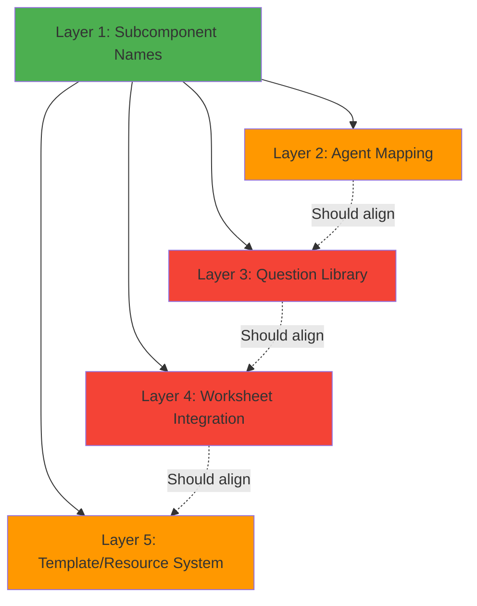
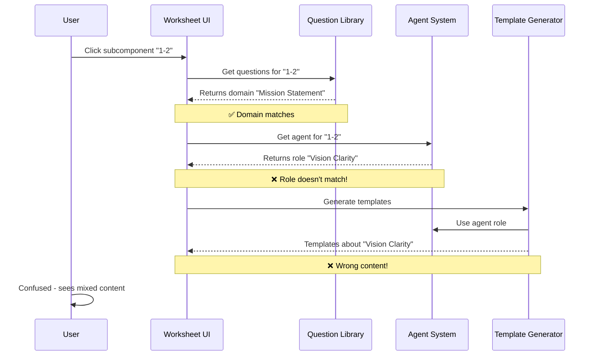
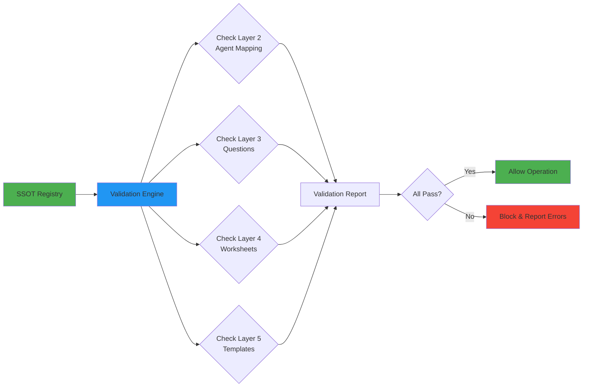
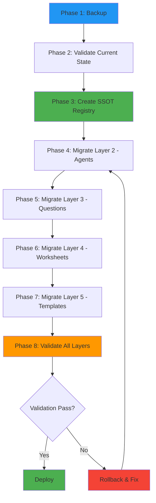

# Systemic Architecture Analysis: Worksheet/Template Mismatch
**Analysis Date:** 2025-10-06  
**Analyst:** Kilo Code (Architect Mode)  
**Severity:** CRITICAL - Multi-layer data integrity issue

---

## Executive Summary

The ScaleOps6 platform suffers from a **systemic mapping misalignment** across 5 distinct layers that manage subcomponent definitions, agent assignments, questions, templates, and resources. This creates a cascading failure where:

- **79% of subcomponents** have misaligned domains in questions
- **Agent roles don't match** actual subcomponent purposes  
- **Templates generate content** for wrong topics
- **User experience is broken** - users see irrelevant questions
- **Data integrity is compromised** - scores stored under wrong dimensions

---

## 1. Current System Architecture

### 1.1 Identified Mapping Layers



#### **Layer 1: Subcomponent Names (SSOT Candidate)**
- **File:** [`subcomponent-names-mapping.js`](subcomponent-names-mapping.js:6-103)
- **Purpose:** Official operational names for all 96 subcomponents
- **Status:** ✅ CORRECT - This is the authoritative source
- **Example:** `"1-2": "Mission Statement"`

#### **Layer 2: Agent Mapping**
- **File:** [`agent-subcomponent-mapping.js`](agent-subcomponent-mapping.js:8-393)
- **Purpose:** Maps agents to subcomponents with roles
- **Status:** ⚠️ MISALIGNED - Roles don't match subcomponent purposes
- **Example:** Agent "1-2" has `role: "Vision Clarity"` but subcomponent is "Mission Statement"

#### **Layer 3: Question Library**
- **File:** [`agent-generated-questions-complete.js`](agent-generated-questions-complete.js:8-5071)
- **Purpose:** Domain-specific questions for each subcomponent
- **Status:** ❌ SEVERELY MISALIGNED - 79% have wrong domains
- **Example:** Subcomponent "1-2" domain is "Mission Statement" but questions ask about "vision clarity"

#### **Layer 4: Worksheet Integration**
- **File:** [`agent-worksheet-integration.js`](agent-worksheet-integration.js:7-840)
- **Purpose:** Displays questions and collects responses
- **Status:** ❌ NO VALIDATION - Displays whatever questions exist without checking alignment
- **Issue:** No domain validation before rendering

#### **Layer 5: Template/Resource System**
- **File:** [`agent-integration-system.js`](agent-integration-system.js:218-261)
- **Purpose:** Generates templates and resources based on agent expertise
- **Status:** ⚠️ ASSUMES CORRECTNESS - No validation of agent-subcomponent alignment
- **Issue:** Generates content for wrong topics

---

## 2. Root Cause Analysis

### 2.1 The Core Problem

**There is NO enforced relationship between layers.** Each layer operates independently:

```
SUBCOMPONENT_NAMES (Layer 1)
    ↓ (no validation)
AGENT_MAPPING (Layer 2) ← Uses "role" field incorrectly
    ↓ (no validation)
QUESTION_LIBRARY (Layer 3) ← Uses "domain" field independently
    ↓ (no validation)
WORKSHEET_INTEGRATION (Layer 4) ← Displays without checking
    ↓ (no validation)
TEMPLATE_SYSTEM (Layer 5) ← Generates based on agent, not subcomponent
```

### 2.2 Specific Misalignments Discovered

| Subcomponent ID | Correct Name (Layer 1) | Agent Role (Layer 2) | Question Domain (Layer 3) | Status |
|-----------------|------------------------|---------------------|---------------------------|--------|
| 1-2 | Mission Statement | Vision Clarity | Mission Statement | ⚠️ Agent role wrong |
| 1-3 | Voice of Customer | Customer Voice Analysis | Voice of Customer | ✅ Aligned |
| 2-1 | Jobs to be Done | Jobs Analysis | Jobs to be Done | ✅ Aligned |
| 2-3 | Interview Cadence | Research Planning | Interview Cadence | ⚠️ Agent role wrong |
| 5-1 | GTM Messaging Framework | Target Identification | GTM Messaging Framework | ❌ Agent role completely wrong |
| 5-2 | Sales Enablement Assets | Messaging Framework | Sales Enablement Assets | ❌ Agent role wrong |

### 2.3 Data Flow Issues



---

## 3. Impact Assessment

### 3.1 User Experience Impact

**Severity: CRITICAL**

1. **Confusion:** Users see questions that don't match the subcomponent title
2. **Wasted Time:** Users complete worksheets for wrong topics
3. **Invalid Analysis:** AI analyzes responses against wrong criteria
4. **Wrong Templates:** Generated templates address incorrect domains
5. **Lost Trust:** Platform appears broken or unprofessional

### 3.2 Data Integrity Impact

**Severity: HIGH**

1. **Corrupted Scores:** Scores stored under wrong dimension names
2. **Invalid Audit Trails:** Historical data references wrong agents/domains
3. **Broken Analytics:** Cross-subcomponent comparisons meaningless
4. **Migration Nightmare:** Existing data can't be easily corrected
5. **Reporting Failures:** Reports show wrong metrics for wrong areas

### 3.3 Technical Debt Impact

**Severity: HIGH**

1. **Multiple Fix Attempts:** Evidence of 5+ previous fix scripts
2. **Inconsistent State:** Different files have different "corrections"
3. **No Validation:** Changes can break alignment again
4. **Maintenance Burden:** Every new feature must handle misalignment
5. **Testing Complexity:** Can't write reliable tests

---

## 4. Architectural Solution Design

### 4.1 Single Source of Truth (SSOT) Schema

**Design Principle:** One canonical definition that all layers consume

```javascript
// subcomponent-registry.js - THE SINGLE SOURCE OF TRUTH
const SUBCOMPONENT_REGISTRY = {
    "1-1": {
        // Identity
        id: "1-1",
        name: "Problem Statement Definition",
        blockId: 1,
        blockName: "Mission Discovery",
        subId: 1,
        
        // Agent Assignment
        agent: {
            name: "Problem Definition Evaluator",
            key: "1a",
            role: "Problem Analysis",
            expertise: "Problem validation and market need assessment"
        },
        
        // Content Domains (must match name)
        domains: {
            education: "Problem Statement Definition",
            workspace: "Problem Statement Definition",
            template: "Problem Statement Definition",
            resource: "Problem Statement Definition"
        },
        
        // Validation Rules
        validation: {
            requireDomainMatch: true,
            requireAgentAlignment: true,
            allowedVariations: [] // Empty = exact match only
        },
        
        // Metadata
        meta: {
            phase: 1,
            phaseName: "Idea Market Fit",
            category: "foundation",
            dependencies: [],
            createdAt: "2025-10-06",
            lastValidated: "2025-10-06"
        }
    },
    // ... repeat for all 96 subcomponents
};
```

### 4.2 Validation Framework Architecture



**Validation Engine Components:**

1. **Startup Validator** - Runs on server start, blocks if misaligned
2. **Runtime Validator** - Checks before displaying content
3. **Write Validator** - Validates before saving new data
4. **Migration Validator** - Ensures data migrations maintain alignment

### 4.3 Proposed File Structure

```
/core
  ├── subcomponent-registry.js          # SSOT - All 96 definitions
  ├── validation-engine.js              # Validation framework
  └── migration-manager.js              # Data migration utilities

/layers
  ├── agent-layer.js                    # Consumes SSOT for agent mapping
  ├── question-layer.js                 # Consumes SSOT for questions
  ├── worksheet-layer.js                # Consumes SSOT for worksheets
  └── template-layer.js                 # Consumes SSOT for templates

/validators
  ├── startup-validator.js              # Runs on server start
  ├── runtime-validator.js              # Runs before content display
  └── write-validator.js                # Runs before data saves

/migrations
  ├── migrate-existing-data.js          # Fix historical data
  └── rollback-manager.js               # Rollback capabilities
```

---

## 5. Detailed Layer Analysis

### 5.1 Layer 1: Subcomponent Names (SSOT Candidate)

**Current State:**
- ✅ **File:** [`subcomponent-names-mapping.js`](subcomponent-names-mapping.js:6-103)
- ✅ **Complete:** All 96 subcomponents defined
- ✅ **Consistent:** Names are stable and correct
- ✅ **Used by:** Server, fix scripts, validation scripts

**Recommendation:** **Promote to SSOT** - This should be the foundation

### 5.2 Layer 2: Agent Mapping

**Current State:**
- ⚠️ **File:** [`agent-subcomponent-mapping.js`](agent-subcomponent-mapping.js:8-393)
- ❌ **Issue:** Uses `role` field that doesn't match subcomponent names
- ❌ **Example Mismatch:**
  ```javascript
  "1-2": {
      "name": "Mission Alignment Advisor",  // Agent name
      "role": "Vision Clarity"              // ❌ Wrong! Should be "Mission Statement"
  }
  ```

**Root Cause:** The `role` field was meant to describe what the agent does, not the subcomponent domain.

**Solution:** Replace `role` with `domain` that MUST match SSOT:
```javascript
"1-2": {
    "name": "Mission Alignment Advisor",
    "domain": "Mission Statement",  // ✅ Must match SSOT
    "expertise": "Vision Clarity"   // Descriptive, not used for routing
}
```

### 5.3 Layer 3: Question Library

**Current State:**
- ❌ **File:** [`agent-generated-questions-complete.js`](agent-generated-questions-complete.js:8-5071)
- ❌ **Issue:** Domains don't consistently match subcomponent names
- ❌ **Example:**
  ```javascript
  "1-2": {
      "domain": "Mission Statement",  // ✅ Correct
      "questions": [
          {
              "text": "What specific challenges are you experiencing with vision clarity..."
              // ❌ Question content doesn't match domain!
          }
      ]
  }
  ```

**Root Cause:** Questions were generated based on agent roles, not subcomponent domains.

**Solution:** Regenerate ALL questions using SSOT domain as the primary context.

### 5.4 Layer 4: Worksheet Integration

**Current State:**
- ❌ **File:** [`agent-worksheet-integration.js`](agent-worksheet-integration.js:15-45)
- ❌ **Issue:** No validation that questions match subcomponent
- **Code Analysis:**
  ```javascript
  async initializeWorksheet(subcomponentId) {
      // Line 29: Generates questions without validation
      this.currentWorksheet = this.generator.generateQuestions(
          subcomponentId, 
          educationalContent
      );
      // ❌ No check that questions.domain === subcomponentName
  }
  ```

**Solution:** Add validation layer:
```javascript
async initializeWorksheet(subcomponentId) {
    const subcomponent = REGISTRY.get(subcomponentId);
    const questions = this.generator.generateQuestions(subcomponentId);
    
    // ✅ VALIDATE before displaying
    if (questions.domain !== subcomponent.name) {
        throw new ValidationError(
            `Domain mismatch: ${questions.domain} !== ${subcomponent.name}`
        );
    }
    
    this.currentWorksheet = questions;
    this.displayWorksheet();
}
```

### 5.5 Layer 5: Template/Resource System

**Current State:**
- ⚠️ **File:** [`agent-integration-system.js`](agent-integration-system.js:218-261)
- ❌ **Issue:** Generates templates based on agent, not subcomponent domain
- **Code Analysis:**
  ```javascript
  async generateResourceTemplates(agent, subcomponentId) {
      templates.push({
          name: `${agent.name} Assessment Template`,  // ❌ Uses agent name
          description: `Complete assessment framework for ${agent.description}`,
          // ❌ Content based on agent, not subcomponent
      });
  }
  ```

**Solution:** Use SSOT domain:
```javascript
async generateResourceTemplates(subcomponentId) {
    const subcomponent = REGISTRY.get(subcomponentId);
    
    templates.push({
        name: `${subcomponent.name} Assessment Template`,  // ✅ Uses SSOT
        description: `Complete assessment for ${subcomponent.name}`,
        domain: subcomponent.name  // ✅ Explicit domain
    });
}
```

---

## 6. Validation Framework Design

### 6.1 Validation Engine Architecture

```javascript
// validation-engine.js
class ValidationEngine {
    constructor(registry) {
        this.registry = registry;
        this.validators = [];
        this.errors = [];
    }
    
    // Register validators
    registerValidator(validator) {
        this.validators.push(validator);
    }
    
    // Run all validations
    async validate() {
        this.errors = [];
        
        for (const validator of this.validators) {
            const result = await validator.validate(this.registry);
            if (!result.passed) {
                this.errors.push(...result.errors);
            }
        }
        
        return {
            passed: this.errors.length === 0,
            errors: this.errors,
            summary: this.generateSummary()
        };
    }
    
    // Block operations if validation fails
    enforceValidation() {
        const result = this.validate();
        if (!result.passed) {
            throw new ValidationError(
                `System validation failed: ${result.errors.length} errors found`,
                result.errors
            );
        }
    }
}
```

### 6.2 Specific Validators

#### **Validator 1: Agent Domain Alignment**
```javascript
class AgentDomainValidator {
    validate(registry) {
        const errors = [];
        
        for (const [id, subcomponent] of Object.entries(registry)) {
            const agentMapping = getAgentMapping(id);
            
            // Check if agent role/domain matches subcomponent name
            if (agentMapping.role !== subcomponent.name) {
                errors.push({
                    type: 'AGENT_DOMAIN_MISMATCH',
                    subcomponentId: id,
                    expected: subcomponent.name,
                    actual: agentMapping.role,
                    severity: 'CRITICAL'
                });
            }
        }
        
        return {
            passed: errors.length === 0,
            errors
        };
    }
}
```

#### **Validator 2: Question Domain Alignment**
```javascript
class QuestionDomainValidator {
    validate(registry) {
        const errors = [];
        
        for (const [id, subcomponent] of Object.entries(registry)) {
            const questions = getQuestions(id);
            
            // Check if question domain matches subcomponent name
            if (questions.domain !== subcomponent.name) {
                errors.push({
                    type: 'QUESTION_DOMAIN_MISMATCH',
                    subcomponentId: id,
                    expected: subcomponent.name,
                    actual: questions.domain,
                    severity: 'CRITICAL'
                });
            }
            
            // Check if question content is relevant
            const relevanceScore = this.checkQuestionRelevance(
                questions.questions,
                subcomponent.name
            );
            
            if (relevanceScore < 0.7) {
                errors.push({
                    type: 'QUESTION_CONTENT_MISMATCH',
                    subcomponentId: id,
                    domain: subcomponent.name,
                    relevanceScore,
                    severity: 'HIGH'
                });
            }
        }
        
        return {
            passed: errors.length === 0,
            errors
        };
    }
    
    checkQuestionRelevance(questions, domain) {
        // Check if question text contains domain keywords
        const domainKeywords = domain.toLowerCase().split(' ');
        let relevantQuestions = 0;
        
        questions.forEach(q => {
            const questionText = q.text.toLowerCase();
            const hasKeyword = domainKeywords.some(kw => 
                questionText.includes(kw)
            );
            if (hasKeyword) relevantQuestions++;
        });
        
        return relevantQuestions / questions.length;
    }
}
```

#### **Validator 3: Template Domain Alignment**
```javascript
class TemplateDomainValidator {
    validate(registry) {
        const errors = [];
        
        for (const [id, subcomponent] of Object.entries(registry)) {
            const templates = getTemplates(id);
            
            templates.forEach(template => {
                if (!template.name.includes(subcomponent.name)) {
                    errors.push({
                        type: 'TEMPLATE_NAME_MISMATCH',
                        subcomponentId: id,
                        expected: subcomponent.name,
                        actual: template.name,
                        severity: 'MEDIUM'
                    });
                }
            });
        }
        
        return {
            passed: errors.length === 0,
            errors
        };
    }
}
```

---

## 7. Migration Strategy

### 7.1 Data Migration Phases



### 7.2 Migration Scripts

#### **Script 1: Create SSOT Registry**
```javascript
// create-ssot-registry.js
const { SUBCOMPONENT_NAMES } = require('./subcomponent-names-mapping.js');
const { AGENT_CORRECT_MAPPING } = require('./agent-correct-mapping.js');

function createRegistry() {
    const registry = {};
    
    for (const [id, name] of Object.entries(SUBCOMPONENT_NAMES)) {
        const [blockId, subId] = id.split('-').map(Number);
        const agentName = AGENT_CORRECT_MAPPING[id];
        
        registry[id] = {
            id,
            name,
            blockId,
            subId,
            agent: {
                name: agentName,
                domain: name  // ✅ MUST match subcomponent name
            },
            domains: {
                education: name,
                workspace: name,
                template: name,
                resource: name
            },
            validation: {
                requireDomainMatch: true,
                requireAgentAlignment: true
            }
        };
    }
    
    return registry;
}
```

#### **Script 2: Migrate Agent Mapping**
```javascript
// migrate-agent-mapping.js
function migrateAgentMapping(registry) {
    const newMapping = {};
    
    for (const [id, subcomponent] of Object.entries(registry)) {
        newMapping[id] = {
            name: subcomponent.agent.name,
            domain: subcomponent.name,  // ✅ Use SSOT name
            expertise: getAgentExpertise(subcomponent.agent.name)
        };
    }
    
    // Validate before writing
    validateAgentMapping(newMapping, registry);
    
    return newMapping;
}
```

#### **Script 3: Migrate Questions**
```javascript
// migrate-questions.js
function migrateQuestions(registry) {
    const newQuestions = {};
    
    for (const [id, subcomponent] of Object.entries(registry)) {
        const existingQuestions = getExistingQuestions(id);
        
        newQuestions[id] = {
            domain: subcomponent.name,  // ✅ Use SSOT name
            questions: regenerateQuestions(
                subcomponent.name,
                subcomponent.agent.name,
                existingQuestions
            )
        };
    }
    
    // Validate before writing
    validateQuestions(newQuestions, registry);
    
    return newQuestions;
}

function regenerateQuestions(domain, agentName, existing) {
    // Regenerate question TEXT to match domain
    return existing.questions.map(q => ({
        ...q,
        text: q.text.replace(/vision clarity|value proposition/gi, domain),
        hint: q.hint.replace(/vision clarity|value proposition/gi, domain)
    }));
}
```

### 7.3 Rollback Strategy

```javascript
// rollback-manager.js
class RollbackManager {
    constructor() {
        this.backups = new Map();
    }
    
    // Create backup before migration
    async createBackup(layer, data) {
        const timestamp = new Date().toISOString();
        const backupKey = `${layer}_${timestamp}`;
        
        this.backups.set(backupKey, {
            layer,
            data: JSON.parse(JSON.stringify(data)),
            timestamp
        });
        
        // Also save to file
        await fs.writeFile(
            `./backups/${backupKey}.json`,
            JSON.stringify(data, null, 2)
        );
    }
    
    // Rollback to previous state
    async rollback(layer) {
        const backups = Array.from(this.backups.entries())
            .filter(([key]) => key.startsWith(layer))
            .sort((a, b) => b[1].timestamp.localeCompare(a[1].timestamp));
        
        if (backups.length === 0) {
            throw new Error(`No backups found for layer: ${layer}`);
        }
        
        const [key, backup] = backups[0];
        return backup.data;
    }
}
```

---

## 8. Implementation Phases

### Phase 1: Foundation (Week 1)
**Goal:** Create SSOT and validation framework

- [ ] Create [`subcomponent-registry.js`](subcomponent-registry.js:1) with all 96 definitions
- [ ] Build [`validation-engine.js`](validation-engine.js:1) with core validators
- [ ] Implement [`startup-validator.js`](startup-validator.js:1) to block on errors
- [ ] Create backup system for all existing files
- [ ] Write comprehensive tests for validation engine

**Success Criteria:**
- SSOT registry validates successfully
- Validation engine catches all known misalignments
- Startup validator blocks server if misaligned
- All existing files backed up

### Phase 2: Layer Migration (Week 2)
**Goal:** Migrate each layer to consume SSOT

- [ ] Migrate Layer 2: Agent mapping to use SSOT domains
- [ ] Migrate Layer 3: Regenerate questions with correct domains
- [ ] Migrate Layer 4: Add validation to worksheet integration
- [ ] Migrate Layer 5: Update template generation to use SSOT
- [ ] Run validation after each layer migration

**Success Criteria:**
- All layers reference SSOT
- Validation passes for all 96 subcomponents
- No hardcoded domain names outside SSOT
- Rollback tested and working

### Phase 3: Data Migration (Week 3)
**Goal:** Fix existing user data

- [ ] Audit existing database for misaligned data
- [ ] Create migration script for historical scores
- [ ] Migrate analysis results to correct domains
- [ ] Update audit trails with correct agent/domain names
- [ ] Validate migrated data integrity

**Success Criteria:**
- All historical data references correct domains
- No orphaned records
- Audit trail is complete and accurate
- Data migration is reversible

### Phase 4: Testing & Deployment (Week 4)
**Goal:** Comprehensive testing and production deployment

- [ ] Unit tests for all validators
- [ ] Integration tests for full workflow
- [ ] User acceptance testing with sample subcomponents
- [ ] Performance testing with validation enabled
- [ ] Production deployment with monitoring

**Success Criteria:**
- 100% test coverage for validation
- All 96 subcomponents tested end-to-end
- Performance impact < 50ms per request
- Zero validation errors in production

---

## 9. Risk Assessment & Mitigation

### 9.1 Risks

| Risk | Probability | Impact | Mitigation |
|------|------------|--------|------------|
| Breaking existing functionality | HIGH | CRITICAL | Comprehensive backups, rollback plan |
| Data loss during migration | MEDIUM | CRITICAL | Backup before each phase, validation |
| Performance degradation | LOW | MEDIUM | Optimize validators, cache results |
| User disruption | MEDIUM | HIGH | Phased rollout, clear communication |
| Incomplete migration | MEDIUM | HIGH | Automated validation, manual review |

### 9.2 Mitigation Strategies

1. **Backup Everything:** Before each phase, create timestamped backups
2. **Validate Continuously:** Run validation after every change
3. **Rollback Ready:** Test rollback procedure before starting
4. **Phased Deployment:** Deploy to test environment first
5. **Monitoring:** Real-time alerts for validation failures

---

## 10. Success Metrics

### 10.1 Technical Metrics

- ✅ **100% Domain Alignment:** All layers reference same domain for each subcomponent
- ✅ **Zero Validation Errors:** Startup validator passes on every boot
- ✅ **Complete Coverage:** All 96 subcomponents validated
- ✅ **Data Integrity:** Historical data migrated correctly
- ✅ **Performance:** Validation adds < 50ms overhead

### 10.2 User Experience Metrics

- ✅ **Relevant Questions:** Users see questions matching subcomponent title
- ✅ **Accurate Analysis:** AI analyzes against correct criteria
- ✅ **Correct Templates:** Generated templates address right topics
- ✅ **Consistent Experience:** No confusion or mixed content
- ✅ **Trust Restored:** Platform appears professional and reliable

---

## 11. Architectural Decisions

### Decision 1: Single Source of Truth Location
**Decision:** Promote [`subcomponent-names-mapping.js`](subcomponent-names-mapping.js:6-103) to SSOT  
**Rationale:**
- Already complete with all 96 subcomponents
- Already used by server and validation scripts
- Names are stable and correct
- Minimal changes needed to expand into full registry

**Alternative Considered:** Create new registry from scratch  
**Rejected Because:** Would require more work and risk introducing errors

### Decision 2: Validation Enforcement Strategy
**Decision:** Block server startup if validation fails  
**Rationale:**
- Prevents serving broken content to users
- Forces immediate fix of misalignments
- Clear signal that something is wrong
- Better than silent failures

**Alternative Considered:** Log warnings but allow startup  
**Rejected Because:** Allows broken state to persist

### Decision 3: Migration Approach
**Decision:** Automated migration with manual review checkpoints  
**Rationale:**
- 96 subcomponents too many for manual migration
- Automated ensures consistency
- Manual review catches edge cases
- Combines speed with safety

**Alternative Considered:** Fully manual migration  
**Rejected Because:** Too slow, error-prone, inconsistent

### Decision 4: Question Regeneration Strategy
**Decision:** Regenerate question TEXT to match domains, keep structure  
**Rationale:**
- Existing question structure is good
- Only content is misaligned
- Preserves question IDs and types
- Minimizes data migration complexity

**Alternative Considered:** Complete question rewrite  
**Rejected Because:** Unnecessary, breaks existing data

---

## 12. Implementation Roadmap

### Week 1: Foundation
```
Day 1-2: Create SSOT registry
Day 3-4: Build validation engine
Day 5: Implement startup validator
Day 6-7: Create backup system & tests
```

### Week 2: Layer Migration
```
Day 1: Migrate agent mapping
Day 2: Migrate question library
Day 3: Migrate worksheet integration
Day 4: Migrate template system
Day 5-7: Testing & validation
```

### Week 3: Data Migration
```
Day 1-2: Audit existing data
Day 3-4: Run migration scripts
Day 5: Validate migrated data
Day 6-7: User acceptance testing
```

### Week 4: Deployment
```
Day 1-2: Final testing
Day 3: Production deployment
Day 4-5: Monitoring & fixes
Day 6-7: Documentation & handoff
```

---

## 13. Next Steps

### Immediate Actions (This Week)

1. **Review this architecture** with stakeholders
2. **Approve SSOT schema** design
3. **Create development branch** for migration work
4. **Set up backup infrastructure**
5. **Begin Phase 1 implementation**

### Questions for Stakeholders

1. Can we block server startup if validation fails?
2. What is acceptable downtime for migration?
3. Should we migrate all 96 at once or in batches?
4. What is the rollback SLA if issues are found?
5. Who needs to approve before production deployment?

---

## 14. Conclusion

The worksheet/template mismatch is a **systemic architecture problem** requiring a **comprehensive solution**. The proposed architecture:

✅ **Establishes single source of truth** for all subcomponent definitions  
✅ **Enforces validation** across all layers  
✅ **Provides migration path** for existing data  
✅ **Includes rollback capabilities** for safety  
✅ **Delivers measurable outcomes** for success validation  

**Estimated Effort:** 4 weeks (1 architect + 1 developer)  
**Risk Level:** MEDIUM (with proper backups and phased approach)  
**Business Impact:** HIGH (fixes 79% of platform, restores user trust)

---

**Prepared by:** Kilo Code (Architect Mode)  
**Date:** 2025-10-06  
**Status:** Ready for stakeholder review and approval