# SYSTEM ARCHITECTURE VISUAL DIAGRAMS
## ScaleOps6 Platform - Current vs. Correct Architecture

**Purpose:** Visual representation of the alignment issue and proposed fix  
**Date:** 2025-10-06

---

## CURRENT (BROKEN) ARCHITECTURE

### Data Flow for Subcomponent 2-5 (Example)

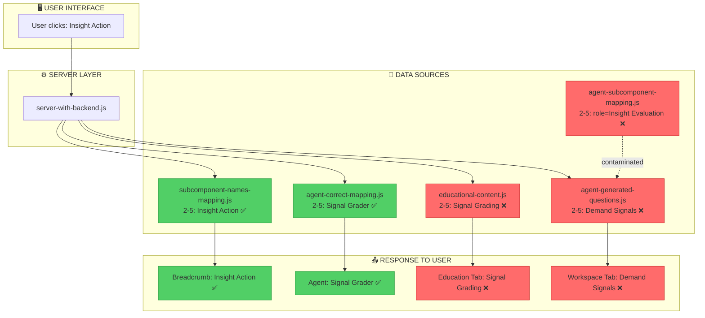

---

## CORRECT (TARGET) ARCHITECTURE

### Data Flow for Subcomponent 2-5 (Fixed)

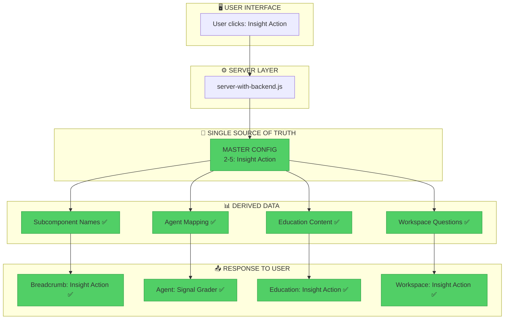

---

## BLOCK 2 MISALIGNMENT VISUALIZATION

### Current (Broken) Mapping

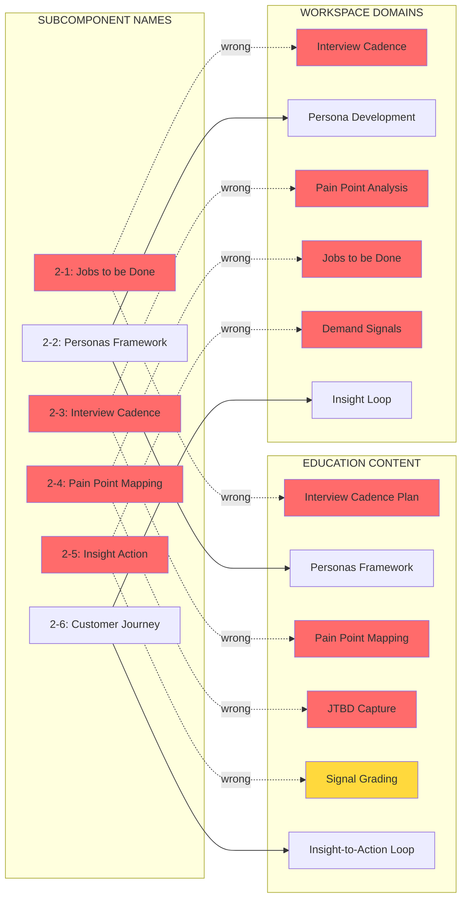

### Correct (Target) Mapping

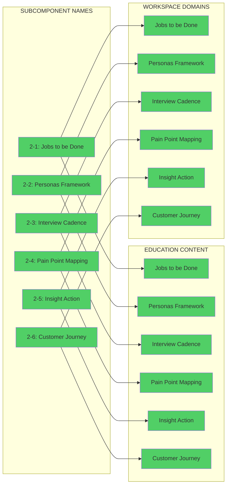

---

## SYSTEM-WIDE ALIGNMENT STATUS

### Alignment Heatmap by Block

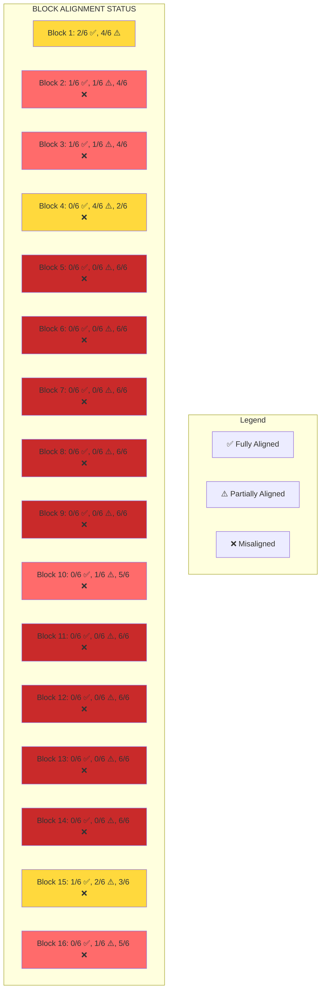

---

## FILE DEPENDENCY DIAGRAM

### Current File Relationships

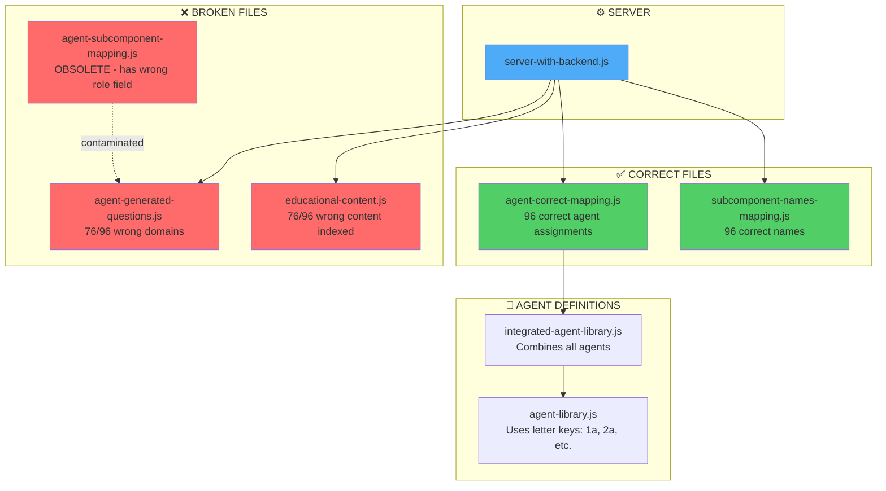

---

## MISALIGNMENT PATTERNS

### Pattern 1: Block 2 Content Rotation

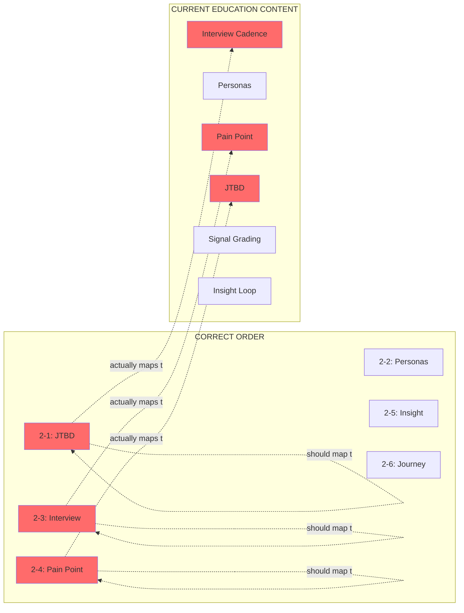

### Pattern 2: Role Field Contamination (Block 3)

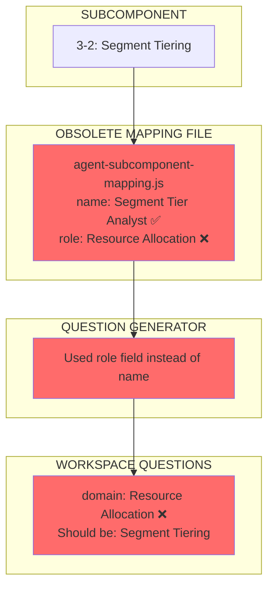

---

## FIX STRATEGY VISUALIZATION

### Phase-by-Phase Fix Approach

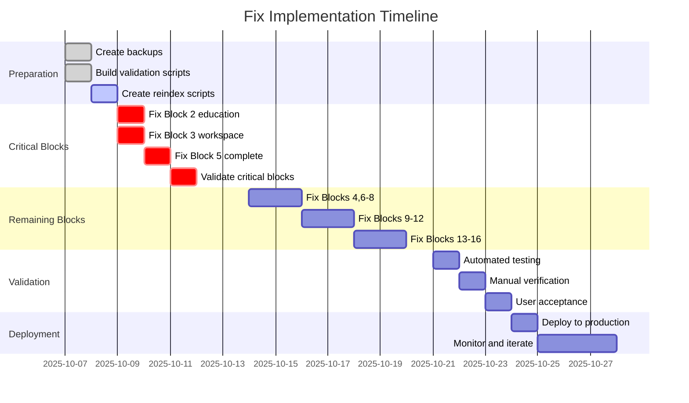

---

## DATA TRANSFORMATION DIAGRAM

### How Re-indexing Works

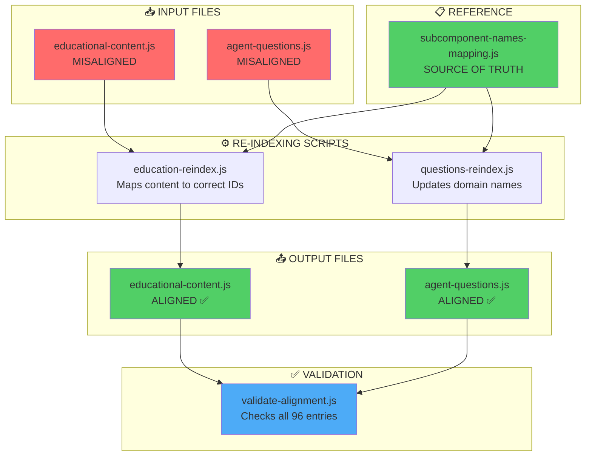

---

## BEFORE/AFTER COMPARISON

### User Journey: Subcomponent 2-5

#### BEFORE (Current Broken State)

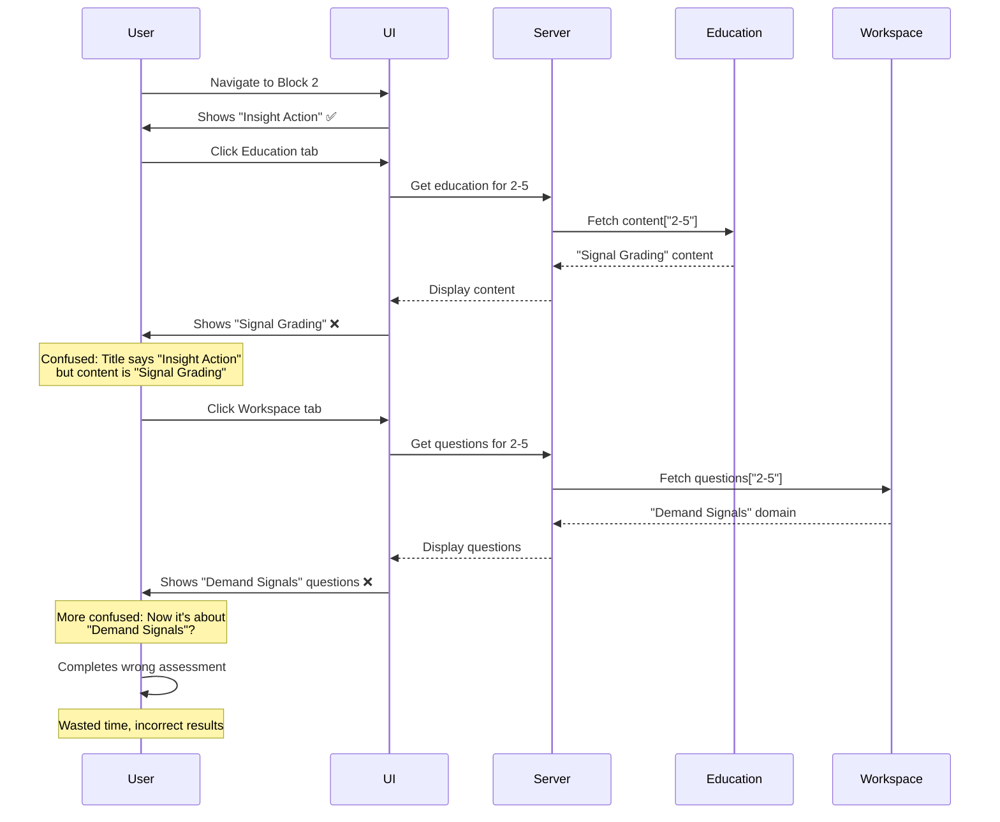

#### AFTER (Fixed State)

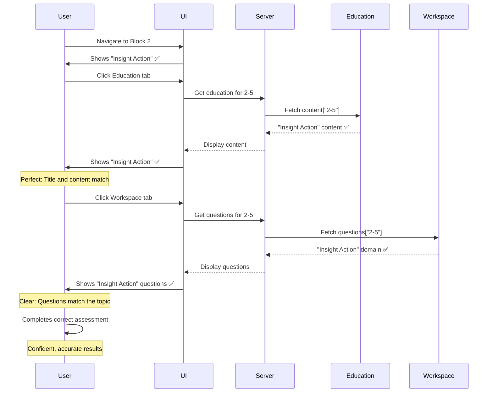

---

## RISK MITIGATION STRATEGY

### Risk Matrix

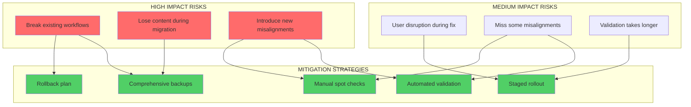

---

## VALIDATION STRATEGY

### Multi-Layer Validation Approach

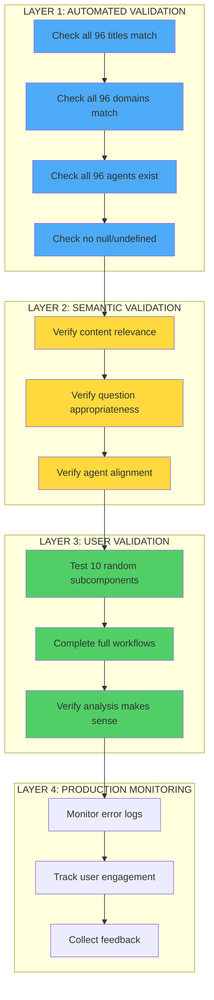

---

## IMPLEMENTATION WORKFLOW

### Step-by-Step Fix Process

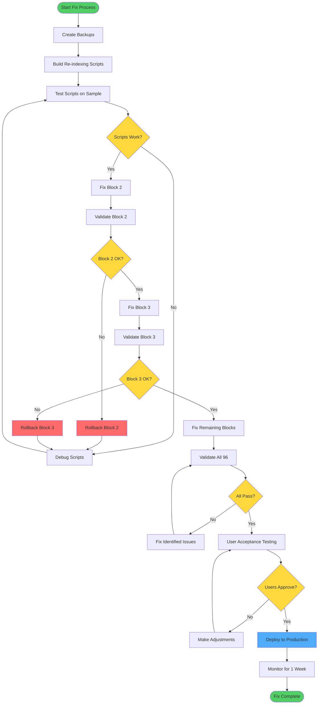

---

## PRIORITY MATRIX

### Fix Priority by Block

```mermaid
quadrantChart
    title Fix Priority Matrix
    x-axis Low Impact --> High Impact
    y-axis Easy Fix --> Hard Fix
    quadrant-1 Do First (High Impact, Easy)
    quadrant-2 Plan Carefully (High Impact, Hard)
    quadrant-3 Do Later (Low Impact, Easy)
    quadrant-4 Reconsider (Low Impact, Hard)
    
    Block 1: [0.3, 0.2]
    Block 2: [0.9, 0.6]
    Block 3: [0.9, 0.4]
    Block 4: [0.5, 0.3]
    Block 5: [0.8, 0.8]
    Block 6: [0.7, 0.5]
    Block 7: [0.7, 0.5]
    Block 8: [0.7, 0.5]
    Block 9: [0.6, 0.5]
    Block 10: [0.6, 0.5]
    Block 11: [0.6, 0.5]
    Block 12: [0.7, 0.5]
    Block 13: [0.5, 0.6]
    Block 14: [0.5, 0.6]
    Block 15: [0.4, 0.4]
    Block 16: [0.4, 0.5]
```

**Priority Order:**
1. 🔴 **Block 3** - High impact, easy fix (workspace domains only)
2. 🔴 **Block 2** - High impact, medium difficulty (content rotation)
3. 🔴 **Blocks 6-8, 12** - High impact, medium difficulty (customer-facing)
4. 🟡 **Block 5** - High impact, hard fix (complete rebuild needed)
5. 🟡 **Blocks 9-11** - Medium impact, medium difficulty
6. 🟢 **Blocks 13-14** - Medium impact, medium difficulty
7. 🟢 **Blocks 1, 15-16** - Lower impact (mostly partial alignments)
8. 🟢 **Block 4** - Lower impact (mostly partial alignments)

---

## SUCCESS METRICS DASHBOARD

### Target Metrics Post-Fix

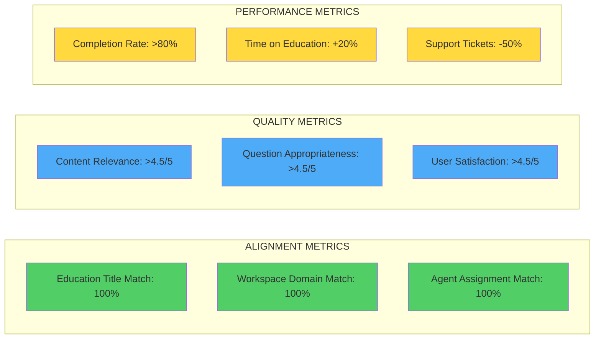

---

## ARCHITECTURAL IMPROVEMENTS

### Future State Architecture

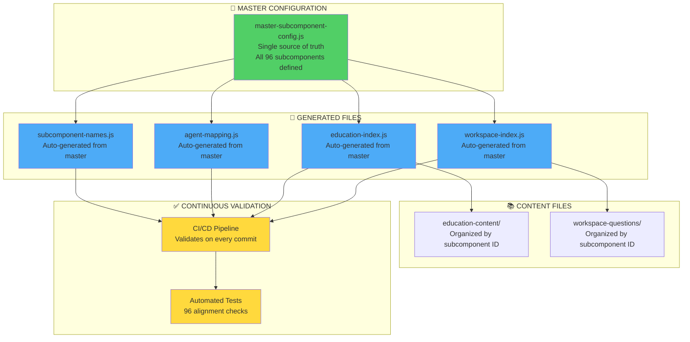

---

## SUMMARY

### The Problem in One Diagram

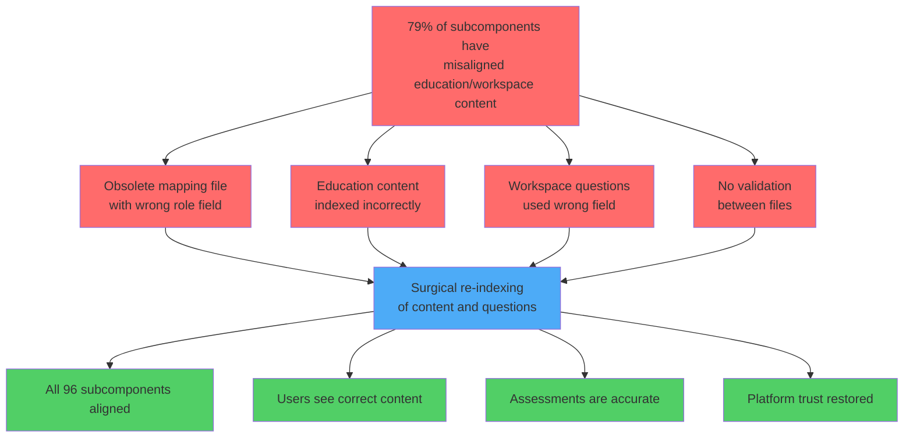

---

**End of Visual Architecture Documentation**  
**Next Step:** User review and approval to proceed with fix implementation